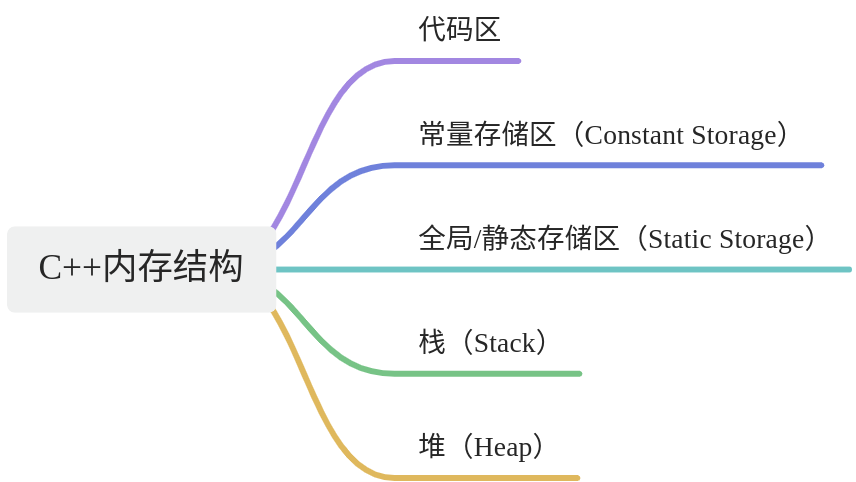
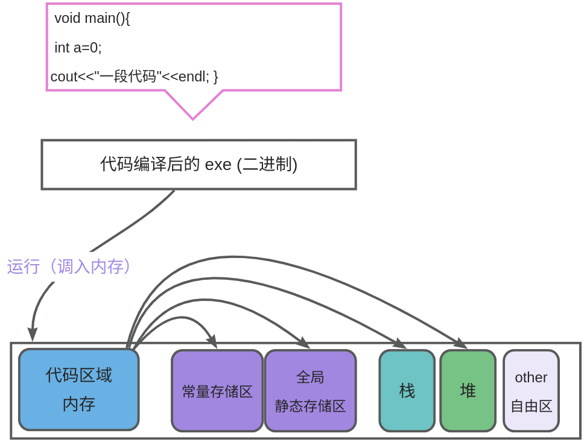

## 1. 内存结构

C++的内存结构主要涉及5 个区域



!!! tip
	想一想：如果你是编译器，给你一段别人写的代码，你该怎么调度运行这段代码？

## 2. 结构示意图
  

这些内存区域在程序执行期间协同工作，每个区域有不同的生命周期、作用和管理方式。下面是对这些内存区块的关系和使用的详细说明：

  

1. **代码区**：

- **作用**：存储程序的机器码指令，包括执行代码和只读数据。
- **使用**：程序在启动时被加载到内存，指令和只读数据在代码区执行。

2. **常量存储区**：

- **作用**：存储不可修改的常量数据，如字符串常量、全局常量、const修饰的变量等。
- **使用**：常量数据在程序加载时被分配内存，通常以只读的方式存储。

1. **全局/静态存储区**：

- **作用**：存储全局变量和静态变量，其生命周期贯穿整个程序执行过程。
- **使用**：全局变量在程序启动时分配内存，静态变量在声明时分配内存。它们的数据在整个程序执行期间可读写。

2. **栈**：

- **作用**：用于存储函数调用信息、局部变量、临时数据等。遵循后进先出（LIFO）原则。
- **使用**：每个函数调用都会创建一个栈帧，包含局部变量和函数调用信息。栈帧在函数返回时被销毁。

3. **堆**：

- **作用**：用于动态分配内存，存储在堆上的数据的生命周期由程序员管理。
- **使用**：通过`new`（C++）或`malloc`（C）等操作在堆上分配内存，程序员负责在适当的时候释放内存（`delete` 或 `free`）。堆上的数据可以在程序的不同部分共享。

  

**内存区域之间的联系**：

  

- **代码区与其他区域**：代码区的指令和只读数据在程序加载时分配，是程序的初始状态。其他区域的数据可以被代码区读取。
- **常量存储区与代码区**：常量存储区中存储的常量数据可以在程序执行时被代码区读取。
- **全局/静态存储区与其他区域**：全局变量和静态变量的数据可以在程序的任何地方访问，包括代码区、栈和堆。
- **栈和堆之间的联系**：栈主要用于存储局部变量和函数调用信息，而堆用于动态分配内存。栈上的指针变量可以存储堆上数据的地址，实现在栈上引用堆上的数据。

  

这些内存区域协同工作，形成程序的内存布局。栈和堆的管理由程序员负责，而代码区、常量存储区、全局/静态存储区由编译器和操作系统管理。在程序执行期间，这些区域协同工作以支持程序的运行、数据存储和动态内存分配。
## 3. 代码区

在C++程序中，代码区是存储程序执行代码的一部分内存区域。它通常被划分为两个主要部分：代码段和只读数据段。

!!! tip
	代码区通常指的是程序在内存中的一部分，而不是存储在硬盘上的代码。在计算机程序执行时，代码从硬盘上加载到内存中，其中的一部分被分配给代码区。代码区包括代码段和只读数据段，用于存储程序的可执行指令和只读的常量数据


1. **代码段（Text Segment）**：

- **结构**：代码段存储程序的可执行指令，即机器码。这是程序中实际执行的代码部分。
- **使用场景**：包括程序的函数、方法、控制流等。这部分内存是只读的，程序在运行时不能修改代码段的内容。
- **示例**：考虑以下简单的C++代码：

```c++
#include <iostream>

int main() {
    std::cout << "Hello, World!" << std::endl;
    return 0;
}
```

  
在这个例子中，`main` 函数的机器码将会存储在代码段中。