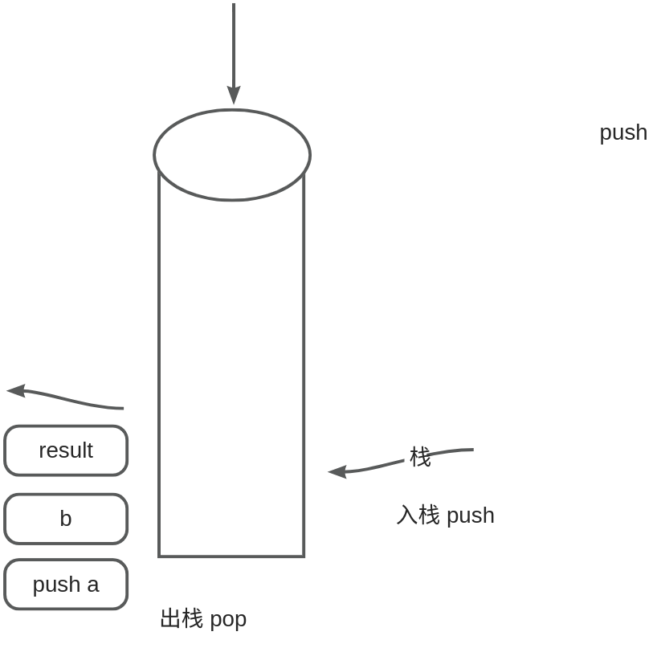

## C++的内存结构
## 1. 内存结构

C++的内存结构主要涉及5 个区域


!!! tip
	想一想：如果你是编译器，给你一段别人写的代码，你该怎么调度运行这段代码？

## 2. 结构示意图
  

这些内存区域在程序执行期间协同工作，每个区域有不同的生命周期、作用和管理方式。下面是对这些内存区块的关系和使用的详细说明：

  

1. **代码区**：

	- **作用**：存储程序的机器码指令，包括执行代码和只读数据。
	- **使用**：程序在启动时被加载到内存，指令和只读数据在代码区执行。

2. **常量存储区**：

	- **作用**：存储不可修改的常量数据，如字符串常量、全局常量、const修饰的变量等。
	- **使用**：常量数据在程序加载时被分配内存，通常以只读的方式存储。

1. **全局/静态存储区**：

	- **作用**：存储全局变量和静态变量，其生命周期贯穿整个程序执行过程。
	- **使用**：全局变量在程序启动时分配内存，静态变量在声明时分配内存。它们的数据在整个程序执行期间可读写。

2. **栈**：

	- **作用**：用于存储函数调用信息、局部变量、临时数据等。遵循后进先出（LIFO）原则。
	- **使用**：每个函数调用都会创建一个栈帧，包含局部变量和函数调用信息。栈帧在函数返回时被销毁。

3. **堆**：

	- **作用**：用于动态分配内存，存储在堆上的数据的生命周期由程序员管理。
	- **使用**：通过`new`（C++）或`malloc`（C）等操作在堆上分配内存，程序员负责在适当的时候释放内存（`delete` 或 `free`）。堆上的数据可以在程序的不同部分共享。

  

**内存区域之间的联系**：

  

- **代码区与其他区域**：代码区的指令和只读数据在程序加载时分配，是程序的初始状态。其他区域的数据可以被代码区读取。
- **常量存储区与代码区**：常量存储区中存储的常量数据可以在程序执行时被代码区读取。
- **全局/静态存储区与其他区域**：全局变量和静态变量的数据可以在程序的任何地方访问，包括代码区、栈和堆。
- **栈和堆之间的联系**：栈主要用于存储局部变量和函数调用信息，而堆用于动态分配内存。栈上的指针变量可以存储堆上数据的地址，实现在栈上引用堆上的数据。

  

这些内存区域协同工作，形成程序的内存布局。栈和堆的管理由程序员负责，而代码区、常量存储区、全局/静态存储区由编译器和操作系统管理。在程序执行期间，这些区域协同工作以支持程序的运行、数据存储和动态内存分配。
## 3. 代码区

在C++程序中，代码区是存储程序执行代码的一部分内存区域。它通常被划分为两个主要部分：代码段和只读数据段。

!!! tip
	代码区通常指的是程序在内存中的一部分，而不是存储在硬盘上的代码。在计算机程序执行时，代码从硬盘上加载到内存中，其中的一部分被分配给代码区。代码区包括代码段和只读数据段，用于存储程序的可执行指令和只读的常量数据


1. **代码段（Text Segment）**：

	*  **结构**：代码段存储程序的可执行指令，即机器码。这是程序中实际执行的代码部分。
	- **使用场景**：包括程序的函数、方法、控制流等。这部分内存是只读的，程序在运行时不能修改代码段的内容。
	- **示例**：考虑以下简单的C++代码：

```c++
#include <iostream>

int main() {
    std::cout << "Hello, World!" << std::endl;
    return 0;
}
```

  
在这个例子中，`main` 函数的机器码将会存储在代码段中。

1. **只读数据段（Read-Only Data Segment）**：

	- **结构**：只读数据段存储常量数据，例如字符串常量，以及全局或静态变量的初始化值。
	- **使用场景**：用于存储不可修改的数据。字符串字面量是一个常见的只读数据段的例子。
	- **示例**：在上述例子中，字符串常量 "Hello, World!" 将存储在只读数据段中。

  

下面是一个简化的内存结构示意图：

```bash
-----------------------
|      代码段           |
|  (可执行指令)        |
-----------------------
| 只读数据段            |
|  (常量数据)           |
-----------------------
```

  

**注意事项**：

- 代码段和只读数据段通常在程序加载时由操作系统加载到内存中，一旦加载就不能被修改。
- 在函数调用时，函数的机器码也存储在代码段中，每个函数有其独特的代码段地址。
- 字符串常量等只读数据段中的数据是不可修改的，任何试图修改这些数据的尝试都会导致运行时错误。

  

理解C++的代码区结构有助于更好地理解程序的内存布局，同时也有助于编写更安全、高效的代码。


在一般情况下，"只读" 和 "可共享"（可复用）是代码区的两个重要特点：

1. **只读（Read-Only）**：

	- 代码区的代码段和只读数据段通常是只读的。这意味着在程序运行时，这些部分的内容不能被修改。这有助于确保程序执行期间的数据的一致性和安全性。
	- 例如，程序的机器码、字符串常量等数据是放在只读部分的，防止程序在运行时意外地修改这些数据。

2. **可复用（Sharable）**：

	- 代码区的内容通常是可共享的，尤其是对于相同的程序的多个实例或同时运行的多个程序来说。多个程序实例可以共享相同的机器码，这有助于节省内存。
	- 共享的代码段通常位于所有程序的相同虚拟地址，但实际的物理内存可能被多个进程共享。

这些特点使得代码区能够更有效地支持多个程序的并发执行，并在运行时提供一定程度的保护，确保代码和只读数据的完整性。在共享库（shared libraries）的概念中，这种可复用性得到了更进一步的利用，允许多个程序共享同一个库的代码段，减少了内存占用。

## 4. 常量存储区

常量存储区通常是指存储程序中的常量数据的一块内存区域。在C++中，常量数据包括字符串常量、全局常量、const修饰的全局/局部变量等，它们的值在程序执行期间不可被修改。这些常量数据通常存储在只读数据段（Read-Only Data Segment）中。

以下是对常量存储区的详细说明：

1. **结构**：

	- 常量存储区是程序内存布局的一部分，主要包含只读数据，这些数据在程序执行期间不可被修改。
	- 常量数据的存储方式取决于其类型和声明位置，可能包括字符串常量、全局常量、以及使用const修饰的全局/局部变量。

2. **使用场景**：

	- 存储不可变的常量数据，例如字符串、常量变量等。
	- 这些数据通常在程序加载时被操作系统分配内存，并在程序执行期间一直存在。

3. **示例**：

```C++
#include <iostream>

// 全局常量
const int GLOBAL_CONSTANT = 42;

int main() {
    // 字符串常量
    const char* message = "Hello, Constants!";

    // 局部常量
    const double LOCAL_CONSTANT = 3.14;

    // 使用常量
    std::cout << "Global Constant: " << GLOBAL_CONSTANT << std::endl;
    std::cout << "String Constant: " << message << std::endl;
    std::cout << "Local Constant: " << LOCAL_CONSTANT << std::endl;

    return 0;
}
```

  
在这个例子中，`GLOBAL_CONSTANT` 是一个全局常量，`message` 是一个指向字符串常量的指针，`LOCAL_CONSTANT` 是一个局部常量。这些常量数据在程序执行期间被存储在常量存储区。

4. **注意事项**：

	- 常量存储区的数据是只读的，试图修改这些数据会导致运行时错误。
	- 字符串常量通常以null结尾（null-terminated），而全局常量和const修饰的变量的值在编译时就被确定。

## 5. 全局/静态存储区

全局/静态存储区是程序中用于存储全局变量和静态变量的内存区域。这些变量在程序的整个生命周期内存在，并且其内存分配发生在程序启动时，直到程序结束。全局/静态存储区包括两个主要部分：全局变量区和静态变量区。

  

1. **全局变量区**：

	- **结构**：全局变量区用于存储全局变量，即在函数外部声明的变量，可以被整个程序访问。
	- **使用场景**：适用于需要在多个函数或文件中共享的数据。
	- **示例**：

```C++
// 全局变量，存储在全局变量区
int globalVariable = 10;

void function1() {
    // 可以访问全局变量
    globalVariable++;
}

void function2() {
    // 也可以访问全局变量
    globalVariable--;
}

int main() {
    // 程序入口
    return 0;
}
```

2. **静态变量区**：

	- **结构**：静态变量区用于存储静态变量，即在函数内部声明但使用`static`关键字修饰的变量。与全局变量一样，静态变量的内存分配发生在程序启动时。
	- **使用场景**：适用于在函数调用之间保持持久性数据的需求。
	- **示例**：

```C++
void exampleFunction() {
    // 静态局部变量，存储在静态变量区
    static int staticVariable = 5;

    // 对静态变量的操作将在函数调用之间保持
    staticVariable++;
}

int main() {
    exampleFunction();  // 静态变量 staticVariable 被初始化为 5
    exampleFunction();  // staticVariable 增加到 6
    return 0;
}
```

  

**注意事项**：

- 全局/静态存储区的数据在程序启动时分配，在程序结束时释放。
- 全局变量区的数据可以被整个程序访问，而静态变量区的数据仅在声明它的函数内可见。
- 在多线程环境中，全局变量和静态变量可能需要额外的同步机制，以确保多个线程对它们的安全访问。

## 6. 栈

栈（Stack）是一种内存分配和管理的数据结构，它遵循后进先出（Last In, First Out，LIFO）的原则。栈内存主要用于存储局部变量、函数调用信息以及一些临时数据，是程序执行时自动管理的一块内存区域。


以下是对栈的详细介绍：

  

1. **结构**：

	- 栈是一种线性数据结构，可以想象成一个具有两个主要操作的容器：压栈（Push）和弹栈（Pop）。
	- 数据项按照后进先出的次序进出栈。

2. **使用场景**：

	- 存储函数的局部变量：每次函数调用时，其局部变量被分配到栈上，函数返回时这些变量就被自动释放。
	- 存储函数的调用信息：每次函数调用时，函数的返回地址和一些其他信息被压入栈中，函数返回时再从栈中弹出这些信息。
	- 临时数据的存储：栈也用于存储一些函数调用过程中的临时数据。

3. **栈帧**：

	- 在函数调用时，一个栈帧（Stack Frame）被压入栈中。栈帧包含了函数的局部变量、返回地址和其他与函数调用相关的信息。
	- 当函数返回时，栈帧被弹出，函数的局部变量被销毁，控制流回到调用函数的位置。

4. **示例**：

```C++
#include <iostream>

int add(int a, int b) {
    // 栈帧开始，局部变量 a 和 b 被分配在栈上
    int result = a + b;  // 临时变量 result 也在栈上
    // 栈帧结束，局部变量 a、b 和 result 被销毁
    return result;
}

int main() {
    // 栈帧开始，局部变量 x 和 y 被分配在栈上
    int x = 5, y = 10;
    int sum = add(x, y);  // 函数调用，新的栈帧被压入栈中
    // 栈帧结束，局部变量 x、y 和 sum 被销毁
    
    std::cout << "Sum: " << sum << std::endl;
    return 0;
}
```

  

在这个例子中，`main` 函数和 `add` 函数的栈帧依次被创建和销毁。`add` 函数的局部变量和临时变量都存储在栈上，随着函数的返回，这些变量也被销毁。函数调用过程中的栈帧操作清晰地展示了栈的特性。

栈的管理通常由编译器负责。编译器根据程序的结构和函数调用关系来分配和管理栈空间。在编译阶段，编译器会生成一些代码来处理栈的操作，包括栈帧的创建和销毁，局部变量的分配和释放，以及函数调用时相关的栈操作。

编译器在编译源代码时会：

1. **分析函数调用关系**：编译器需要了解程序中函数的调用关系，以便正确生成栈帧和处理函数调用时的参数传递和返回值。
2. **分配栈空间**：对于每个函数，编译器需要决定分配多少空间用于栈帧，以容纳局部变量、函数参数、返回地址等。
3. **生成栈操作指令**：编译器会生成相应的汇编或机器码指令，用于执行栈的压栈和弹栈操作，以及处理函数调用时的栈操作。

虽然编译器负责生成大部分与栈相关的代码，但在一些特殊情况下，程序员也可以通过手动操作栈指针来进行底层的栈管理。在汇编语言等低级语言中，程序员有更多的控制权，可以直接操作栈。在高级语言中，这种底层的栈操作通常由编译器自动处理。

!!! tip
	栈 stack ：是那些编译器在需要时分配，在不需要时自动清除的存储区。存放局部变量、函数参数。存放在栈中的数据只在当前函数及下一层函数中有效，一旦函数返回了，这些数据也就自动释放了。

## 7. 堆

堆是程序运行时用于动态分配内存的一种内存区域，也称为自由存储区。堆上的内存可以在运行时动态地分配和释放，由程序员负责管理。与栈不同，堆上的内存分配和释放不受程序的执行顺序限制。

  

以下是对堆的详细介绍：

  

1. **结构**：

	- 堆是由操作系统分配的一块较大的内存区域，程序运行时可以在堆上动态地分配内存。
	- 堆上的内存分配和释放是由程序员手动控制的。

2. **使用场景**：

	- 动态内存分配：当程序无法确定需要多少内存时，或者需要在程序的不同部分共享数据时，使用堆上的内存是很有用的。
	- 对象的动态创建和销毁：例如，使用 `new` 操作符在堆上创建对象，以及使用 `delete` 操作符释放相应的内存。

3. **堆上的内存分配和释放**：

	- **分配内存**：可以使用 `new` 操作符（在C++中）或者 `malloc` 函数（在C语言中）来在堆上动态分配内存。

```C++
// 在堆上分配整数数组
int* dynamicArray = new int[10];
```

- **释放内存**：分配的内存需要手动释放，否则可能会导致内存泄漏。使用 `delete` 操作符（在C++中）或者 `free` 函数（在C语言中）。

```C++
// 释放动态分配的内存
delete[] dynamicArray;
```

4. **示例**：

```C++
#include <iostream>

int main() {
    // 在堆上分配一个整数
    int* dynamicInt = new int;
    *dynamicInt = 42;

    // 在堆上分配一个字符串
    char* dynamicString = new char[10];
    strcpy(dynamicString, "Hello");

    // 使用分配的内存
    std::cout << "Dynamic Int: " << *dynamicInt << std::endl;
    std::cout << "Dynamic String: " << dynamicString << std::endl;

    // 释放堆上的内存
    delete dynamicInt;
    delete[] dynamicString;

    return 0;
}
```

  

在这个例子中，通过 `new` 操作符在堆上分配了一个整数和一个字符串，并使用 `delete` 操作符释放了这些内存。这样的动态内存管理允许程序在运行时动态地创建和销毁对象，增加了灵活性。但需要注意，堆上的内存分配和释放需要程序员小心管理，以避免内存泄漏或悬挂指针等问题。在现代C++中，推荐使用智能指针等资源管理工具来减少手动内存管理的复杂性。

!!! tip
	堆 heap ：由 new 分配的内存块，其释放编译器不去管，由程序员自己控制。如果程序员没有释放掉，在程序结束时系统会自动回收。涉及的问题：“缓冲区溢出”、“内存泄露”。

## 8. 小结

理解 太多 太杂

我的经验：

当你在VS中写下一段代码，按道理来讲，你并不需要太在意，你的代码变量被分配到哪个内存区域，也就是说这对程序员来说，基本上是透明的，你可以在意，也可以不在意。但是，作为一个专业的C++使用者来讲，你应该对自己所写的代码有比较清晰的把握，清楚自己的代码中的变量存在什么区域中，会有非常大好处，这不但能够让你写出高性能的代码，还有助于你减少一些比较深层次的BUG。

例如下面的问题：

使用C++内存时的一些注意事项：

  

- **内存泄漏**：确保在动态分配内存后适时释放，避免出现内存泄漏问题。
- **野指针**：注意在指针使用后及时置为 nullptr 避免野指针的产生，避免访问已经释放的内存。
- **栈溢出**：谨慎使用递归或者分配大量的局部变量，以免造成栈溢出。
- **悬挂指针**：避免悬挂指针问题，即指向已经释放的内存区域。
- **智能指针**：考虑使用C++的智能指针（如`std::unique_ptr`和`std::shared_ptr`），以提高内存管理的安全性和便利性。
- **局部变量生命周期**：理解局部变量的生命周期，确保在离开其作用域前不再访问。

  

**野指针（Wild Pointer）**和**悬空指针（Dangling Pointer）**都是与指针相关的问题，但它们产生的原因和表现有所不同。

  

1. **野指针**：

- **定义**：野指针是指未初始化或者已经释放的指针，其值是不确定的，可能指向任意内存地址。
- **示例**：

```C++
int* wildPointer;  // 未初始化的野指针
// 或者
int* ptr = new int;  // 创建了一个动态分配的内存，但没有初始化指针的值
// 此时 ptr 是野指针
```

- **问题**：对野指针进行解引用或者修改操作会导致未定义的行为，因为它们指向的内存区域是不可知的。

2. **悬空指针**：

- **定义**：悬空指针是指指向已经被释放的内存地址的指针，即指针指向的内存已经不再有效，但指针本身并没有被重置为 `nullptr` 或 `NULL`。
- **示例**：

```C++
int* danglingPointer;
{
    int x = 5;
    danglingPointer = &x;  // x 在离开作用域后，danglingPointer 成为悬空指针
}
```

- **问题**：对悬空指针进行解引用或者修改操作同样会导致未定义的行为，因为它们指向的内存已经被释放。

  

**区别总结**：

- 野指针通常是因为未初始化或者未明确赋值导致的，它们指向的内存区域是不确定的。
- 悬空指针则是指向已经被释放的内存，它们指向的内存区域虽然曾经有效，但现在已经不再属于程序。
- 野指针和悬空指针都可能导致程序运行时错误，应该避免它们的产生。使用智能指针、良好的内存管理实践和规范的指针使用可以减少这些问题的发生。

