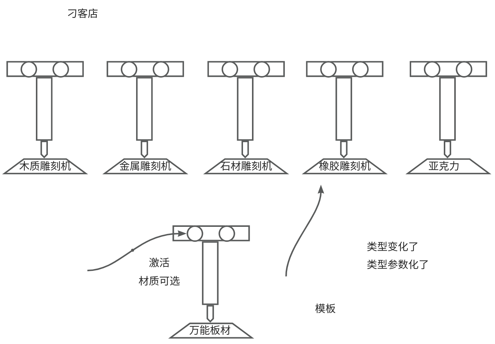
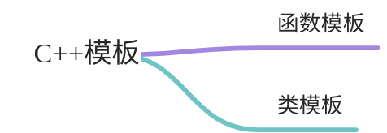

# 【01】基本概念
## 模板-基本概念

### 1.1. 什么是模板编程？

什么是模板？



模板编程

宽泛、广泛，泛泛....

!!! tip
	- **模板编程是**C++实现泛型编程的手段，泛型故名思议，同一段代码逻辑可以接收多个类型的参数。

  

!!! important
	- **为什么出现泛型**？
	
	强类型语言（Java，C#，Swift，Python）和弱类型（Javascript,php,python）的语言。C++是强类型语言。

	例如，如果你想在 C++ 中将一个整数和一个浮点数相加，你需要明确地将其中一个转换为另一个类型，以确保类型匹配。这样的严格类型检查有助于预防一些由于类型不匹配而导致的错误。

	为了让一段代码逻辑，可以同时适应多个数据类型，在C++中采用了模板技术。这样的好处是，你写一套代码，可以适应多个数据类型，这样你就省事儿了，达到了高效复用代码的目的。

  
!!! note
	模板的终极目标是：支持泛型编程，即编写与数据类型无关的通用代码。这使得可以创建更灵活、通用的数据结构和算法，而无需为每种数据类型都编写单独的代码



### 1.2. 产生的原因举例

为什么要使用模板，它到底要解决什么问题呢？ 让我们来看一段烂大街且务必经典的案例。

在传统的C++中，如果要交换不同类型的参数（如int、double、char等），你可能需要为每一种类型编写一个独立的函数。这会导致代码的重复，而模板提供了一种更通用和灵活的解决方案。

  

首先，我们来看一下传统的非模板方式：

```C++
#include <iostream>

// 交换两个int型参数
void swapInt(int &a, int &b) {
    int temp = a;  // 临时变量存储a的值
    a = b;         // 将b的值赋给a
    b = temp;      // 将临时变量的值赋给b，完成交换
}

// 交换两个double型参数
void swapDouble(double &a, double &b) {
    double temp = a;  // 临时变量存储a的值
    a = b;            // 将b的值赋给a
    b = temp;         // 将临时变量的值赋给b，完成交换
}

// 交换两个char型参数
void swapChar(char &a, char &b) {
    char temp = a;  // 临时变量存储a的值
    a = b;         // 将b的值赋给a
    b = temp;      // 将临时变量的值赋给b，完成交换
}

int main() {
    int x = 5, y = 10;
    double a = 3.14, b = 6.28;
    char c = 'A', d = 'B';

    std::cout << "交换前: x = " << x << ", y = " << y << std::endl;
    swapInt(x, y);
    std::cout << "交换后: x = " << x << ", y = " << y << std::endl;

    std::cout << "交换前: a = " << a << ", b = " << b << std::endl;
    swapDouble(a, b);
    std::cout << "交换后: a = " << a << ", b = " << b << std::endl;

    std::cout << "交换前: c = " << c << ", d = " << d << std::endl;
    swapChar(c, d);
    std::cout << "交换后: c = " << c << ", d = " << d << std::endl;

    return 0;
}

```

现在，让我们使用模板来改进这段代码：


```C++
#include <iostream>

// 定义模板函数，实现通用的两个参数交换
template <typename JT>
void swap(JT &a, JT &b) {
    JT temp = a;
    a = b;
    b = temp;
}

int main() {
    // 示例：int类型参数交换
    int x = 5, y = 10;
    std::cout << "交换前: x = " << x << ", y = " << y << std::endl;
    swap(x, y);
    std::cout << "交换后: x = " << x << ", y = " << y << std::endl;

    // 示例：double类型参数交换
    double a = 3.14, b = 6.28;
    std::cout << "交换前: a = " << a << ", b = " << b << std::endl;
    swap(a, b);
    std::cout << "交换后: a = " << a << ", b = " << b << std::endl;

    // 示例：char类型参数交换
    char c = 'A', d = 'B';
    std::cout << "交换前: c = " << c << ", d = " << d << std::endl;
    swap(c, d);
    std::cout << "交换后: c = " << c << ", d = " << d << std::endl;

    return 0;
}
```

  

通过使用模板，我们只需编写一个`swap`函数，它可以用于不同类型的参数。这样，我们避免了为每种数据类型编写不同的交换函数的重复代码，提高了代码的可维护性和可读性。模板的好处之一就是能够实现更通用的代码，同时减少代码的冗余。

  

通过上面的例子， 我相信 您已经不难感知到，模板编程的魅力了吧。

### 1.3. 如何定义模板？

在C++中，你可以使用模板来定义通用的、与数据类型无关的代码。模板的定义使用`template`关键字，其语法如下：

  

```C++
template <typename T>
// 或者使用
// template <class T>
```

  

这里，`typename`或者`class`关键字都可以用来声明模板参数。`T`是模板参数的占位符，表示类型参数。你可以选择其他标识符作为模板参数，例如`template <typename ElementType>`。

  

下面是一个简单的模板函数的定义示例，演示了如何使用模板参数：

  

```C++
#include <iostream>

// 定义一个模板函数
template <typename T>
T add(T a, T b) {
    return a + b;
}

int main() {
    // 使用模板函数，传入不同类型的参数
    int resultInt = add(5, 10);
    double resultDouble = add(3.14, 6.28);

    std::cout << "Result (int): " << resultInt << std::endl;
    std::cout << "Result (double): " << resultDouble << std::endl;

    return 0;
}
```

  

在这个例子中，`add`函数是一个模板函数，它可以接受任意相同类型的参数，并返回它们的和。模板函数的定义以`template <typename T>`开始，然后在函数参数和返回类型中使用`T`作为类型占位符。

  

需要注意的是，模板并不仅限于函数，还可以用于类和类成员函数。模板的使用可以让你编写更通用、可重用的代码，适用于不同的数据类型。