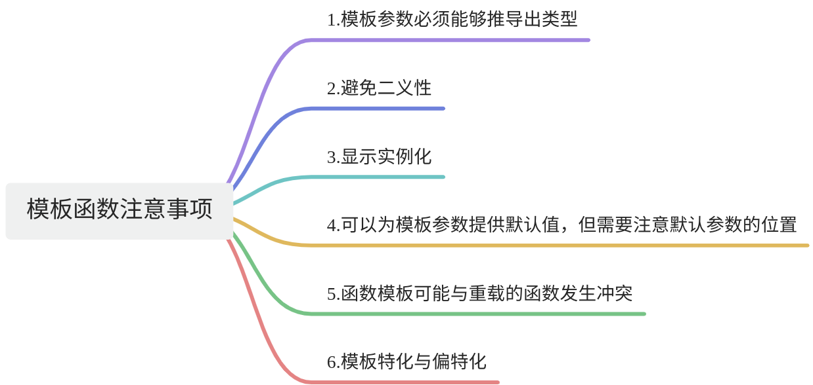

# 【03】函数模板
## 1. 函数模板

### 1.1. 函数模板的定义语法

```C++
template <typename T>
T add(T a, T b) {
    return a + b;
}
```

1. T只是一个代号，你可以改成自己定义的字符，例如：JT，ABC ...等
2. `typename` 关键字 也可以换成 `class` 。是等效的。

### 1.2. 多个类型参数的函数模板

当涉及多个参数的模板时，你可以通过在模板定义中添加多个类型参数或非类型参数来处理。以下是处理多个参数的两种主要情况：函数模板和类模板。

```C++
#include <iostream>

// 定义一个模板函数，处理多个类型参数
template <typename T, typename U>
void printPair(T a, U b) {
    std::cout << "Pair: " << a << " and " << b << std::endl;
}

int main() {
    // 使用模板函数，传入不同类型的参数
    printPair<int,double>(5, 3.14);          // T为int，U为double
    printPair<string,char>("Hello", 'A');     // T为const char[6]，U为char

    return 0;
}
```

  

在这个例子中，`printPair`函数接受两个不同类型的参数，并在输出中显示它们。

### 1.3. 非类型参数

在C++中，非类型参数是一种模板参数，允许你将常量值作为参数传递给模板。这样的参数在模板实例化的过程中被用作常量，而不是类型。这使得你可以编写更灵活的通用代码，而不仅仅是处理不同类型的数据。

下面是一个简单的示例，演示如何使用非类型参数：

```C++
#include <iostream>

// 定义一个模板函数，接受一个非类型参数作为常量
template <int N>
void printNTimes(const std::string& message) {
    for (int i = 0; i < N; ++i) {
        std::cout << message << std::endl;
    }
}

int main() {
    // 使用模板函数，传入不同的常量参数
    printNTimes<3>("Hello");  // 打印 "Hello" 3次
    printNTimes<5>("World");  // 打印 "World" 5次

    return 0;
}
```

  

在这个例子中，`printNTimes`函数是一个接受非类型参数的函数模板。通过使用`<3>`和`<5>`等非类型参数，我们在编译时确定了循环迭代的次数。这使得编译器能够在生成代码时进行优化，而不需要在运行时进行循环次数的计算。

非类型参数可以是整数、枚举、指针等常量表达式。它们在模板实例化的过程中起到了常量的作用，有助于生成更高效、更灵活的代码。

### 1.4. **隐式实例化**

**隐式实例化：** 编译器根据调用的数据类型自动实例化模板。

```C++
int resultInt = add(5, 10);
double resultDouble = add(3.14, 6.28);
```

### 1.5. 模板特化

**特化：** 允许为特定的数据类型提供定制的实现。

```C++
template <>
double add(double a, double b) {
    return a + b + 10.0;
}
```

### 1.6. 延迟实例化和.hpp

在 C++ 中，未使用的模板函数（包括类模板中的成员函数）在大多数情况下不会生成编译代码，这是因为 C++ 编译器在编译过程中会进行模板实例化（Template Instantiation），只有当模板函数被实际调用时，编译器才会生成对应的函数代码。这被称为模板的延迟实例化（Template Instantiation on Demand）。

这种行为有助于减少编译时间和生成的目标代码的大小，因为只有实际需要的模板函数才会被编译和链接到最终的可执行文件中。

然而，有一些情况下编译器可能会生成未使用的模板函数的一部分代码，具体取决于编译器的优化策略和具体的使用情况。例如，一些编译器可能会生成函数的函数框架（Function Frame），但是函数的主体代码可能不会被生成。

总的来说，未使用的模板函数通常不会在最终的目标代码中生成编译代码，但是具体行为可能因编译器而异。

### 1.7. 注意事项


在使用函数模板时，有一些注意事项需要考虑，以确保正确的使用和预防一些潜在的问题。以下是一些函数模板的注意事项：

1. **模板参数必须能够推导出类型：** 编译器需要能够推导出模板参数的类型。如果在某些情况下类型无法推导，可能导致编译错误。确保传递的参数足够明确，以便类型推导是有效的。
```C++
// 有效的使用
template <typename T>
void myFunction(T a) {
    // ...
}

// 无法推导出类型，会导致编译错误
// template <typename T>
// void myFunction(T a, T b) {
//     // ...
// }
```


2. **避免二义性：** 如果同时存在多个模板函数，编译器可能无法确定使用哪个模板，从而导致二义性错误。确保模板的使用是明确的。

```C++
template <typename T>
void myFunction(T a) {
    // ...
}

template <typename T>
void myFunction(T a, T b) {
    // ...
}
```

3. **显示实例化：** 在某些情况下，你可能需要通过显示实例化来指定使用的具体模板实例。
```cpp
template <typename T>
void myFunction(T a) {
    // ...
}

// 显示实例化为int类型
template void myFunction<int>(int a);
```

4. **默认模板参数：** 可以为模板参数提供默认值，但需要注意默认参数的位置。
```cpp
// 有效的使用
template <typename T = int>
void myFunction(T a) {
    // ...
}

// 无效的使用，应该将默认参数放在最后
// template <typename T = int>
// void myFunction(T a, T b) {
//     // ...
// }
```

5. **函数模板与重载：** 函数模板可能与重载的函数发生冲突，特别是在涉及类型推导的情况下。确保模板和重载的函数之间没有歧义。

```cpp
template <typename T>
void myFunction(T a) {
    // ...
}

void myFunction(int a) {
    // ...
}
```

6. **依赖于模板参数的成员函数：** 如果你在类中定义依赖于模板参数的成员函数，确保使用了类模板的所有模板参数。

```cpp
template <typename T>
class MyClass {
public:
    void myFunction(T a) {
        // ...
    }
};

MyClass<int> obj;
obj.myFunction(5);  // 有效
```

7. **模板特化与偏特化：** 了解模板特化和偏特化的概念，以便在需要时进行特殊处理。

```cpp
// 完全特化
template <>
void myFunction<int>(int a) {
    // ...
}

// 部分特化
template <typename T, typename U>
void myFunction<T>(T a, U b) {
    // ...
}
```

8. **模板的限制和约束：** C++20引入了概念（Concepts），用于对模板参数进行约束。了解如何使用概念来增强对模板的限制。

```cpp
template <typename T>
requires std::is_integral_v<T>
void myFunction(T a) {
    // ...
}
```

在使用函数模板时，理解这些注意事项并合理设计模板将有助于避免潜在的问题，提高代码的健壮性和可维护性。