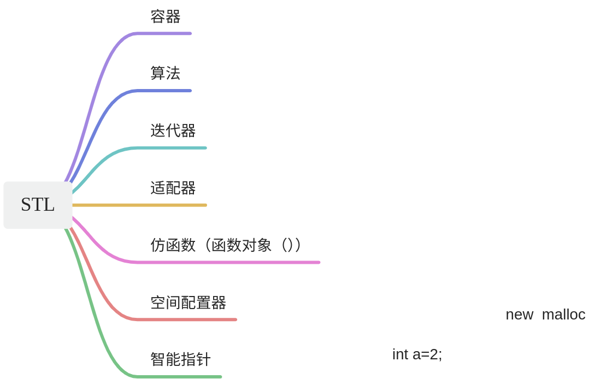
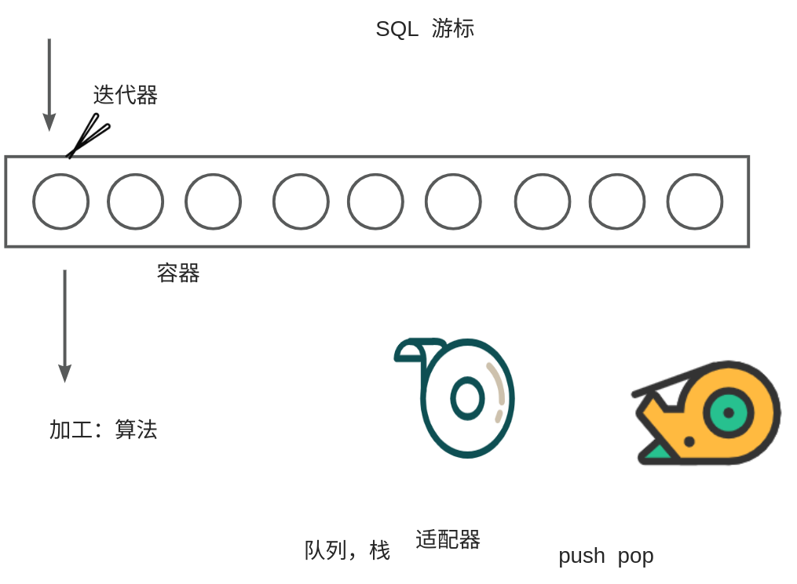

# 【01】STL

## STL产生的原因

C++的STL（Standard Template Library）

为什么会有标准的模板库。

主要是为了代码重用利用，减少不必要的付出

## STL的内容

STL是C++标准库的一部分，提供了一组通用的模板类和函数，用于实现常见的数据结构和算法。STL主要包括以下几个组件：

咱们用大白话 说一下：

容器：就像是放汤圆的盒子

数据：就是盒子里的汤圆

拿汤圆的夹子：就可以看做迭代器

对汤圆的二次加工就是算法

适配器就是为来更好地让你操作汤圆的一种工具包装。

  

1. 容器（Containers）：STL提供了多种容器，包括vector、deque、list、set、map等，用于存储和管理数据。
2. 算法（Algorithms）：STL提供了大量的算法，如排序、搜索、数值计算等，这些算法可以与各种容器一起使用。
3. 迭代器（Iterators）：迭代器是STL的核心概念之一，它提供了一种统一的访问容器元素的方式，使得算法能够独立于容器进行操作。
4. 函数对象（Function Objects）：STL中的很多算法都是通过函数对象来完成的，函数对象是可调用对象的抽象，可以是函数指针、函数、lambda表达式等。
5. 适配器（Adapters）：STL提供了一些适配器，用于改变容器的接口或行为，如stack、queue、priority_queue等。
6. 智能指针（Smart Pointers）：STL还提供了智能指针，包括shared_ptr、unique_ptr和weak_ptr，用于管理动态分配的内存。
7. 空间配置器：STL中也包含空间配置器（allocator）作为一部分，用于管理内存的分配和释放。空间配置器是容器的一部分，用于封装底层的内存分配算法，并提供一致的接口供容器使用。通过使用空间配置器，容器类可以在运行时动态地分配内存，并在不再需要时释放这些内存，从而实现对内存的高效管理。