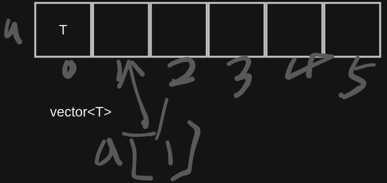

# 【03】vector容器

vector 表示对象的集合。

## vector本身是模板

`vector` 不是一个单独的类型，而是C++标准库中的一个模板类。它用于创建动态数组容器，可以存储一组相同类型的元素。实际上，`std::vector` 是一个参数化的模板类，您需要指定要存储的元素类型作为模板参数。

## vector的定义初始化
```cpp
//以下是几种定义vector变量的语句
//泛型
vector<T> x; //空的向量数组

vector<T> b(x) ;//定义
vector<T> c=x;
vector<T> v2(n,a); //由n个a组成的vector
vector<T> v4(n) ; //n个默认的元素
vector<T> v3={a,b,c,d}; //定义散装
vector<T> v5{a,b,c}; //C++11 是{} 不是（）

//T 是可以支持用户自定义的类型的，例如 用户定义的类

```



## vector的插入

!!! note
	不能使用[]下标的方式，向vector中添加元素。而是要使用push_back()。 也就是说只能对已经存在的元素执行下标操作
```cpp
int main()
{
	vector<int> mybox(200); //如果将定义换成 vector<int> mybox(200) 就不报错了
	for (int i = 0; i < 100; i++)
	{
		mybox[i]=i; //错误：因为mybox是空的 ,应该使用push_back()
	}

	return 0;
}
```
## vector的使用归纳

`std::vector` 是C++标准库中的一个动态数组容器，用于存储一组元素。它提供了动态调整大小、随机访问元素、高效插入和删除元素等功能，是C++中常用的数据结构之一。下面是关于`std::vector`的详细介绍：

  

1. **包含头文件：** 要使用`std::vector`，需要包含头文件 `<vector>`。

```C++
#include <vector>
```

2. **创建和初始化：** 可以通过多种方式创建和初始化`std::vector`，包括默认构造函数、拷贝构造函数、初始化列表等。

```C++
std::vector<int> numbers; // 创建一个空的整数向量
std::vector<int> numbers2 = {1, 2, 3, 4, 5}; // 使用初始化列表初始化
```

1. **访问元素：** 使用下标操作符 `[]` 或 `at()` 方法可以访问向量中的元素。

```C++
int firstElement = numbers2[0];
int secondElement = numbers2.at(1);
```

2. **插入和删除元素：** 使用`push_back()`方法在向量末尾插入元素，使用`pop_back()`方法删除末尾的元素。

```C++
numbers.push_back(10);
numbers.pop_back();
```

`

3. **获取大小和容量：** `size()` 方法返回向量中的元素数量，`capacity()` 方法返回向量当前可容纳的元素数量。

```C++
size_t size = numbers.size();
size_t capacity = numbers.capacity();
```

4. **动态调整大小：** 使用`resize()`方法可以动态调整向量的大小。

```C++
numbers.resize(10); // 将向量调整为包含 10 个元素
```

5. **迭代：** 可以使用迭代器来遍历向量中的元素。

```C++
for (std::vector<int>::iterator it = numbers.begin(); it != numbers.end(); ++it) {
    // 使用 *it 访问元素
}
```

6. **其他功能：** `std::vector`还提供了许多其他功能，如插入元素到指定位置、删除指定位置的元素、查找元素等。

```C++
numbers.insert(numbers.begin() + 2, 7); // 在索引 2 处插入元素 7
numbers.erase(numbers.begin() + 3);     // 删除索引 3 处的元素
auto it = std::find(numbers.begin(), numbers.end(), 5); // 查找元素 5
```

  
总之，`std::vector`是一个功能强大的动态数组容器，适用于存储和操作一组元素。它是C++标准库提供的常用数据结构之一，可以帮助您在程序中更方便地处理数组操作和动态内存管理。