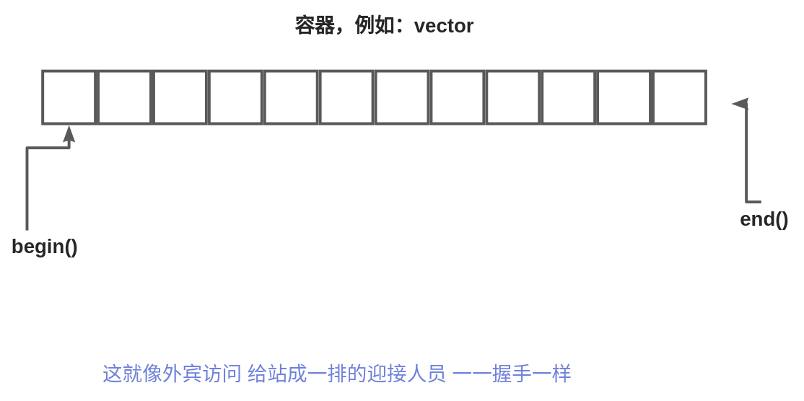
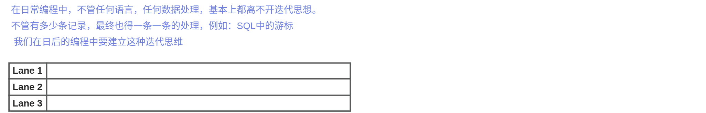

# 【05】迭代器
## 什么是迭代器

迭代器（Iterator）是一种设计模式，在编程中广泛用于遍历（迭代）集合（容器）中的元素，而不暴露集合的底层实现细节。在C++中，迭代器是一种特定类型的对象，用于在容器中遍历元素并访问它们。

  

迭代器可以看作是一个指向容器内元素的指针，允许您通过指针语法来访问容器中的元素，而不必关心容器的底层表示。它提供了一种通用的方式来遍历不同类型的容器，无论容器是数组、链表、集合还是映射。

  

C++标准库中的容器类（如 `std::vector`、`std::list`、`std::map` 等）都提供了迭代器，以便开发者可以方便地遍历容器中的元素。

  

以下是一个使用迭代器遍历 `std::vector` 的示例：

  

```C++
#include <iostream>
#include <vector>

int main() {
    std::vector<int> numbers = {1, 2, 3, 4, 5};

    // 使用迭代器遍历 vector
    for (std::vector<int>::iterator it = numbers.begin(); it != numbers.end(); ++it) {
        std::cout << *it << " "; // 通过迭代器访问元素
    }

    return 0;
}
```

  

在这个示例中，`numbers.begin()` 返回指向第一个元素的迭代器，`numbers.end()` 返回指向末尾的迭代器。通过迭代器可以逐个访问容器中的元素，即使容器的类型和实现细节不同。

  

C++11 引入了更简洁的迭代器语法，称为范围基于循环（Range-based for loop）。使用范围基于循环，遍历容器的代码可以更加简洁：

  

```C++
#include <iostream>
#include <vector>

int main() {
    std::vector<int> numbers = {1, 2, 3, 4, 5};

    // 使用范围基于循环遍历 vector
    for (const int& num : numbers) {
        std::cout << num << " ";
    }

    return 0;
}
```

  

迭代器是一个强大且灵活的概念，它使您能够在不同类型的容器上进行通用的遍历操作，提高了代码的可复用性和可维护性。


## 使用迭代器

end简称为尾后迭代器，它本身并没有实际意义，表示容器已经被遍历完了。

**如果容器为空，则begin()和end()返回的是同一个迭代器，都是尾后迭代器**

```cpp
int main() {
    string mystr = "hello world"; // 创建一个字符串 "hello world"
    auto b = mystr.begin();       // 获取字符串的起始迭代器
    auto e = mystr.end();         // 获取字符串的结束迭代器

    if (b != e) {
         //b++; //这里可以让指针向后移动一位
        *b = toupper(*b); // 将第一个字符转换为大写
        //*b = toupper(*b);
    }

    cout << mystr << endl; // 输出修改后的字符串

    return 0;
}
```
`b` 是一个迭代器，实际上在这个上下文中就是一个指针。迭代器是一种行为类似指针的对象，用于遍历容器中的元素。当您使用 `*b` 时，它实际上是在获取迭代器所指向的元素的值。

在这个代码片段中，`*b` 用于获取迭代器 `b` 所指向的字符（即字符串的第一个字符），然后对该字符应用 `toupper()` 函数将其转换为大写字母，并将结果存储回原位置。这就是为什么在这里使用 `*b`。

在C++中，通过解引用迭代器，您可以访问迭代器指向的元素，就像使用指针一样。这种机制使得使用迭代器来遍历容器变得更加方便。

!!! note
	我们认定一个类型是迭代器，当且仅当它支持一套操作。这套操作使得我们能够访问容器的元素，也可以从一个元素的访问跳转到对另外一个元素的访问。

## begin 和 end的运算

begin和end返回的类型由对象是否是常量而决定，如果对象是常量，begin和end返回的是 const_iterator,

否则返回iterator. 当只读不写时，建议采用 const_iterator 。C++11中专门为这种常量对象，提供了特有的迭代器。cbegin 和 cend.

```C++
vector<int> v;
const vector<int> cv;

auto it1=v.begin();
auto it2=cv.begin();
auto it3=cv.cbegin();
```

  

## 结合解引用和成员访问

通过`*t`的方式 可以对迭代容器成员进行访问。

```C++
(*t).empty(); //正确：判断元素是不是为空
*t.empty() //错误：小括号不能少
it->mem; //正确 成员访问  等同于（*t）.mem 
```

## 迭代器的运算

迭代器的递增运算，使得迭代器每次移动一个元素

```C++

int main()
{

	string mystr = "hello world";
	auto b = mystr.begin();
	auto e = mystr.end();
	if (b != e)
	{
		*b = toupper(*b);
		b += 3;
		*b = toupper(*b);
		b += -1;
		*b = toupper(*b);
	}
	cout << mystr << endl;

	return 0;
}
```

C++中的迭代器支持一系列运算，这些运算用于在容器中移动和操作迭代器。不同类型的迭代器支持不同的运算，以下是一些常见的迭代器运算：

  

1. **递增（Increment）：** 使用 `++` 运算符可以将迭代器移动到容器中的下一个位置。例如：`++it;`
2. **递减（Decrement）：** 适用于双向迭代器和随机访问迭代器，使用 `--` 运算符可以将迭代器移动到容器中的上一个位置。例如：`--it;`
3. **加法（Addition）：** 适用于随机访问迭代器，可以使用 `+` 运算符将迭代器移动到距离当前位置指定数量的位置。例如：`it = it + 3;`
4. **减法（Subtraction）：** 适用于随机访问迭代器，可以使用 `-` 运算符将迭代器向前移动指定数量的位置。例如：`it = it - 2;`
5. **比较运算符（Comparison Operators）：** 用于比较两个迭代器的相对位置。例如：`it1 == it2` 表示两个迭代器相等，`it1 < it2` 表示 `it1` 在 `it2` 之前。
6. **解引用（Dereference）：** 使用 `*` 运算符可以访问迭代器指向的元素。例如：`int value = *it;`
7. **成员访问（Member Access）：** 使用 `->` 运算符可以访问迭代器指向元素的成员（适用于迭代器指向对象的情况）。例如：`it->member;`
8. **距离计算（Distance Calculation）：** 适用于随机访问迭代器，可以使用 `std::distance()` 函数计算两个迭代器之间的距离。例如：`int dist = std::distance(it1, it2);`

  

需要注意的是，不同类型的迭代器支持不同的运算。递增和递减运算对于所有迭代器类型都是支持的，但加法、减法、比较运算符等可能仅适用于随机访问迭代器。在使用迭代器时，您应该根据迭代器的类型和容器的特性来选择适当的运算。

## 编程思想：迭代思想

