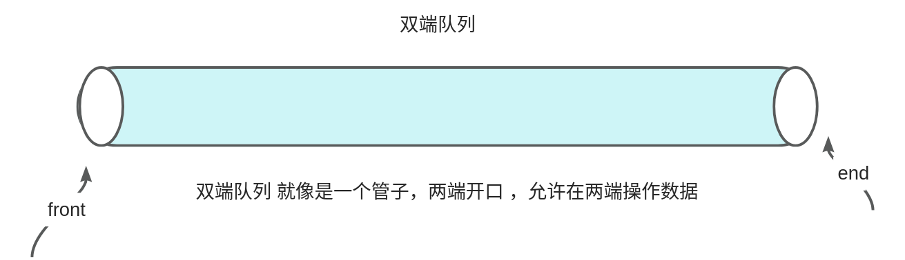
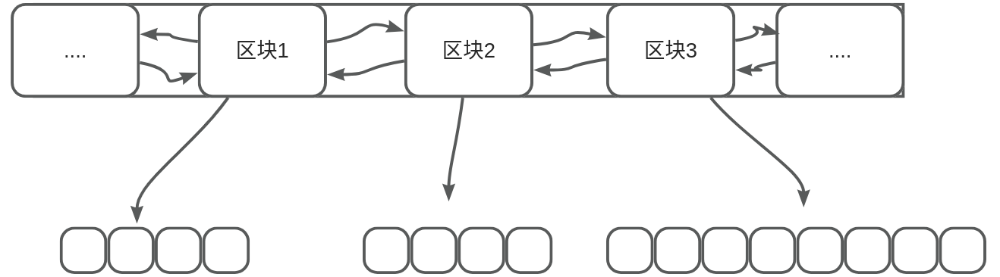

# 【06】deque
## 基本概念：

deque是双端队列（Double-Ended Queue）的缩写，是C++ STL（标准模板库）中的一种顺序容器。双端队列是一种特殊的队列，允许从队列的两端进行元素的插入和删除操作。deque（双端队列）支持在队列的前端和后端进行高效的插入和删除操作，因此具有较好的灵活性和效率。

## 1. 实现原理

deque（双端队列）是一种双向开口的连续线性存储结构，它允许在两端进行快速插入和删除操作，因此可以高效地实现队列、栈等数据结构。deque 是由一系列连续的内存块组成，每个内存块存储若干个元素，并且这些内存块是分散分布在内存中的。

!!! note
	每个区块的大小通常是固定的，具体的大小是由实现决定的，并且可以在不同的编译器和不同的标准库实现中有所不同。这个大小通常是根据平台的内存分配策略和性能优化考虑而确定的。

deque 的实现通常是通过一种叫做“分段连续空间”的数据结构来实现的。在这种结构中，deque 被划分为多个连续的内存块，每个内存块都是一个定长数组，用来存储元素。这些内存块以双向链接的方式组织在一起，形成一个双向链表，每个内存块都包含指向前一个和后一个内存块的指针。这种结构使得在两端进行快速插入和删除操作成为可能。



## 2. 定义与构造

在C++的deque中，有几种构造和赋值方法，我会列举一些常见的：

  

### 2.1. 构造方法：

  

1. **默认构造函数：**

```C++
std::deque<int> myDeque; // 创建一个空的deque
```

2. **带有初始元素个数和初始值的构造函数：**

```C++
std::deque<int> myDeque(5, 10); // 创建一个包含5个值为10的元素的deque
```

3. **使用迭代器范围构造函数：**

```C++
std::vector<int> vec = {1, 2, 3, 4, 5};
std::deque<int> myDeque(vec.begin(), vec.end()); // 使用vec中的元素来构造deque
```

  

### 2.2. 赋值方法：

  

1. **使用赋值操作符`=`**

```C++
std::deque<int> anotherDeque;
anotherDeque = myDeque; // 使用myDeque中的元素赋值给anotherDeque
```

2. **使用**`assign`**函数：**

```C++
std::deque<int> anotherDeque;
anotherDeque.assign(myDeque.begin(), myDeque.end()); // 使用myDeque中的元素赋值给anotherDeque
```

3. **使用`assign`函数进行重复赋值：**

```C++
std::deque<int> anotherDeque;
anotherDeque.assign(5, 10); // 将5个值为10的元素赋值给anotherDeque
```

这些是一些常见的构造和赋值方法，你可以根据需要选择适合你的情况的方法。

## 3. deque 的主要特点

1. **双向开口**：deque 允许在两端进行快速的插入和删除操作，因此可以高效地实现队列、栈等数据结构。
2. **动态扩展**：deque 在需要时可以动态地增加内存块，以容纳更多的元素，因此可以动态地扩展其容量。
3. **随机访问**：deque 支持随机访问，可以通过下标或迭代器直接访问任意位置的元素，时间复杂度为 O(1)。
4. **内存分配**：deque 采用分段连续空间的方式存储元素，可以有效地管理内存空间，减少内存碎片。

在C++中，vector和deque都是标准模板库（STL）中的容器，它们都可以用来存储一系列元素，但它们在内部实现和性能特征上有一些区别。

  

## 4. deque与vector的比较

### 4.1. 内部实现：

  

1. **vector：**

- 底层通过动态数组实现。
- 内部分配一块连续的内存区域，因此支持随机访问。
- 在末尾进行插入和删除操作效率较高，但在中间或头部插入/删除操作效率较低。

2. **deque：**

- 底层通过一系列固定大小的数组块实现。
- 允许在两端（头部和尾部）进行高效的插入和删除操作。
- 支持随机访问，但不像vector那样连续内存，因此在插入和删除操作上可能更加高效。

  

### 4.2. 性能特征：

  

1. **随机访问：**

- 对于随机访问，vector的性能优于deque，因为vector具有连续的内存存储，因此访问元素的时间复杂度为O(1)，而deque的时间复杂度为O(1)或更高。

2. **插入和删除操作：**

- 在末尾进行插入和删除操作时，vector和deque的性能相似，都为常数时间复杂度（摊销情况下）。
- 在中间或头部进行插入和删除操作时，deque的性能通常优于vector，因为deque允许在两端进行高效操作，而vector需要移动大量元素。

3. **内存分配：**

- vector在需要扩展容量时，可能需要重新分配内存并复制元素，这可能导致一些性能开销。
- deque的每个块都是固定大小的，因此它可能会频繁地分配和释放内存块，这可能会增加一些额外的开销。

  

### 4.3. 选择使用场景：

- 如果需要高效的随机访问，并且主要操作是在末尾进行插入和删除操作，那么vector可能更适合。
- 如果需要在两端进行高效的插入和删除操作，或者在中间进行频繁的插入和删除操作，那么deque可能更适合。deque在处理大量数据时，可能比vector更具性能优势。

  

## 5. deque 插入数据

```C++
#include <iostream>
#include <deque>

int main() {
    std::deque<int> mydeque = {1, 2, 3, 4, 5};

    // 在前端插入数据
    mydeque.push_front(0);

    // 在后端插入数据
    mydeque.push_back(6);

    // 在指定位置插入数据
    std::deque<int>::iterator it = mydeque.begin() + 2;
    mydeque.insert(it, 99);

    // 输出结果
    std::cout << "Deque elements after insertion:" << std::endl;
    for (int x : mydeque) {
        std::cout << x << " ";
    }
    std::cout << std::endl;

    return 0;
}
```

如果在双端队列的某个区块上进行插入操作时，发现该区块的内存空间不足以容纳新元素，就会导致内存不连续的问题。这种情况通常称为“分段内存分配”。

当双端队列的某个区块内存空间不足时，需要进行内存重新分配，通常的做法是创建一个新的区块，并将新元素插入到新的区块中。由于新的区块可能不与原来的区块相邻，因此就会导致双端队列的存储空间不连续。

在这种情况下，双端队列会保持其原有的双向链表结构，但可能会涉及到额外的内存分配和数据复制操作。这样的不连续性可能会影响双端队列的性能，因为在插入或删除元素时可能需要更多的时间来处理额外的内存分配和数据复制。

## 6. deque的排序

你可以使用标准库中的 `std::sort` 算法来对 `deque` 进行排序。`std::sort` 可以用于排序任何支持随机访问的容器，包括 `deque`。

  

下面是一个示例代码，演示如何对 `deque` 进行排序：

  

```C++
#include <iostream>
#include <deque>
#include <algorithm>

int main() {
    std::deque<int> myDeque = {5, 2, 9, 3, 7, 1};

    // 使用 std::sort 对 deque 进行排序
    std::sort(myDeque.begin(), myDeque.end());

    // 输出排序后的 deque 元素
    std::cout << "Sorted deque elements: ";
    for (const auto& elem : myDeque) {
        std::cout << elem << " ";
    }
    std::cout << std::endl;

    return 0;
}
```

  

在这个示例中，我们首先定义了一个 `deque`，然后使用 `std::sort` 对其进行排序。最后，我们输出排序后的 `deque` 元素。

  

请注意，`std::sort` 会对 `deque` 进行原地排序，因此它将修改原始容器，而不会创建新的排序后容器。

## 7. 删除数据

```C++
#include <iostream>
#include <deque>

int main() {
    std::deque<int> mydeque = {1, 2, 3, 4, 5};

    // 删除前端的数据
    mydeque.pop_front();

    // 删除后端的数据
    mydeque.pop_back();

    // 删除指定位置的数据
    std::deque<int>::iterator it = mydeque.begin() + 1; // 删除第二个元素
    mydeque.erase(it);

    // 输出结果
    std::cout << "Deque elements after deletion:" << std::endl;
    for (int x : mydeque) {
        std::cout << x << " ";
    }
    std::cout << std::endl;

    return 0;
}
```

当在双端队列的某个区块上删除数据时，会根据删除的位置和情况，可能会触发以下几种情况：

1. **删除元素，但不释放内存**：如果删除的元素并不是该区块的最后一个元素，那么只需要简单地将目标位置上的元素删除，并将后续的元素向前移动以填补删除的空位。这样做不会涉及到内存释放的操作，只是修改了元素的位置。
2. **释放内存，合并区块**：如果删除的元素是该区块的最后一个元素，并且该区块是队列的最后一个区块，那么可能会触发内存释放和区块合并的操作。在这种情况下，会释放最后一个区块的内存，并将该区块从双端队列中移除。如果删除的区块之前还有其他区块，则可能会将相邻的区块合并成一个区块，以减少内存碎片的产生。
3. **重新分配内存**：在一些特殊情况下，可能会涉及到重新分配内存的操作。例如，如果删除元素后，某个区块的剩余空间超过了一定的阈值，可以考虑将该区块的内存空间缩小，以减少内存的浪费。

## 8. 常用的成员函数

下表总结了 `std::deque` 常用的成员函数及其作用和含义：

| 成员函数           | 作用和含义                               |
| -------------- | ----------------------------------- |
| `push_back()`  | 在双端队列的末尾插入一个元素。                     |
| `push_front()` | 在双端队列的开头插入一个元素。                     |
| `pop_back()`   | 移除双端队列末尾的元素。                        |
| `pop_front()`  | 移除双端队列开头的元素。                        |
| `insert()`     | 在指定位置插入一个或多个元素。                     |
| `erase()`      | 删除指定位置或指定范围内的一个或多个元素。               |
| `clear()`      | 清空双端队列，移除所有元素。                      |
| `size()`       | 返回双端队列中的元素个数。                       |
| `empty()`      | 检查双端队列是否为空，如果为空则返回 true，否则返回 false。 |
| `front()`      | 返回双端队列中的第一个元素的引用。                   |
| `back()`       | 返回双端队列中的最后一个元素的引用。                  |
| `at()`         | 返回双端队列中指定位置的元素的引用，并进行边界检查。          |
| `operator[]()` | 返回双端队列中指定位置的元素的引用，不进行边界检查。          |
| `begin()`      | 返回指向双端队列中第一个元素的迭代器。                 |
| `end()`        | 返回指向双端队列中最后一个元素的下一个位置的迭代器。          |
| `rbegin()`     | 返回指向双端队列中最后一个元素的逆向迭代器。              |
| `rend()`       | 返回指向双端队列中第一个元素的前一个位置的逆向迭代器。         |
| `resize()`     | 更改双端队列的大小。                          |
| `swap()`       | 交换两个双端队列的内容。                        |

这些成员函数可以用于对双端队列进行元素的插入、删除、访问、修改、大小调整等操作，提供了对双端队列进行灵活操作的接口。

## 9. 什么是随机 什么是不随机

随机访问迭代器是一种迭代器类型，具有一些特定的特性，而不支持随机访问的容器则可能具有不同的特性。 at

### 9.1. 随机访问迭代器的特性：

1. **常数时间复杂度的随机访问：** 随机访问迭代器支持在常数时间复杂度内对容器中的任意元素进行访问，这意味着通过迭代器可以直接访问容器中的任何元素，而不需要进行线性搜索。
2. **支持算术操作：** 随机访问迭代器支持算术操作，如加法（**+**）、减法（**-**）、自增（**++**）、自减（**--**）等，以及比较操作（**<**、**>**、**<=**、**>=**）。
3. **支持距离计算：** 随机访问迭代器支持 **std::distance** 函数，可以计算两个迭代器之间的距离，即在容器中的元素个数。
4. **元素直接访问：** 随机访问迭代器支持通过下标操作符（**[]**）直接访问容器中的元素。

### 9.2. 不支持随机访问的容器的特性：

1. **线性访问：** 不支持随机访问的容器可能只支持线性访问，即只能按顺序访问容器中的元素，不能在常数时间复杂度内直接访问任意元素。
2. **限制的迭代器操作：** 不支持随机访问的容器可能不支持一些高级的迭代器操作，如算术操作、距离计算等。
3. **插入和删除效率可能较低：** 不支持随机访问的容器可能对于插入和删除操作的效率不如支持随机访问的容器高，因为它们可能需要在容器中进行线性搜索来找到插入或删除位置。你可以通过查看容器的迭代器类型来确定容器是否支持随机访问。在C++中，可以使用 `std::iterator_traits` 模板类来获取迭代器的属性，其中的 `std::iterator_traits::iterator_category` 可以告诉你迭代器的类型。随机访问迭代器的类型是 `std::random_access_iterator_tag`。

  

下面是一个示例，演示如何检查一个容器是否支持随机访问：

  

```C++
#include <iostream>
#include <vector>
#include <deque>
#include <array>
#include <iterator>

template<typename Container>
void checkRandomAccess(Container& cont) {
    // 使用 std::iterator_traits 获取迭代器类型
    typename std::iterator_traits<typename Container::iterator>::iterator_category cat;
    
    // 检查迭代器类型是否为随机访问迭代器
    if (std::is_same<cat, std::random_access_iterator_tag>::value) {
        std::cout << "Container supports random access." << std::endl;
    } else {
        std::cout << "Container does not support random access." << std::endl;
    }
}

int main() {
    std::vector<int> vec;
    std::deque<int> deq;
    std::array<int, 5> arr;

    std::cout << "Checking vector: ";
    checkRandomAccess(vec);

    std::cout << "Checking deque: ";
    checkRandomAccess(deq);

    std::cout << "Checking array: ";
    checkRandomAccess(arr);

    return 0;
}
```

  

在这个示例中，我们定义了一个函数 `checkRandomAccess`，该函数接受一个容器作为参数，并通过迭代器类型来检查容器是否支持随机访问。然后，在 `main` 函数中，我们分别对 `std::vector`、`std::deque` 和 `std::array` 进行了检查。根据输出，你可以确定每个容器是否支持随机访问。

## 10. 容器&适配器

以下是使用表格形式回答你的问题：

| 真正的容器               | 描述                      |
| ------------------- | ----------------------- |
| `std::vector`       | 动态数组，支持随机访问。            |
| `std::deque`        | 双端队列，支持随机访问和双端高效操作。     |
| `std::list`         | 双向链表，支持双向迭代和高效的插入和删除操作。 |
| `std::forward_list` | 单向链表，支持单向迭代和高效的插入和删除操作。 |
| `std::array`        | 固定大小的数组，支持随机访问。         |

|   |   |
|---|---|
|容器适配器|描述|
|`std::stack`|栈，提供后进先出（LIFO）的操作接口。默认使用 `std::deque`<br><br>作为底层容器。|
|`std::queue`|队列，提供先进先出（FIFO）的操作接口。默认使用 `std::deque`<br><br>作为底层容器。|
|`std::priority_queue`|优先队列，按照一定顺序进行元素的插入和弹出操作。默认使用 `std::vector`<br><br>作为底层容器。|


以上表格列出了STL中真正的容器和容器适配器，以及它们的描述。这些容器和容器适配器提供了不同的数据组织方式和操作接口，可根据需求选择合适的容器类型。容器适配器提供了一种简单的方式来访问现有容器的功能，并通过限制或扩展底层容器的某些操作来实现特定的行为。
