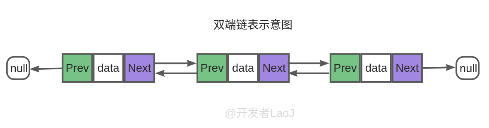
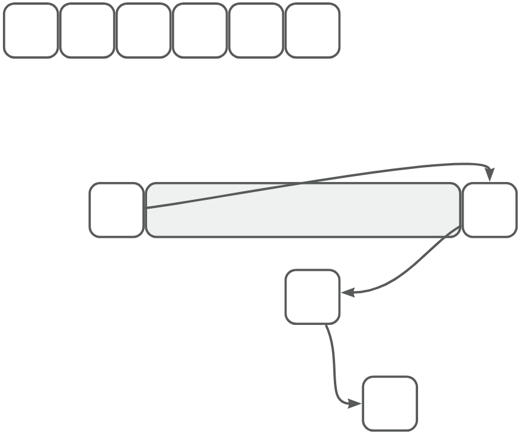

# 【07】list
## 1. list的概念

std::list是C++标准模板库（STL）中的一种双向链表数据结构。与数组和向量（vector）不同，list中的元素不是存储在连续的内存空间中，而是分散存储，并通过指针或迭代器链接在一起。每个元素都包含指向其前一个元素和后一个元素的指针，这使得在list中进行插入和删除操作变得非常高效。

## 2. list的实现原理

list的实现主要依赖于节点（node）的概念。每个节点包含两部分：数据部分和指针部分。数据部分存储实际的值，而指针部分则包含指向下一个和上一个节点的指针。通过这种方式，所有的节点都被链接在一起，形成一个双向链表。

## 3. list的特点

1. **动态大小**：list的大小可以在运行时动态改变，无需预先分配固定大小的内存。
2. **双向迭代**：可以通过迭代器在list中向前或向后遍历元素。
3. **高效插入和删除**：在list中的任何位置插入或删除元素都只需要改变相邻元素的指针，时间复杂度为O(1)。
4. **非连续内存**：list中的元素不存储在连续的内存中，这有助于在内存碎片较多的环境中更有效地管理内存。

## 4. list与vector的区别

1. **内存布局**：vector的元素存储在连续的内存空间中，而list的元素则分散存储。

2. **插入和删除操作**：在vector的中间位置插入或删除元素需要移动大量的元素，因此时间复杂度较高（O(n)）。而在list中，这些操作只需要改变相邻节点的指针，时间复杂度为O(1)。
3. **访问元素**：由于vector的元素存储在连续的内存中，因此可以通过下标直接访问任何元素，时间复杂度为O(1) 。而在list中，访问元素需要通过迭代器逐步遍历，时间复杂度为O(n)。
4. **空间效率**：vector在动态调整大小时可能会进行内存分配和释放，这可能导致一定的空间浪费。而list则不需要预先分配固定大小的内存，因此空间效率更高。

## 5. 常用的成员函数

1. begin() 和 end()：返回指向list第一个元素和最后一个元素之后位置的迭代器。
2. rbegin() 和 rend()：返回指向list最后一个元素和第一个元素之前位置的反向迭代器。
3. size()：返回list中元素的数量。
4. empty()：检查list是否为空。
5. front() 和 back()：返回对list中第一个和最后一个元素的引用。
6. push_front() 和 pop_front()：在list的开头插入和删除元素。
7. push_back() 和 pop_back()：在list的末尾插入和删除元素。
8. insert()：在list的指定位置插入一个或多个元素。
9. erase()：删除list中的一个或多个元素。
10. clear()：删除list中的所有元素。
11. splice()：将另一个list中的一个或多个元素移动到当前list的指定位置。
12. sort()：对list中的元素进行排序。
13. unique()：删除list中连续的重复元素。
14. merge()：合并两个已排序的list。
15. reverse()：反转list中元素的顺序。

以上就是关于C++ STL中list的基本概念、特点、实现原理以及与vector的区别和常用成员函数的介绍。希望这份讲义能帮助学生更好地理解和使用list。

## 6. 代码样例

当然可以，以下是std::list中insert(), unique(), merge(), splice(), 和 sort() 成员函数的代码样例：

### insert()

```C++
#include <iostream>  
#include <list>  
  
int main() {  
    std::list<int> myList = {1, 2, 4, 5};  
  
    // 在位置2插入元素3  
    auto it = myList.begin();  
    std::advance(it, 2); // 将迭代器向前移动2个位置  
    myList.insert(it, 3); // 在该位置插入元素3  
  
    // 输出: 1 2 3 4 5  
    for (int num : myList) {  
        std::cout << num << ' ';  
    }  
    std::cout << std::endl;  
  
    return 0;  
}
```

### unique()

```C++
#include <iostream>  
#include <list>  
#include <algorithm>  
  
int main() {  
    std::list<int> myList = {1, 2, 2, 3, 3, 3, 4};  
  
    // 删除连续的重复元素  
    myList.unique();  
  
    // 输出: 1 2 3 4  
    for (int num : myList) {  
        std::cout << num << ' ';  
    }  
    std::cout << std::endl;  
  
    return 0;  
}
```

### merge()

```C++

#include <iostream>  
#include <list>  
#include <algorithm>  
  
int main() {  
    std::list<int> list1 = {1, 3, 5};  
    std::list<int> list2 = {2, 4, 6};  
  
    // 假设list1和list2已排序  
    list1.merge(list2); // 合并两个已排序的list  
  
    // 输出: 1 2 3 4 5 6  
    for (int num : list1) {  
        std::cout << num << ' ';  
    }  
    std::cout << std::endl;  
  
    return 0;  
}
```

### splice()

```C++
#include <iostream>  
#include <list>  
  
int main() {  
    std::list<int> list1 = {1, 2, 3, 4, 5};  
    std::list<int> list2;  
  
    // 将list1中的第2个到第4个元素移动到list2的开始位置  
    auto it = list1.begin();  
    std::advance(it, 1); // 移动到第2个元素  
    list2.splice(list2.begin(), list1, it, std::next(it, 3));  
  
    // list1现在包含: 1 5  
    // list2现在包含: 2 3 4  
  
    // 输出list1  
    for (int num : list1) {  
        std::cout << num << ' ';  
    }  
    std::cout << std::endl;  
  
    // 输出list2  
    for (int num : list2) {  
        std::cout << num << ' ';  
    }  
    std::cout << std::endl;  
  
    return 0;  
}
```

### sort()

```C++
#include <iostream>  
#include <list>  
#include <algorithm>  
  
int main() {  
    std::list<int> myList = {5, 2, 4, 1, 3};  
  
    // 对list进行排序  
    myList.sort();  
  
    // 输出: 1 2 3 4 5  
    for (int num : myList) {  
        std::cout << num << ' ';  
    }  
    std::cout << std::endl;  
  
    return 0;  
}
```

这些代码样例展示了如何使用std::list中的insert(), unique(), merge(), splice(), 和 sort() 成员函数。注意，在使用merge()函数时，需要确保两个列表都已经排序，否则结果将不是预期的排序列表。同样，unique()函数只删除连续的重复元素，如果列表中的重复元素不是连续的，那么它们将不会被删除。在使用splice()时，需要特别注意迭代器的位置，以避免错误地移动元素。