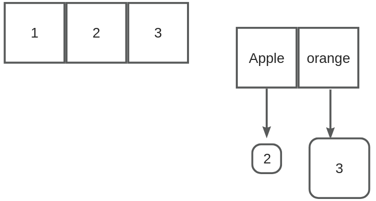
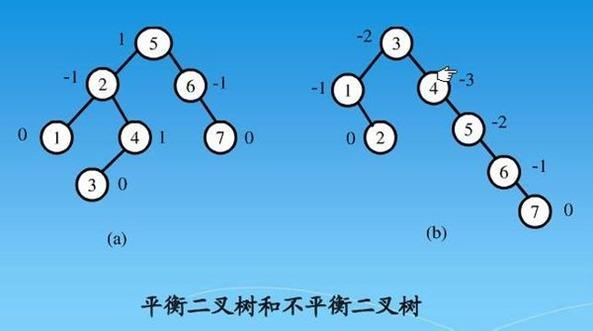
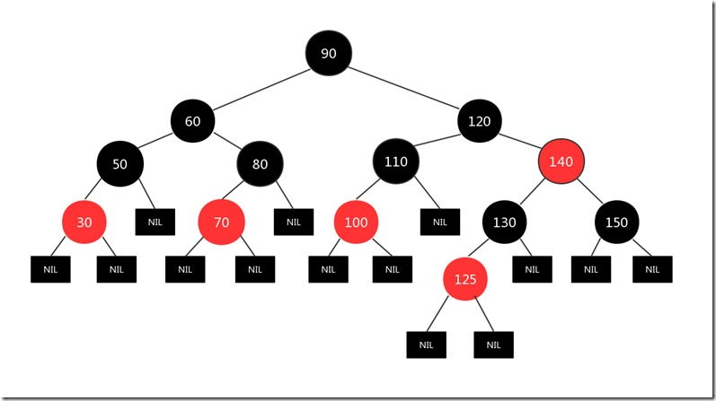

# 【08】Map容器
## 1. Map的概念

STL Map是C++标准模板库（Standard Template Library）中的一个关联容器，它存储的元素都是键值对(key-value)，并且根据键的值自动排序。在Map中，键值(key)是唯一的，每个键最多只能对应一个值(value)。Map的内部实现通常是一个红黑树，因此插入、删除和查找操作的时间复杂度都是O(log n)。

## 2. 底层原理

std::map 在 C++ STL（Standard Template Library）中的底层实现通常是一个平衡搜索树，具体来说，最常用的是红黑树（Red-Black Tree）。红黑树是一种自平衡的二叉搜索树，它通过对树进行着色和旋转等操作，来保持树的平衡性，从而在插入、删除和查找操作中都能保持相对稳定的对数时间复杂度。

平衡二叉树和红黑树都是用于实现高效查找、插入和删除操作的树形数据结构，但它们之间存在一些关键差异，这些差异决定了在特定场景下选择使用哪一种结构更为合适。

**什么是平衡二叉树：**

平衡二叉树，如AVL树，是一种严格平衡的二叉搜索树。它要求每个节点的左右子树的高度差最多为1，这确保了树的高度与节点数目的对数成比例，从而保证了查找、插入和删除操作的时间复杂度都是O(log n)。然而，维持这种严格的平衡需要付出一定的代价。在每次插入或删除节点时，可能需要通过旋转和重构操作来调整树的结构，以确保平衡。


**什么是红黑树：**

红黑树则是一种相对平衡的二叉搜索树。它放宽了平衡性的要求，允许树在某种程度上“不那么平衡”。红黑树通过颜色和旋转操作来保持树的平衡性，这种平衡性足以保证查找、插入和删除操作的时间复杂度也是O(log n)。与平衡二叉树相比，红黑树的实现更简单，插入和删除操作的开销也相对较低。
红黑树的特性包括：

1. 每个节点要么是红色，要么是黑色。
2. 根节点是黑色。
3. 所有叶子节点（NIL或空节点）是黑色。
4. 如果一个节点是红色的，则它的两个子节点都是黑色的（从每个叶子到根的所有路径上不能有两个连续的红色节点）。
5. 对于每个节点，从该节点到其所有后代叶子节点的简单路径上，均包含相同数目的黑色节点。

这些特性保证了红黑树在动态数据插入、删除和搜索时都能保持较快的性能。

在 std::map 中，键（key）用来在红黑树中排序和定位元素，而值（value）与键相关联并存储在相应的节点中。当向 map 插入元素时，红黑树会根据键的值进行排序并相应地调整树的结构以保持平衡。同样，删除和查找操作也会利用红黑树的特性来高效地定位元素。

!!! note
	那么，有了平衡二叉树为什么还要红黑树呢？这主要源于红黑树的以下优势：

	实现简单性：红黑树的平衡性要求相对宽松，这使得其实现比平衡二叉树更简单。在实践中，红黑树的代码通常更短、更易于理解和维护。

	性能稳定性：虽然平衡二叉树在理论上具有更严格的平衡性，但在实际应用中，红黑树的性能通常更为稳定。红黑树的平衡性调整策略使其在插入和删除操作中能够保持相对稳定的性能。

	应用场景广泛性：红黑树由于其简单性和性能稳定性，在多种场合得到了广泛应用。例如，在C++的STL库中，map和set容器的底层实现通常使用红黑树。此外，红黑树也常用于内核模块、数据库索引等场景。
## 3. Map的基本操作

1. 包含头文件

```C++
#include <map>  
using namespace std;
```

2. 声明Map

```C++
map<string, int> map_name;  //STL
```

其中，key_type是键的类型，value_type是值的类型。

3. 插入元素

```C++
map_name[key] = value;
```

或者

```C++
map_name.insert(pair<key_type, value_type>(key, value));
```

4. 访问元素

```C++
value_type value = map_name["apple"];
```

如果key不存在，会创建一个新的键值对，其中value被初始化为value_type的默认值。

5. 删除元素

```C++
map_name.erase(key);
```

6. 查找元素

```C++

map<key_type, value_type>::iterator it = map_name.find(key);  
if (it != map_name.end()) {  
    // 找到元素  
} else {  
    // 没找到元素  
}
```

7. 遍历元素

```C++

for (map<key_type, value_type>::iterator it = map_name.begin(); it != map_name.end(); ++it) {  
    key_type key = it->first;  
    value_type value = it->second;  
    // 处理键值对  
}
```

或者使用C++11的基于范围的for循环：

```C++
for (const auto &pair : map_name) {  
    key_type key = pair.first;  
    value_type value = pair.second;  
    // 处理键值对  
}
```

## 4. Map的高级特性

1. 自定义排序  
	默认情况下，Map中的元素会根据键的值进行升序排序。如果需要自定义排序规则，可以通过提供自定义的比较函数或函数对象作为Map的第二个模板参数来实现。

```C++
struct Compare {  
    bool operator()(const key_type& a, const key_type& b) const {  
        // 自定义比较逻辑  
    }  
};  
  
map<key_type, value_type, Compare> map_name;
```

2. Map的大小  
    可以使用size()函数获取Map中元素的数量。

```C++
size_t size = map_name.size();
```

3. 判断Map是否为空  
    可以使用empty()函数判断Map是否为空。

```C++
if (map_name.empty()) {  
    // Map为空  
} else {  
    // Map不为空  
}
```

## 5. 示例

```C++
#include <iostream>  
#include <map>  
#include <string>  
  
using namespace std;  
  
int main() {  
    // 声明一个存储字符串到整数的映射的Map  
    map<string, int> wordCount;  
  
    // 插入元素  
    wordCount["apple"] = 3;  
    wordCount["banana"] = 2;  
    wordCount["cherry"] = 5;  
  
    // 访问元素  
    cout << "Number of apples: " << wordCount["apple"] << endl;  
  
    // 遍历元素  
    for (const auto &pair : wordCount) {  
        cout << pair.first << ": " << pair.second << endl;  
    }  
  
    // 删除元素  
    wordCount.erase("banana");  
  
    // 判断Map是否为空  
    if (wordCount.empty()) {  
        cout << "Map is empty." << endl;  
    } else {  
        cout << "Map is not empty." << endl;  
    }  
  
    return 0;  
}
```

## 6. 注意事项

- Map的键是唯一的，不能有重复的键。
- 如果在访问不存在的键时，使用map_name[key]会创建一个新的键值对，其中value被初始化为value_type的默认值。如果只是想检查键是否存在而不创建新的键值对，应该使用find()函数。
- Map的内部实现是红黑树