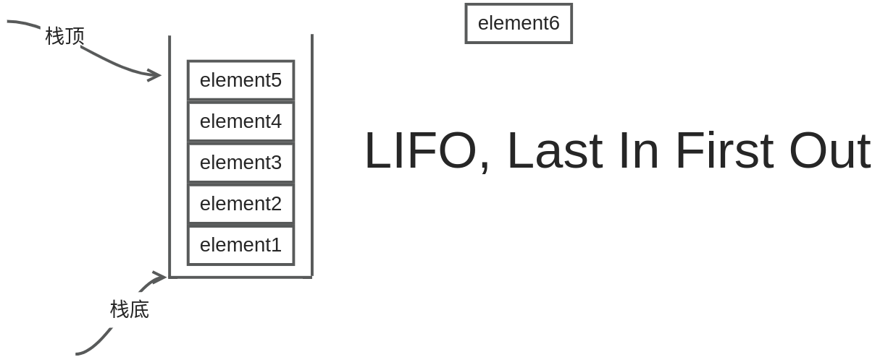
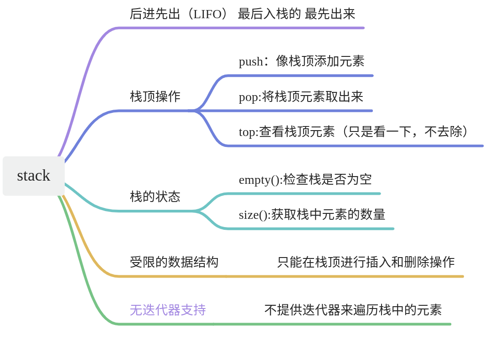

# 【10】stack容器

### stack容器概述

stack（栈）是一种后进先出（LIFO, Last In First Out）的数据结构。你可以将元素压入（push）栈顶，或者从栈顶弹出（pop）元素。栈顶元素总是最后被压入的那个元素，因此也是第一个被弹出的元素。此外，你还可以查看（peek）栈顶的元素，而不将其从栈中移除。


### stack的特性

### stack容器的使用

在C++的STL中，stack容器是一个模板类，定义在头文件`<stack>`中。你可以这样声明一个stack：
```cpp
//首先的引入下面这个
#include <stack>  
  
std::stack<int> intStack;  // 声明一个int类型的栈
```

这里，我们声明了一个int类型的栈intStack。当然，你也可以将栈的元素类型替换为其他类型，比如自定义的类或结构体。

### stack容器的常用操作

1. **push(element)**：将元素压入栈顶。

```C++
intStack.push(5);  // 将整数5压入栈顶
```

2. **pop()**：弹出栈顶元素。这个操作不会返回被弹出的元素，但会修改栈的内容。

```C++
intStack.pop();  // 弹出栈顶元素
```

3. **top()**：返回栈顶元素的引用，但不弹出它。

```C++
int topElement = intStack.top();  // 获取栈顶元素的值
```

4. **empty()**：检查栈是否为空。如果栈为空，返回true；否则返回false。

```C++
if (intStack.empty()) {  
    // 栈为空的处理逻辑  
}
```

5. **size()**：返回栈中元素的个数。

```C++
size_t stackSize = intStack.size();  // 获取栈的大小
```

### 注意事项

- stack容器内部通常使用deque或list等容器作为其底层实现，因此它继承了这些容器的特性。但是，你不需要（也不应该）直接访问或修改stack的内部实现。
- stack容器不提供迭代器支持，因为栈是一种受限的数据结构，只允许在栈顶进行插入和删除操作。
- 在使用stack容器时，要特别注意不要访问或操作已经弹出的元素，因为这可能会导致未定义的行为。

**我所说的“尝试访问已经弹出的元素”是指在弹出元素之后，如果试图访问该元素的原始内存位置（即不再指向栈顶元素的内存位置），或者错误地假设弹出的元素仍然存在于栈中，这将会导致问题。实际上，在C++的stack容器中，一旦元素被弹出，就不能通过任何方式再次访问它，因为stack没有提供这样的机制。**

### 成员函数和示例代码

以下是一个更详细的stack容器成员函数列表，包括了常见的以及不那么常用的成员函数：

| **成员函数**                  | **描述**                               |
| ------------------------- | ------------------------------------ |
| push(const T& value)      | 将一个元素压入栈顶。                           |
| pop()                     | 移除栈顶的元素。                             |
| top()                     | 返回栈顶元素的引用。                           |
| empty()                   | 检查栈是否为空。如果为空，返回true；否则返回false。       |
| size()                    | 返回栈中元素的数量。                           |
| operator=                 | 赋值操作符，用于将一个stack对象的内容复制到另一个stack对象。  |
| stack()                   | 默认构造函数，创建一个空的stack对象。                |
| stack(const stack& other) | 拷贝构造函数，创建一个新的stack对象，作为现有stack对象的副本。 |
| ~stack()                  | 析构函数，释放stack对象占用的内存。                 |

下面是一个简单的示例代码，展示了如何使用stack容器：

```C++
#include <iostream>  
#include <stack>  //引入
  
int main() {  
    std::stack<int> intStack;  //定义
  
    // 压入元素  
    intStack.push(1);  
    intStack.push(2);  
    intStack.push(3);  
  
    // 输出栈的大小  
    std::cout << "Stack size: " << intStack.size() << std::endl;  
  
    // 弹出并输出栈顶元素   事实上是在出栈
    while (!intStack.empty()) {  
        std::cout << intStack.top() << " ";  
        intStack.pop();  
    }  
    
    std::cout << std::endl;  
  
    // 输出栈的大小（此时应为0）  
    std::cout << "Stack size after popping all elements: " << intStack.size() << std::endl;  
  
    return 0;  
}
```