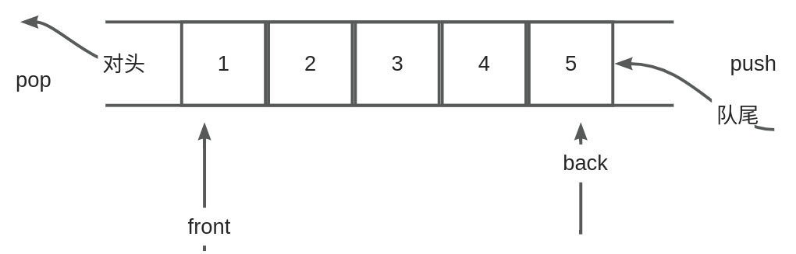

# 【11】queque

1. queue容器概述  
queue（队列）是一种先进先出（FIFO - First In First Out）的数据结构。在C++的STL（Standard Template Library）中，queue是一个容器适配器，它基于底层容器（如deque、list等）实现了一个队列。默认情况下，queue的底层容器是deque。

2. 基本操作  
    构造函数：queue() 默认构造函数，创建一个空的队列。  
    入队操作：push(const value_type& val) 在队列尾部插入一个元素。  
    出队操作：pop() 移除队列头部的元素。  
    访问队首元素：front() 返回队列头部的元素（但不移除）。  
    访问队尾元素：back() 返回队列尾部的元素（但不移除）。  
    判断队列是否为空：empty() 如果队列为空，则返回true。  
    获取队列的大小：size() 返回队列中的元素数量。
3. 示例代码

```C++
#include <iostream>  
#include <queue>  //引入
  
int main() {  
    std::queue<int> myQueue;  
  
    // 插入元素  
    myQueue.push(1);  
    myQueue.push(2);  
    myQueue.push(3);  
  
    // 检查队列大小  
    std::cout << "Queue size: " << myQueue.size() << std::endl;  
  
    // 访问队列头部元素  
    std::cout << "Front element: " << myQueue.front() << std::endl;  
  
    // 删除队列头部元素  
    myQueue.pop();  
  
    // 再次检查队列大小  
    std::cout << "Queue size after pop: " << myQueue.size() << std::endl;  
  
    return 0;  
}
```

4. 注意事项  
    queue不提供迭代器，因为它只支持在队列的头部和尾部进行插入和删除操作。  
    queue的front()和back()成员函数返回的是对元素的引用（const reference对于const queue），这意味着你不能直接修改队列中的元素（除非它是可修改的引用类型）。  
    由于queue是FIFO数据结构，因此你不能从队列的中间插入或删除元素。
5.  std::queue的成员函数：

|   |   |
|---|---|
|**成员函数**|**描述**|
|queue()|默认构造函数，创建一个空的队列|
|queue(const queue& q)|拷贝构造函数，创建一个与q相同的队列|
|queue(const allocator_type& alloc)|使用指定的分配器创建空的队列|
|~queue()|析构函数，销毁队列并释放其内存|
|queue& operator=(const queue& q)|赋值操作符，将q的内容复制到当前队列|
|size_type size() const noexcept|返回队列中元素的数量|
|bool empty() const noexcept|如果队列为空，则返回true|
|const_reference front() const|返回队列头部元素的常量引用|
|const_reference back() const|返回队列尾部元素的常量引用|
|void push(const value_type& val)|在队列尾部插入元素val|
|void push(value_type&& val)|移动语义版本的push，在队列尾部插入元素val|
|void pop()|删除队列头部的元素|
|void swap(queue& x) noexcept|交换两个队列的内容|

注意：

- value_type 是队列中元素的类型。
- size_type 是一个无符号整数类型，用于表示队列的大小。
- const_reference 是一个到value_type的常量引用类型。
- std::queue不提供直接访问队列中元素的迭代器或返回非常量引用的成员函数，因为它的设计目标是提供严格的队列语义。
- allocator_type 是队列使用的分配器类型，它默认是std::allocator。

  

queue与deque的异同点：

|   |   |   |
|---|---|---|
|**特性/功能**|**queue**|**deque**|
|**基本概念**|队列（Queue）|双端队列（Double-Ended Queue）|
|**数据结构**|先进先出（FIFO）|可以在两端插入和删除元素|
|**用途**|通常用于需要保持元素顺序的场合，如任务队列、消息队列等|适用于需要频繁在两端进行操作的场合，如滑动窗口、环形缓冲区等|
|**接口**|push()（入队）|push_front()（前端插入）|
||pop()（出队）|pop_front()（前端删除）|
||front()（队头元素）|front()（前端元素）|
||back()（队尾元素）|back()（后端元素）|
||empty()（是否为空）|empty()（是否为空）|
||size()（元素数量）|size()（元素数量）|
|**默认容器**|通常是deque|无默认容器，直接使用deque类|
|**修改元素**|不直接支持修改队中元素（除非先弹出再入队）|支持直接访问和修改元素|
|**线程安全**|本身不是线程安全的，但在多线程环境中使用时需要额外同步机制|本身不是线程安全的，但在多线程环境中使用时需要额外同步机制|
|**示例场景**|1. 消息队列处理|1. 滑动窗口计算|
||2. 任务调度|2. 环形缓冲区|
||3. 广度优先搜索|3. 双端插入/删除操作|

请注意，虽然queue和deque在功能上有所不同，但它们都是STL（Standard Template Library）中的容器适配器，用于封装和简化底层容器的使用。在大多数情况下，queue使用deque作为其默认底层容器，但这不是必需的，queue也可以与其他容器（如list）一起使用（尽管这可能会影响性能）。