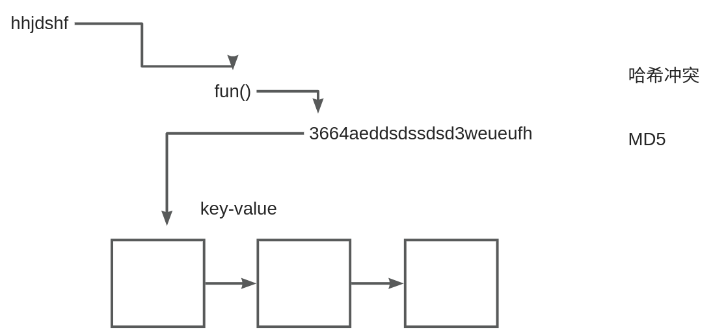

# 【12】unordered_map 和 unordered_set


STL（Standard Template Library，标准模板库）中的容器大致可以分为几大类，包括序列容器、关联容器和其他容器。以下是这些容器的列表，以表格形式呈现：

|   |   |
|---|---|
|**容器类型**|**描述**|
|序列容器||
|vector|可变大小数组，支持快速随机访问元素，但在尾部之外的位置插入或删除元素可能较慢|
|deque|双端队列，支持在头尾快速插入/删除元素|
|list|双向链表，支持在任何位置快速插入/删除元素，但不支持快速随机访问|
|forward_list|单向链表，功能与list类似，但更节省空间|
|array|固定大小的数组，支持快速随机访问元素，但无法改变大小|
|string|专门用于处理字符串的容器，可视为字符的vector|
|关联容器||
|set|集合，包含唯一元素的容器，自动排序元素|
|multiset|允许包含重复元素的集合|
|map|键值对映射，键是唯一的，自动排序键|
|multimap|允许键重复的键值对映射|
|unordered_set|不排序的集合，使用哈希表实现快速查找|
|unordered_multiset|不排序且允许重复元素的集合|
|unordered_map|不排序的键值对映射，使用哈希表实现快速查找|
|unordered_multimap|不排序且允许键重复的键值对映射|
|其他容器||
|stack|后进先出（LIFO）的容器适配器|
|queue|先进先出（FIFO）的容器适配器|
|priority_queue|允许用户自定义比较函数的队列，元素总是按优先级顺序出队|
|valarray|数值数组，支持数学运算|
|bitset|固定大小的位集合，用于处理位运算|

这些容器提供了C++程序设计中常用的数据结构，可以根据具体需求选择合适的容器来使用。
### std::unordered_map

#### 概念

std::unordered_map 是一个无序的关联容器。

#### 底层实现原理


std::unordered_map 的底层实现基于哈希表。每个键值对通过哈希函数被映射到一个桶（bucket）中。桶实际上是一个链表，用于处理哈希冲突（即不同键具有相同哈希值的情况）。当插入一个键值对时，首先通过哈希函数计算出键的哈希值，然后定位到对应的桶，最后将这个键值对添加到桶的链表中。查找和删除操作也类似，首先通过哈希函数找到桶，然后在桶的链表中查找或删除相应的键值对。

#### 代码样例

```C++
#include <iostream>  
#include <unordered_map>  
  
int main() {  
    std::unordered_map<std::string, int> word_counts;  
    word_counts["apple"] = 3;  
    word_counts["banana"] = 2;  
    word_counts["apple"]++; // 更新apple的计数  
  
    // 查找  
    if (word_counts.find("banana") != word_counts.end()) {  
        std::cout << "Banana count: " << word_counts["banana"] << std::endl;  
    }  
  
    // 遍历  
    for (const auto& pair : word_counts) {  
        std::cout << pair.first << ": " << pair.second << std::endl;  
    }  
  
    return 0;  
}
```

#### 使用场景

1. 需要快速查找、插入和删除键值对的场景，如缓存系统、数据库索引等。
2. 存储从名称到对象的映射，如字符串到整数的映射、用户ID到用户信息的映射等。

#### 注意事项

1. 键的类型需要支持哈希函数和相等比较操作。
2. 哈希函数的选择对性能有重要影响，应尽量避免哈希冲突。
3. 插入和删除操作可能会导致容器的重新哈希（rehashing），这是一个相对耗时的操作。因此，在需要频繁插入和删除的场景中，可能需要考虑其他数据结构或优化策略。

### std::unordered_set

#### 概念

std::unordered_set 是一个无序的关联容器，它包含唯一的元素，并且不保存元素的顺序。它基于哈希表实现，提供了快速查找、插入和删除操作的能力。

#### 底层实现原理

与 std::unordered_map 类似，std::unordered_set 的底层实现也基于哈希表。每个元素通过哈希函数被映射到一个桶（bucket）中。桶实际上是一个链表，用于处理哈希冲突。当插入一个元素时，首先通过哈希函数计算出元素的哈希值，然后定位到对应的桶，最后将这个元素添加到桶的链表中（如果桶中不存在相同的元素）。查找和删除操作也类似，首先通过哈希函数找到桶，然后在桶的链表中查找或删除相应的元素。

#### 代码样例

```C++
#include <iostream>  
#include <unordered_set>  
  
int main() {  
    std::unordered_set<int> unique_numbers;  
    unique_numbers.insert(1);  
    unique_numbers.insert(2);  
    unique_numbers.insert(2); // 插入重复元素，但集合中只保留一个  
  
    // 查找  
    if (unique_numbers.find(2) != unique_numbers.end()) {  
        std::cout << "2 is in the set." << std::endl;  
    }  
  
    // 遍历  
    for (int num : unique_numbers) {  
        std::cout << num << " ";  
    }  
    std::cout << std::endl;  
  
    return 0;  
}
```

#### 使用场景

4. 需要快速检查一个元素是否存在于集合中的场景，如检查用户ID是否已注册、检查单词是否在词典中等。
5. 需要消除重复元素或构建唯一元素集合的场景，如数据去重、构建词袋模型等。

#### 注意事项

6. 元素的类型需要支持哈希函数和相等比较操作。
7. 哈希函数的选择对性能有重要影响，应尽量避免哈希冲突。
8. 插入和删除操作可能会导致容器的重新哈希（rehashing），这是一个相对耗时的操作。因此，在需要频繁插入和删除的场景中，可能需要考虑其他数据结构或优化策略。

希望这次的解答更加详细和全面！