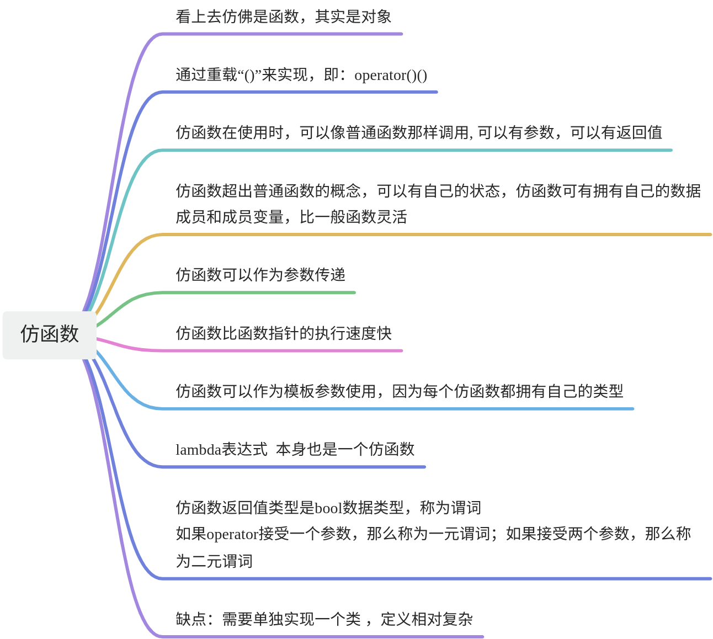

# 【13】仿函数（函数对象）
## 1. 仿函数定义

在C++中，仿函数（Functors）或称为函数对象（Function Objects）是重载了调用操作符operator()的类或结构体。这使得这些类的对象可以像函数一样被调用。仿函数的主要用途是提供一种灵活的方式来定义和操作数据。通过创建自定义的仿函数，你可以将特定的逻辑封装在一个对象中，并在需要时将其传递给算法或容器。STL

容器 算法

## 2. 仿函数特性



### 2.1. 仿函数定义

```C++
#include <iostream>  
#include <vector>  
#include <algorithm>  
  
// 定义一个仿函数，用于比较两个整数  
struct CompareInt {  
    bool operator()(int a, int b) const {  
        return a < b;  
    }  
};  
  
int main() {  
    std::vector<int> numbers = {5, 2, 9, 1, 5, 6};  
  
    // 使用STL的sort算法和自定义的仿函数对vector进行排序  
    std::sort(numbers.begin(), numbers.end(), CompareInt());  
  
    // 输出排序后的vector  
    for (int num : numbers) {  
        std::cout << num << " ";  
    }  
  
    return 0;  
}
```

  

### 2.2. 仿函数可以封装状态

仿函数的一个关键特点是它们可以封装状态，这意味着它们可以拥有数据成员，这些成员可以在不同的函数调用之间保持状态。以下是一个简单的C++仿函数示例，它包含了一个状态变量（internal_sum），并在每次调用时将其与输入参数相加：

```C++
#include <iostream>  
  
// 定义一个仿函数类，带有内部状态  
class Accumulator {  
public:  
    // 构造函数，初始化内部状态  
    Accumulator(int initial_sum = 0) : internal_sum(initial_sum) {}  
  
    // 重载operator()，使其接受一个整数参数，将其与内部状态相加，并返回结果  
    int operator()(int value) {  
        internal_sum += value; // 修改内部状态  
        return internal_sum;   // 返回累加后的结果  
    }  
  
    // 获取当前内部状态  
    int getCurrentSum() const {  
        return internal_sum;  
    }  
  
private:  
    int internal_sum; // 仿函数的内部状态  
};  
  
int main() {  
    // 创建Accumulator类的实例，初始内部状态为0  
    Accumulator accumulator;  
  
    // 使用仿函数实例来“调用”它（即，使用它像一个函数）  
    std::cout << "After adding 5: " << accumulator(5) << std::endl;  
    std::cout << "After adding 3: " << accumulator(3) << std::endl;  
    std::cout << "Current sum: " << accumulator.getCurrentSum() << std::endl;  
  
    // 创建另一个Accumulator实例，初始内部状态为10  
    Accumulator accumulatorWithInitialSum(10);  
  
    // 使用这个实例进行累加  
    std::cout << "With initial sum 10, after adding 2: " << accumulatorWithInitialSum(2) << std::endl;  
  
    return 0;  
}
```

在这个例子中，Accumulator类是一个仿函数，它有一个私有的整数成员internal_sum，用于存储累加的值。构造函数允许我们设置初始的累加值。operator()函数接收一个整数参数，将其加到internal_sum上，并返回累加后的结果。此外，还提供了一个公共函数getCurrentSum()来获取当前的累加值。

在main函数中，我们创建了两个Accumulator的实例，并使用它们来进行累加操作。第一个实例从0开始累加，而第二个实例从10开始累加。由于仿函数可以保持状态，因此不同的实例可以独立地维护自己的累加值。

### 2.3. 仿函数可以当参数传递

```C++
#include <iostream>  
  
// 定义一个仿函数类  
class MyFunctor {  
public:  
    // 重载()操作符  
    int operator()(int value) {  
        return value * 2; // 假设这是一个简单的乘法仿函数  
    }  
};  
  
// 一个接受仿函数作为参数的函数  
void applyFunctor(int value, const MyFunctor& functor) {  
    std::cout << "经过仿函数处理后的值: " << functor(value) << std::endl;  
}  
  
int main() {  
    // 创建仿函数实例  
    MyFunctor functor;  
  
    // 调用接受仿函数作为参数的函数  
    applyFunctor(5, functor); // 输出：经过仿函数处理后的值: 10  
   
  
    return 0;  
}
```

  

  

### 2.4. 仿函数的相对性能优势

通常说仿函数（也称为函数对象或functor）比函数指针的执行速度快，这并不是一个绝对的结论。在大多数情况下，它们之间的性能差异是非常小的，甚至在现代的编译器优化下可能几乎无法测量。但是，有几个原因可能会导致在某些特定情况下仿函数相对更快：

1. **内联优化**：仿函数作为类的成员函数或操作符重载，更有可能被编译器内联（inline），这可以减少函数调用的开销。相比之下，函数指针指向的函数通常不会被内联，除非编译器特别确定这样做是安全的。
2. **状态局部性**：仿函数可以包含状态（即数据成员），这些状态可以与其成员函数紧密地存储在一起。这种紧密性可以提高数据访问的局部性，从而提高缓存利用率，进而可能提高性能。
3. **类型安全**：仿函数可以通过模板和类型系统提供更高级别的类型安全性。虽然这不会直接影响执行速度，但它可以减少因类型错误而导致的运行时开销。
4. **无额外间接引用**：函数指针需要额外的间接引用来访问目标函数。虽然这种间接引用在现代处理器上通常是非常快的，但在某些极端情况下，它可能会成为性能瓶颈。
5. **编译时优化**：由于仿函数是类的实例，编译器可以对它们进行更广泛的优化，例如通过消除虚拟函数调用的开销（如果仿函数没有使用虚函数）或使用特定的类特定优化。

### 2.5. 仿函数可以作为模板参数

仿函数确实可以作为模板参数使用，因为它们具有自己的唯一类型。模板参数可以接受任何类型，包括类类型，而仿函数就是类类型的一种。下面是一个代码样例，展示了如何使用仿函数作为模板参数：

```C++
#include <iostream>  
#include <vector>  
#include <algorithm>  
  
// 定义一个仿函数类  
class MultiplyByTwo {  
public:  
    int operator()(int value) const {  
        return value * 2;  
    }  
};  
  
// 定义一个接受仿函数作为模板参数的函数模板  
template <typename Functor>  
void transformVector(std::vector<int>& vec, Functor functor) {  
    for (auto& item : vec) {  
        item = functor(item);  
    }  
}  
  
int main() {  
    std::vector<int> numbers = {1, 2, 3, 4, 5};  
  
    // 使用MultiplyByTwo仿函数作为模板参数  
    transformVector(numbers, MultiplyByTwo());  
  
    // 输出变换后的vector  
    for (const auto& num : numbers) {  
        std::cout << num << ' ';  
    }  
    std::cout << std::endl;  
  
    // 也可以直接使用lambda表达式作为模板参数  
    transformVector(numbers, [](int value) { return value * 3; });  
  
    // 再次输出变换后的vector  
    for (const auto& num : numbers) {  
        std::cout << num << ' ';  
    }  
    std::cout << std::endl;  
  
    return 0;  
}
```

在这个例子中，transformVector 是一个函数模板，它接受一个`std::vector<int>` 和一个仿函数作为参数。这个函数模板使用仿函数来变换 vector 中的每一个元素。在 main 函数中，我们首先使用 MultiplyByTwo 仿函数作为模板参数调用 transformVector 函数，然后使用一个 lambda 表达式作为模板参数再次调用 transformVector 函数。这展示了仿函数和 lambda 表达式都可以作为模板参数传递给函数模板。

### 2.6. 谓词

!!! note
	在计算机语言中，谓词通常指条件表达式的求值返回真或假的过程

#### 2.6.1. 一元谓词（Unary Predicate）

一元谓词通常用于判断单个元素是否满足某个条件。以下是一个使用 std::remove_if 和一元谓词的简单例子，它移除 `std::vector<int>` 中的所有偶数：

```C++
#include <iostream>  
#include <vector>  
#include <algorithm>  
  
// 一元谓词，检查整数是否为偶数  
bool isEven(int num) {  
    return num % 2 == 0;  
}  
  
int main() {  
    std::vector<int> numbers = {1, 2, 3, 4, 5, 6};  
  
    // 使用 std::remove_if 和一元谓词 isEven 移除所有偶数  
    numbers.erase(std::remove_if(numbers.begin(), numbers.end(), isEven), numbers.end());  
  
    // 输出处理后的 vector  
    for (const auto& num : numbers) {  
        std::cout << num << ' ';  
    }  
    std::cout << std::endl;  
  
    return 0;  
}
```

#### 2.6.2. 二元谓词（Binary Predicate）

二元谓词通常用于比较两个元素。以下是一个使用 std::sort 和二元谓词的简单例子，它根据自定义的比较规则对` std::vector<int>` 进行排序：

```C++
#include <iostream>  
#include <vector>  
#include <algorithm>  
  
// 二元谓词，比较两个整数的大小（降序排序）  
bool compareDescending(int a, int b) {  
    return a > b;  
}  
  
int main() {  
    std::vector<int> numbers = {3, 1, 4, 1, 5, 9, 2, 6, 5, 3, 5};  
  
    // 使用 std::sort 和二元谓词 compareDescending 对 vector 进行降序排序  
    std::sort(numbers.begin(), numbers.end(), compareDescending);  
  
    // 输出排序后的 vector  
    for (const auto& num : numbers) {  
        std::cout << num << ' ';  
    }  
    std::cout << std::endl;  
  
    return 0;  
}
```

在这两个例子中，我分别定义了一个一元谓词 isEven 和一个二元谓词 compareDescending。一元谓词用于判断单个元素是否为偶数，而二元谓词用于比较两个元素的大小。然后，我们使用这些谓词与标准库算法（如 std::remove_if 和 std::sort）一起工作，以完成特定的任务。
