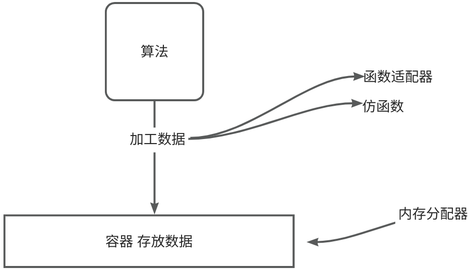

# 【14】算法

在C++ STL（Standard Template Library）中，算法（Algorithms）部分包含了一系列用于操作容器元素的通用算法。这些算法主要定义在**algorithm**头文件中，并且可以根据需要进行定制和扩展。以下是一些常见的STL算法目录：



### 非修改序列算法（Non-mutating Sequence Algorithms）

- std::find：在序列中查找等于某值的第一个元素。
- std::find_if：对序列中的每个元素应用给定的函数对象，直到找到使函数对象返回true的元素。
- std::count：计算序列中等于某值的元素个数。
- std::count_if：对序列中的每个元素应用给定的函数对象，并返回使函数对象返回true的元素个数。
- std::for_each：对序列中的每个元素应用给定的函数对象。
- std::equal：比较两个序列是否相等。
- std::mismatch：比较两个序列，并返回第一个不匹配的元素的位置。
- std::search：在序列中查找另一个序列的第一次出现。
- std::search_n：在序列中查找n个连续的元素，这些元素与给定值相等。
```C++
int main() {
	vector<int> mybox = {12,2,3,9,1,3,4,45,3,34,2,5,6,7,8};
	auto x = count_if(mybox.begin(), mybox.end(), [](int a) {return a == 3; });
	cout << x << endl;  //3
}
```

```C++
int main() {
	
	auto myfun = [](int x) {return x == 3; };
	vector<int> mybox = {12,2,3,9,1,3,4,45,34,34,2,5,6,7,8};
	auto x = find_if(mybox.begin(), mybox.end(), myfun);
	while (x != mybox.end())
	{
		cout << (x != mybox.end() ? *(++x) : *x) << endl;
		x= find_if(next(x), mybox.end(), myfun);
	}

}
```

```C++
//for_each的第一种用法,主要是在第三个参数的变化，最传统的玩法
//针对可以修改容器的引用式调用
int funx(int& a)
{
	return a += 10;
}

int main() {
	vector<int> mybox = {12,2,3,9,1,3,4,45,3,34,2,5,6,7,8};

	//操作之前
	for (auto x : mybox)
	{
		cout << x << " ";
	}
	cout << endl;

	for_each(mybox.begin(), mybox.end(), ref( funx));

	//操作之后
	for (auto x : mybox)
	{
		cout << x << " ";
	}
	cout << endl;
}
```

  

```C++
//第二种方式：仿函数式的玩法
class Myfang {

public:
	bool operator()(int& a) {
		return a =a+ 10;
	}
};


int main() {
	vector<int> mybox = {12,2,3,9,1,3,4,45,3,34,2,5,6,7,8};

	//操作之前
	for (auto x : mybox)
	{
		cout << x << " ";
	}
	cout << endl;

	for_each(mybox.begin(), mybox.end(), Myfang());

	//操作之后
	for (auto x : mybox)
	{
		cout << x << " ";
	}
	cout << endl;
}
```

### 修改序列算法（Mutating Sequence Algorithms）

- std::copy：将序列中的元素复制到另一个序列。
- std::copy_if：将满足给定条件的序列元素复制到另一个序列。
- std::replace：将序列中等于某值的元素替换为另一个值。
- std::replace_if：对序列中的每个元素应用给定的函数对象，并替换使函数对象返回true的元素。
- std::swap：交换两个元素的值。
- std::swap_ranges：交换两个序列中的元素。
- std::reverse：反转序列中的元素顺序。
- std::rotate：将序列中的元素向左或向右旋转。
- std::remove：移除序列中等于某值的所有元素（通过将它们移动到序列的末尾）。
- std::remove_if：移除序列中使给定函数对象返回true的所有元素。
- std::unique：移除序列中的连续重复元素（通过将它们移动到序列的末尾）。
- std::unique_copy：将序列中的元素复制到另一个序列，并移除连续重复的元素。

```C++
int main() {
	vector<int> mybox = {12,2,3,9,1,3,4,45,3,34,2,5,6,7,8};
	vector<int> mybox1 = {1,2,3,4,56};
	mybox1.resize(mybox.size());
	//auto x =copy(mybox.begin(), mybox.end(), mybox1.begin());
	auto x = copy_if(mybox.begin(), mybox.end(), mybox1.begin(), [](int& x) {return x % 2 == 0; });
	for (auto x : mybox1) {
		cout << x << " ";
	}
	cout << endl;
	return 0;
}
```

  

//repalce

```C++
int main() {
	vector<int> mybox = {12,2,3,9,1,3,4,45,3,34,2,5,6,7,8};
	vector<int> mybox1 = {1,2,3,4,56};
	mybox1.resize(mybox.size());
	//replace(mybox.begin(), mybox.end(), 3, 300);
	replace_if(mybox.begin(), mybox.end(), [](const int& x) {return x % 2 == 0; },300);

	for (auto x : mybox)
	{
		cout << x << " ";
	}
	cout << endl;
	return 0;
}
```

  

```C++
#include"iostream"
#include<vector>
#include<algorithm>
using namespace std;


void printIntVector(const vector<int> & mybox)
{
	for (auto x : mybox) {
	
		cout << x << " ";
	
	}
	cout << endl;

}

int main() {
	vector<int> mybox = {12,2,3,3,3,3,4,45,3,34,2,5,6,7,8};
	vector<int> mybox1 = {1,2,3,4,56};
	mybox1.resize(mybox.size());

	//1.翻转元素
	//reverse(mybox.begin(), mybox.end());
	
	//2.旋转 将左边的一半移动到右边
	//rotate(mybox.begin(), mybox.begin() + mybox.size() / 2, mybox.end());

	//3.删除某个指定的元素
	//remove(mybox.begin(), mybox.end(), 45);
	
	//4.删除某一类元素,注意remove 并不是真的删除元素  而是从头部开始覆盖 然后返回一个迭代器首位置
	/*auto it = std::remove_if(mybox.begin(), mybox.end(), [](const int& a) {return a % 2 == 0; });
	mybox.erase(it, mybox.end());*/

	//5.unique 移除重复的元素
	/*auto it = unique(mybox.begin(), mybox.end());
	mybox.erase(it, mybox.end());*/

	//6.unique_copy 将序列中的元素复制到另一个序列，并移除连续重复的元素。
	/*printIntVector(mybox1);
	auto it=unique_copy(mybox.begin(), mybox.end(),mybox1.begin());
	mybox1.erase(it, mybox1.end());
	printIntVector(mybox1);*/


	cout << endl;
	return 0;
}
```

### 排序和相关算法（Sorting and Related Algorithms）

- std::sort：对序列进行排序。
- std::stable_sort：对序列进行稳定排序（即相等的元素保持其原始顺序）。
- std::partial_sort：对序列进行部分排序，使前N个元素处于已排序状态。
- std::nth_element：对序列进行部分排序，以便指定位置的元素（即第n个元素）位于其已排序位置。
- std::partition：根据给定的函数对象对序列进行划分，使得满足函数对象的元素在前，不满足的在后。
- std::stable_partition：与std::partition类似，但保持相等元素的原始顺序。
- std::make_heap：将序列转换为堆结构。
- std::push_heap：在堆的末尾添加元素并重新堆化。
- std::pop_heap：移除堆顶元素并将其放在末尾，然后重新堆化。
- std::sort_heap：对堆进行排序。

```C++
#include"iostream"
#include<vector>
#include<algorithm>
#include<queue>
using namespace std;


void printIntVector(const vector<int> & mybox)
{
	for (auto x : mybox) {
	
		cout << x << " ";
	
	}
	cout << endl;

}

int main() {
	vector<int> mybox = {12,2,1,2,7,3,4,45,3,34,2,5,6,7,8};
	vector<int> mybox1 = {1,2,3,4,56};
	mybox1.resize(mybox.size());

	//1.sort 对容器进行排序
	//sort(mybox.begin(), mybox.end());

	//2.stable_sort 稳定排序
	//stable_sort(mybox.begin(), mybox.end());

	//3.partial_sort：对序列进行部分排序，使前N个元素处于已排序状态。
	//partial_sort(mybox.begin(),mybox.begin()+8, mybox.end());

	//4.make_heap
	make_heap(mybox.begin(), mybox.end(), [](const int& a, const int& b) {return a > b; });
	//下面咱们通过建堆的方法 对vector进行排序
	//vector<int> mynew; //排好以后放这里面
	//while (mybox.begin() != mybox.end())
	//{
	//	make_heap(mybox.begin(), mybox.end());
	//	mynew.push_back(mybox[0]);
	//	mybox.erase(mybox.begin());
	//}
	//printIntVector(mynew);

	//5.push_heap
	//mybox.push_back(60);
	//push_heap(mybox.begin(), mybox.end());
	sort_heap(mybox.begin(), mybox.end());


	printIntVector(mybox);
	cout << endl;
	return 0;
}
```

### 通用数值算法（Numeric Algorithms）

- std::accumulate：计算序列中所有元素的和（或其他二元操作的累积结果）。
- std::inner_product：计算两个序列的点积。
- std::adjacent_difference：计算序列中相邻元素的差值，并将结果存储在另一个序列中。
- std::partial_sum：计算序列中元素的部分和，并将结果存储在另一个序列中。

这些算法提供了丰富的功能，用于处理容器中的元素，并且可以与STL中的其他组件（如容器和迭代器）无缝集成。

咱们不能都搞，举几个例子意思一下：

当然，以下是一些C++ STL算法的示例代码，并附带了中文注释：

### 1. std::find

```C++
#include <iostream>  
#include <vector>  
#include <algorithm>  
  
int main() {  
    // 创建一个整数向量  
    std::vector<int> vec = {1, 2, 3, 4, 5};  
  
    // 使用std::find查找值为3的元素  
    auto it = std::find(vec.begin(), vec.end(), 3);  
  
    // 检查是否找到了元素  
    if (it != vec.end()) {  
        // 打印找到的元素的位置  
        std::cout << "找到了3，位置为: " << std::distance(vec.begin(), it) << std::endl;  
    } else {  
        std::cout << "未找到3" << std::endl;  
    }  
  
    return 0;  
}
```

### 2. std::sort

```C++
#include <iostream>  
#include <vector>  
#include <algorithm>  
  
int main() {  
    // 创建一个未排序的整数向量  
    std::vector<int> vec = {5, 2, 4, 1, 3};  
  
    // 使用std::sort对向量进行排序  
    std::sort(vec.begin(), vec.end());  
  
    // 打印排序后的向量  
    for (int num : vec) {  
        std::cout << num << ' ';  
    }  
    std::cout << std::endl;  
  
    return 0;  
}
```

### 3. std::for_each

```C++
#include <iostream>  
#include <vector>  
#include <algorithm>  
  
// 打印函数  
void print_number(int num) {  
    std::cout << num << ' ';  
}  
  
int main() {  
    // 创建一个整数向量  
    std::vector<int> vec = {1, 2, 3, 4, 5};  
  
    // 使用std::for_each遍历向量并调用print_number函数  
    std::for_each(vec.begin(), vec.end(), print_number);  
    std::cout << std::endl;  
  
    return 0;  
}
```

### 4. std::replace

```C++

#include <iostream>  
#include <vector>  
#include <algorithm>  
  
int main() {  
    // 创建一个整数向量  
    std::vector<int> vec = {1, 2, 2, 3, 2, 4};  
  
    // 使用std::replace将所有值为2的元素替换为0  
    std::replace(vec.begin(), vec.end(), 2, 0);  
  
    // 打印替换后的向量  
    for (int num : vec) {  
        std::cout << num << ' ';  
    }  
    std::cout << std::endl;  
  
    return 0;  
}
```

### 5. std::count_if

```C++
#include <iostream>  
#include <vector>  
#include <algorithm>  
  
int main() {  
    // 创建一个整数向量  
    std::vector<int> vec = {1, 2, 3, 4, 5, 6, 7, 8, 9};  
  
    // 使用std::count_if计算偶数的个数  
    // 定义一个lambda函数检查一个数是否为偶数  
    auto is_even = [](int num) { return num % 2 == 0; };  
    std::cout << "偶数的个数为: " << std::count_if(vec.begin(), vec.end(), is_even) << std::endl;  
  
    return 0;  
}
```

### 6. std::remove_if（注意：std::remove_if不会实际删除元素，而是将它们移动到容器末尾，并返回一个迭代器指向新逻辑末尾）

```C++
#include <iostream>  
#include <vector>  
#include <algorithm>  
#include <iterator>  
  
int main() {  
    // 创建一个整数向量  
    std::vector<int> vec = {1, 2, 3, 2, 4, 2, 5};  
  
    // 使用std::remove_if移除值为2的元素  
    // 定义一个lambda函数检查一个数是否等于2  
    auto is_two = [](int num) { return num == 2; };  
    vec.erase(std::remove_if(vec.begin(), vec.end(), is_two), vec.end());  
  
    // 打印移除后的向量  
    for (int num : vec) {  
        std::cout << num << ' ';  
    }  
    std::cout << std::endl;  
  
    return 0;  
}
```
