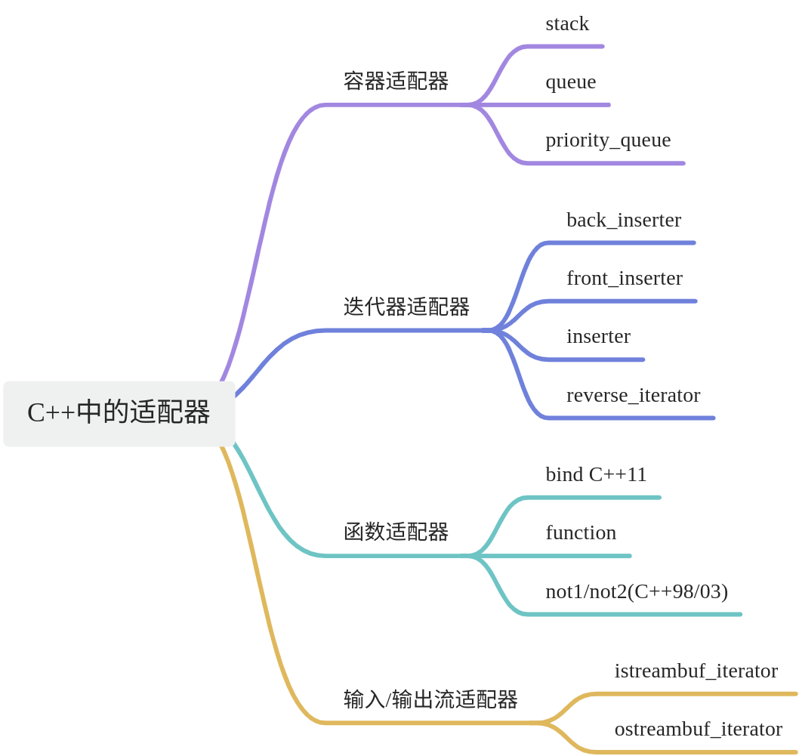

# 【16】函数适配器
## 1. 什么是适配器？

C++中有三类适配器，分别是容器适配器，迭代器适配器和函数适配器，这里主要介绍函数适配器

以下是C++标准库中常见的几种适配器及其用途：

1. **函数适配器（Function Adapters）**

	- **std::bind**：这是一个通用适配器，可以将成员函数、全局函数、静态成员函数以及任何可调用对象绑定到特定参数。然而，随着C++11引入了lambda表达式，std::bind的使用已经相对减少，因为lambda通常更简洁且易于使用。
	- **std::function**：这是一个通用、多态的函数包装器。它可以保存、复制和调用任何可调用目标——函数、lambda表达式、bind表达式或其他函数对象。std::function提供了一种类型安全的、统一的方式来处理可调用对象。
	- **std::not1** **和** **std::not2**（C++98/03）：这些适配器用于一元和二元谓词（返回布尔值的函数或函数对象），它们反转谓词的逻辑结果。然而，在C++11及更高版本中，这些适配器已不常用，因为lambda表达式可以更简洁地实现相同的功能。

2. **容器适配器（Container Adapters）**

	- **std::stack**：这是一个后进先出（LIFO）的容器适配器，它提供了对底层容器（如std::deque、std::vector或std::list）的栈操作接口。
	- **std::queue**：这是一个先进先出（FIFO）的容器适配器，它提供了对底层容器（如std::deque或std::list）的队列操作接口。
	- **std::priority_queue**：这是一个优先级队列的容器适配器，它通常使用std::vector作为底层容器，并使用std::less作为比较函数。元素根据它们的优先级进行排序，最高优先级的元素总是第一个出队。

3. **迭代器适配器（Iterator Adapters）**

	- **std::back_inserter**：这是一个迭代器适配器，它将在容器末尾插入元素的操作包装为一个迭代器。当通过此迭代器赋值时，元素将被添加到容器的末尾。
	- back_inserter 是 C++ 标准库中的一个迭代器适配器，它接受一个容器作为参数，并返回一个迭代器，这个迭代器被用作目标时，会在容器的尾部添加元素。它通常与算法（如 std::copy、std::move 等）一起使用，以将元素从一个容器复制到另一个容器的末尾。

以下是一个简单的例子，演示了如何使用 back_inserter 将一个 std::list 中的元素复制到 std::vector 的末尾：
```cpp
#include <iostream>  
#include <vector>  
#include <list>  
#include <iterator>  
#include <algorithm>  
  
int main() {  
    // 创建一个 std::list 并初始化  
    std::list<int> list_of_ints = {1, 2, 3, 4, 5};  
  
    // 创建一个空的 std::vector  
    std::vector<int> vector_of_ints;  
  
    // 使用 std::copy 和 back_inserter 将 list 中的元素复制到 vector 的末尾  
    std::copy(list_of_ints.begin(), list_of_ints.end(), std::back_inserter(vector_of_ints));  

    //注意，std::back_inserter 返回的是一个特殊的迭代器，当通过这个迭代器向容器中添加元素时，
    //实际上是在调用容器的 push_back 方法。因此，我们不需要手动调整目标容器的大小来容纳源容器中的元素。
    // 打印 vector 中的元素  
    for (const auto& elem : vector_of_ints) {  
        std::cout << elem << ' ';  
    }  
    std::cout << '\n';  
  
    return 0;  
}
```

- **std::front_inserter**：类似于std::back_inserter，但它在容器的开头插入元素（仅适用于支持在开头插入的容器，如std::deque和std::list）。
- **std::inserter**：这是一个更通用的迭代器适配器，它允许你指定一个迭代器和一个容器，然后通过在返回的迭代器上赋值来在容器的指定位置插入元素。
- **std::reverse_iterator**：这是一个迭代器适配器，它提供了对容器的反向迭代。它允许你从后向前遍历容器，并像正向迭代器一样进行解引用和递增/递减操作。

4. **输入/输出流适配器**

	- **std::istreambuf_iterator** 和 **std::ostreambuf_iterator**：这些适配器允许你将输入/输出流与STL算法一起使用。它们将流缓冲区转换为迭代器，使得可以使用STL算法（如std::copy）来读取或写入流。

## 2. 什么是函数适配器？

简单来说函数适配器就是基于原有函数功能的基础上，再增加一些功能。

函数适配器就实现了这一功能：将一种函数对象转化为另外一种符合要求的函数对象。

STL 函数适配器（Function Adapters）是工具，可以帮助你修改和组合函数对象，以便更方便地在 STL 算法中使用。主要有三类函数适配器：绑定适配器（Binders）、成员函数适配器（Member Function Adapters）和谓词适配器（Predicate Adapters）。在 C++11 之前，标准库提供了一些函数适配器，例如 `std::bind1st` 和 `std::bind2nd`。但在 C++11 之后，这些适配器被 `std::bind` 和 lambda 表达式所取代。

### 2.1. `std::bind`

`std::bind` 是一个通用的函数适配器，可以将函数对象的一些参数绑定为特定值，从而创建一个新的函数对象。

```C++
#include <iostream>
#include <functional>
#include <algorithm>
#include <vector>

void print(int x, int y) {
    std::cout << x << ", " << y << std::endl;
}

int main() {
    auto print_42 = std::bind(print, 42, std::placeholders::_1);
    std::vector<int> vec = {1, 2, 3, 4, 5};
    std::for_each(vec.begin(), vec.end(), print_42);

    return 0;
}
```

  

在这个例子中，`std::bind` 将 `print` 函数的第一个参数绑定为 `42`，创建一个新的函数对象 `print_42`，它接受一个参数并调用 `print(42, param)`。

### 2.2. `std::mem_fn`

`std::mem_fn` 是一个函数适配器，用于处理成员函数指针和成员对象指针。

  

```C++
#include <iostream>
#include <functional>
#include <vector>
#include <algorithm>

struct Foo {
    void print_sum(int n1, int n2) {
        std::cout << n1 + n2 << std::endl;
    }
};

int main() {
    Foo foo;
    auto print_sum = std::mem_fn(&Foo::print_sum);

    print_sum(foo, 3, 4); // 输出: 7

    return 0;
}
```

  

在这个例子中，`std::mem_fn` 将 `Foo` 类的成员函数 `print_sum` 适配为一个可以直接调用的函数对象。

### 2.3. 谓词适配器

STL 提供了一些适配器来组合和修改谓词，例如 `std::not1` 和 `std::not2`。不过在 C++11 之后，lambda 表达式更为常用。

  

```C++
#include <iostream>
#include <vector>
#include <algorithm>
#include <functional>

int main() {
    std::vector<int> vec = {1, 2, 3, 4, 5};

    // 使用 std::not1 和 std::bind 来创建一个谓词
    auto is_even = [](int i) { return i % 2 == 0; };
    auto is_odd = std::not1(std::function<bool(int)>(is_even));

    auto result = std::find_if(vec.begin(), vec.end(), is_odd);

    if (result != vec.end()) {
        std::cout << "First odd number is " << *result << std::endl;
    }

    return 0;
}
```

  

在这个例子中，`std::not1` 适配器将 `is_even` 谓词反转，创建一个新的谓词 `is_odd`。