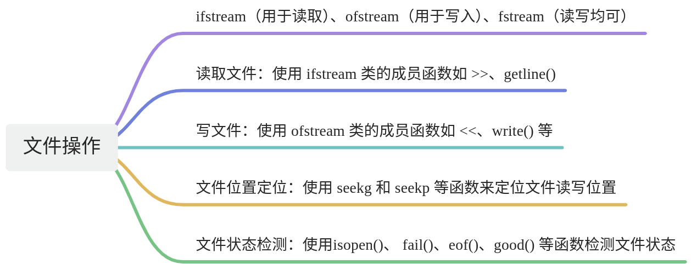
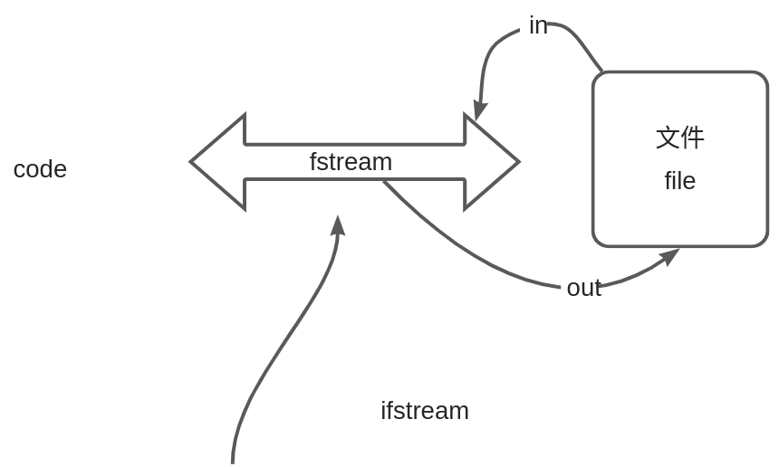
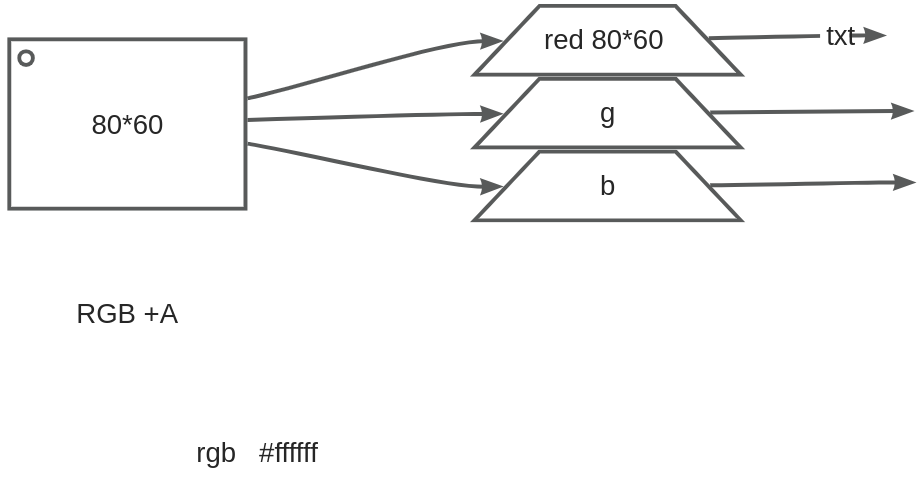

## 1. 文件处理简要概述

文件处理是计算机编程中一个重要的主题，它涉及到读取和写入文件，以及对文件进行各种操作。文件处理允许程序与外部存储交互，实现数据的持久性保存。以下是文件处理的基本概念和用途：

文件是一组相关数据的集合，可以是文本文件（包含字符）或二进制文件（包含任意数据）。

C++ 操作一个文件的流程主要包括打开文件、读写文件、定位文件位置、关闭文件等步骤

打开、操作、关闭 >三步走

C++提供了丰富的文件处理功能，主要通过标准库中的文件流（**fstream**）类来实现。

## 2. 文件的打开和关闭

在C++中，`fstream` 类是用于文件操作的重要类。它继承自 `ifstream` 和 `ofstream` 类，因此可以同时用于文件的读取和写入操作。以下是文件的打开和关闭流程：

  

**如何打开文件：**

使用 `fstream` 类的构造函数可以打开一个文件。构造函数的参数包括文件名和打开模式。

```C++
#include <fstream>

int main() {
    // 打开文件（默认为输出模式）
    std::fstream file("laojia.txt", std::ios::out);

    // 进行文件操作...

    // 关闭文件
    file.close();

    return 0;
}
```

  

**打开模式说明：**下面是使用表格展示文件打开模式说明的示例：

| **模式**               | **含义**                          |
| -------------------- | ------------------------------- |
| **std::ios::in**     | 以输入模式打开文件，用于读取数据。               |
| **std::ios::out**    | 以输出模式打开文件，用于写入数据。               |
| **std::ios::app**    | 以追加模式打开文件，新写入的内容会添加到文件末尾。append |
| **std::ios::ate**    | 打开文件并定位到文件末尾。 atend             |
| **std::ios::binary** | 以二进制模式打开文件，用于处理二进制数据。           |

多个模式之间用`“|”`运算符，联合。

```C++
// 以二进制模式打开文件 读写文件
fstream binaryFile("binary.bin", ios::binary | ios::out | ios::in);
```

关于in和out的困惑，画一幅画。

如果文件不使用 **close()** 关闭会有什么问题？

!!! note
	1. **资源泄漏：** 每次打开文件都会分配一些系统资源，如果不及时关闭文件，可能会导致资源泄漏，最终影响程序性能。
	2. **文件锁定：** 在某些操作系统中，文件可能会被锁定，防止其他程序或进程访问。如果文件没有关闭，其他程序可能无法正常访问该文件。
	3. **数据不稳定：** 未关闭的文件可能会导致数据不稳定，因为可能尚未将所有的写入操作完全刷新到磁盘上。

就像你同时为两个领导服务，你是什么感受？

## 3. 写文件

在C++中，使用 `ofstream` 类可以方便地进行文件写入操作。以下是一些写文件的常见操作：

### 3.1. 使用 `ofstream` 类写入文本文件

```C++
#include <iostream>
#include <fstream>
using namespace std;

int main() {
    // 打开文件进行写入
    ofstream outputFile("output.txt");

    // 检查文件是否成功打开
    if (!outputFile.is_open()) {
        cerr << "Unable to open file for writing." << endl;
        return 1;  // 退出程序，返回错误状态码
    }

    // 写入内容
    outputFile << "Hello, this is a line of text." << endl;

    // 关闭文件
    outputFile.close();

    return 0;
}
```

  

在这个例子中，我们使用 `ofstream` 打开名为 "output.txt" 的文件进行写入，然后将一行文本写入文件。最后，我们使用 `close()` 函数关闭文件。

### 3.2. 写入整行

```C++
#include <iostream>
#include <fstream>
using namespace std;

int main() {
    // 打开文件进行写入
    ofstream outputFile("output.txt");

    // 检查文件是否成功打开
    if (!outputFile.is_open()) {
        cerr << "Unable to open file for writing." << endl;
        return 1;  // 退出程序，返回错误状态码
    }

    // 写入整行
    outputFile << "This is a line of text." << endl;

    // 关闭文件
    outputFile.close();

    return 0;
}
```

### 3.3. 写入字符

```C++
#include <iostream>
#include <fstream>
using namespace std;

int main() {
    // 打开文件进行写入
    ofstream outputFile("output.txt");

    // 检查文件是否成功打开
    if (!outputFile.is_open()) {
        cerr << "Unable to open file for writing." << endl;
        return 1;  // 退出程序，返回错误状态码
    }

    // 写入字符
    outputFile.put('A');

    // 关闭文件
    outputFile.close();

    return 0;
}
```

  

### 3.4. 使用`write` 函数

下面是一个简单的C++写文件的示例，使用 `ofstream` 类和 `write` 函数：

  

```C++
#include <iostream>
#include <fstream>

int main() {
    // 打开文件以写入数据
    std::ofstream outFile("example.txt", std::ios::binary);

    if (!outFile) {
        std::cerr << "无法打开文件！" << std::endl;
        return 1;
    }

    // 数据准备
    char data[] = "Hello, World!";
    size_t size = sizeof(data);

    // 将数据写入文件
    outFile.write(data, size);

    // 关闭文件
    outFile.close();

    std::cout << "数据成功写入文件 'example.txt'" << std::endl;

    return 0;
}
```

  

在这个示例中，我们首先创建一个 `ofstream` 对象 `outFile`，并打开一个名为 "example.txt" 的文件，以二进制模式写入数据。接着，我们准备了一个包含字符串 "Hello, World!" 的字符数组 `data`，并使用 `write` 函数将数据写入文件。最后，我们关闭文件并输出成功的消息。

### 3.5. 文件不存在时的处理

在打开文件进行写入操作时，如果文件不存在，`ofstream` 会尝试创建文件。如果创建文件失败，可以使用 `is_open()` 函数检查文件是否成功打开，以便进行错误处理。在上述例子中，都包含了对文件是否成功打开的检查。

### 3.6. 写文件常用函数

在C++中写文件时，常用的一些成员函数包括 `ofstream` 类的成员函数。下面是一些主要的写文件成员函数以及它们的作用：

1. **open**：

	- 作用：打开文件，关联文件名和输出流。
	- 示例：`ofstreamObject.open("filename.txt");`

2. **is_open**：

	- 作用：检查文件是否成功打开。
	- 示例：`if (ofstreamObject.is_open()) { /* 文件成功打开 */ }`

3. **close**：

	- 作用：关闭文件。
	- 示例：`ofstreamObject.close();`

4. **seekp**：

	- 作用：设置文件写入位置。
	- 示例：`ofstreamObject.seekp(0, ios::beg);`

5. **tellp**：

	- 作用：获取当前的文件写入位置。
	- 示例：`streampos position = ofstreamObject.tellp();`

6. **write**：

	- 作用：将数据写入文件。
	- 示例：`ofstreamObject.write(data, size);`

7. **put**：

	- 作用：将一个字符写入文件。
	- 示例：`ofstreamObject.put('A');`

8. **operator<<**：

	- 作用：用于插入数据到文件，类似于输出流的 `<<` 操作符。
	- 示例：`ofstreamObject << "Hello, World!" << endl;`

9. **good**：

	- 作用：检查流的状态是否正常，返回 `true` 表示正常。
	- 示例：`if (ofstreamObject.good()) { /* 流状态正常 */ }`

10. **bad**：

	- 作用：检查流是否处于错误状态，返回 `true` 表示有错误。
	- 示例：`if (ofstreamObject.bad()) { /* 流处于错误状态 */ }`

11. **fail**：

	- 作用：检查流是否处于失败状态，返回 `true` 表示有失败。
	- 示例：`if (ofstreamObject.fail()) { /* 流处于失败状态 */ }`

12. **eof**：

	- 作用：检查是否已到达文件末尾。
	- 示例：`if (ofstreamObject.eof()) { /* 已到达文件末尾 */ }`

  

这些成员函数允许你在写文件时进行各种不同类型的操作，包括设置写入位置、写入数据、插入数据等，同时也可以通过状态函数检查文件流的状态。

## 4. 读文件

  

使用 ifstream 类读取文本文件

在C++中，可以使用 **ifstream** 类来方便地读取文本文件

### 4.1. 读取方式


### 4.2. 读文件示例代码

1. **逐行读取：** 使用 `getline` 函数逐行读取文件的内容。

```C++
#include <iostream>
#include <fstream>
#include <string>
using namespace std;

int main() {
    ifstream inputFile("example.txt");
    string line;

    while (getline(inputFile, line)) {
        cout << line << endl;
    }

    inputFile.close();
    return 0;
}
```

在你提供的C++代码中，`getline` 函数返回一个 `istream&` 类型的引用，表示输入流对象。在这个特定的情境中，`getline` 用于从文件流 `inputFile` 中读取一行文本，并将该行文本存储到字符串变量 `line` 中。

具体来说，`getline(inputFile, line)` 的作用是从文件中读取一行文本，将其存储到 `line` 变量中，并返回输入流对象 `inputFile` 的引用。如果成功读取一行文本，条件 `while (getline(inputFile, line))` 就为真，进入循环体并输出当前行的内容到标准输出流 `cout` 中。当文件读取到末尾或发生错误时，`getline` 返回 `false`，循环结束，程序关闭文件并返回 0。

解决中文乱码问题

```C++
#include <iostream>
#include <fstream>
#include <string>
#include <locale>
#include <codecvt>
#include <corecrt_io.h>
#include <fcntl.h>

using namespace std;

int main() {
    wifstream inputFile("a.txt", ios::in | ios::binary);

    // 设置输入流为 UTF-8
    inputFile.imbue(locale(inputFile.getloc(), new codecvt_utf8<wchar_t>));

    // 设置控制台输出为 UTF-8
    _setmode(_fileno(stdout), _O_U8TEXT);

    wstring line;
    while (getline(inputFile, line)) {
        wcout << line << endl;
    }

    inputFile.close();
    return 0;
}
```

2. **按单词读取：** 使用输入运算符 `>>` 从文件中读取一个单词。

```C++
#include <iostream>
#include <fstream>
#include <string>
using namespace std;

int main() {
    ifstream inputFile("example.txt");
    string word;

    while (inputFile >> word) {
        cout << word << endl;
    }

    inputFile.close();
    return 0;
}
```

3. **按字符读取：** 使用 `get` 函数从文件中读取一个字符。

```C++
#include <iostream>
#include <fstream>
using namespace std;

int main() {
    ifstream inputFile("example.txt");
    char character;

    while (inputFile.get(character)) {
        cout << character << endl;
    }

    inputFile.close();
    return 0;
}
```

4. **二进制读取：** 使用 `read` 函数按字节读取二进制数据。

```C++
#include <iostream>
#include <fstream>
#include <string>
using namespace std;

int main() {
    // 打开文件
    fstream inputFile("laojia.txt", ios::in | ios::binary);

    // 检查文件是否成功打开
    if (!inputFile.is_open()) {
        cerr << "无法打开文件。" << endl;
        return 1;
    }

    // 获取文件大小
    inputFile.seekg(0, ios::end);
    streampos fileSize = inputFile.tellg();

    // 检查文件大小是否有效
    if (fileSize < 0) {
        cerr << "获取文件大小时发生错误。" << endl;
        inputFile.close();
        return 1;
    }

    // 将文件指针重置到文件开头
    inputFile.seekg(0, ios::beg);

    // 输出文件大小
    cout << "文件大小: " << fileSize << " 字节" << endl;

    // 定义缓冲区大小
    const int bufferSize = 100;
    char buffer[bufferSize];

    // 逐块读取文件
    while (!inputFile.eof()) {
        // 读取缓冲区大小的数据块
        inputFile.read(buffer, sizeof(buffer));

        // 处理二进制数据，以十六进制格式输出每个字节
        for (int i = 0; i < inputFile.gcount(); ++i) {
            cout << hex << static_cast<int>(buffer[i]) << " ";
        }
    }

    // 关闭文件
    inputFile.close();
    return 0;
}
```

每种方式都有其适用的场景，选择合适的读取方式取决于文件内容的结构和处理需求。

### 4.3. 异常处理

在进行文件操作时，应该考虑到文件可能不存在或打开失败的情况。这时可以使用异常处理来捕获并处理异常

```C++
#include <iostream>
#include <fstream>
#include <string>
#include <stdexcept>
using namespace std;

int main() {
    try {
        // 尝试打开文件
        ifstream inputFile("nonexistent.txt");

        // 检查文件是否成功打开
        if (!inputFile.is_open()) {
            throw runtime_error("Unable to open file.");
        }

        // 读取文件内容
        string line;
        while (getline(inputFile, line)) {
            cout << line << endl;
        }

        // 关闭文件
        inputFile.close();
    } catch (const exception& e) {
        cerr << "Error: " << e.what() << endl;
    }

    return 0;
}
```

在这个示例中，我们使用了 **try** 和 **catch** 块来捕获异常。如果文件打开失败，会抛出一个 **runtime_error** 异常，并在 **catch** 块中输出错误信息。这样可以更好地处理文件不存在等异常情况。

### 4.4. 相关成员函数

在C++中，对文件进行读取时，常用的一些 `istream` 和 `ifstream` 成员函数包括：

  

#### 4.4.1. 对于 `istream`（输入流）：

  

1. **operator>>**：

	- 作用：用于从流中提取数据。
	- 示例：`istreamObject >> variable;`

2. **getline**：

	- 作用：从输入流中读取一行数据。
	- 示例：`getline(istreamObject, stringVariable);`

3. **get**：

	- 作用：从输入流中读取一个字符。
	- 示例：`charVariable = istreamObject.get();`

4. **ignore**：

	- 作用：从输入流中忽略指定数量的字符，或者直到遇到指定的分隔符。
	- 示例：`istreamObject.ignore(100, '\n');`

5. **peek**：

	- 作用：查看输入流中的下一个字符，但不从流中移除它。
	- 示例：`charVariable = istreamObject.peek();`

6. **putback**：

	- 作用：将一个字符放回输入流。
	- 示例：`istreamObject.putback('c');`

  

#### 4.4.2. 对于 `ifstream`（文件输入流）：

  

1. **open**：

	- 作用：打开文件，关联文件名和输入流。
	- 示例：`ifstreamObject.open("filename.txt");`

2. **is_open**：

	- 作用：检查文件是否成功打开。
	- 示例：`if (ifstreamObject.is_open()) { /* 文件成功打开 */ }`

3. **close**：

	- 作用：关闭文件。
	- 示例：`ifstreamObject.close();`

4. **seekg**：

	- 作用：设置文件读取位置。
	- 示例：`ifstreamObject.seekg(0, ios::beg);`

5. **tellg**：

	- 作用：获取当前的文件读取位置。
	- 示例：`streampos position = ifstreamObject.tellg();`

6. **good**：

	- 作用：检查流的状态是否正常，返回 `true` 表示正常。
	- 示例：`if (ifstreamObject.good()) { /* 流状态正常 */ }`

7. **bad**：

	- 作用：检查流是否处于错误状态，返回 `true` 表示有错误。
	- 示例：`if (ifstreamObject.bad()) { /* 流处于错误状态 */ }`

8. **fail**：

	- 作用：检查流是否处于失败状态，返回 `true` 表示有失败。
	- 示例：`if (ifstreamObject.fail()) { /* 流处于失败状态 */ }`

9. **eof**：

	- 作用：检查是否已到达文件末尾。
	- 示例：`if (ifstreamObject.eof()) { /* 已到达文件末尾 */ }`

  

这些函数允许你在读取文件时进行各种不同类型的操作，从整行读取到逐个字符的读取，以及对文件的状态进行检查和控制。

## 5. 文件指针和定位

在C++中，文件指针是用于指示文件读写位置的工具。`seekg` 用于定位输入文件指针，而 `seekp` 用于定位输出文件指针。以下是一些文件指针和定位的常见用法：

**seekg**=读取 seek+ get，**seekp**=写入 seek+put

### 5.1. 文件指针的作用和用法

- **文件指针的作用：**

	- 文件指针用于指示文件的当前读写位置。
	- 允许在文件中进行随机访问，而不仅仅是按顺序读写文件。

- **文件指针的用法：**

	- `seekg` 和 `seekp` 函数用于定位输入和输出文件指针的位置。
	- `seekg(offset, origin)`：将输入文件指针移动到距离 `origin` 处 `offset` 个字节的位置。
	- `seekp(2, ios::beg)`：将输出文件指针移动到距离 `origin` 处 `offset` 个字节的位置。
	- `ios::beg` 表示相对于文件开头，`ios::cur` current表示相对于当前位置，`ios::end` 表示相对于文件末尾。

文件指针的灵活性使得在文件中执行各种定位和操作成为可能，可以随机访问文件的不同位置，而不仅仅是按照顺序进行读写。

### 5.2. 使用 `seekg` 定位输入文件指针

```C++
#include <iostream>
#include <fstream>
using namespace std;

int main() {
    // 打开文件进行读取
    ifstream inputFile("example.txt");

    // 检查文件是否成功打开
    if (!inputFile.is_open()) {
        cerr << "Unable to open file for reading." << endl;
        return 1;  // 退出程序，返回错误状态码
    }

    // 定位文件指针到第五个字符处
    inputFile.seekg(4, ios::beg);

    // 读取并输出文件指针当前位置后的内容
    char ch;
    while (inputFile.get(ch)) {
        cout << ch;
    }

    // 关闭文件
    inputFile.close();

    return 0;
}
```

在这个例子中，我们使用 `seekg` 将输入文件指针定位到文件的第五个字符处，然后读取并输出文件指针当前位置后的内容。

  

### 5.3. 使用 `seekp` 定位输出文件指针

```C++
#include <iostream>
#include <fstream>
using namespace std;

int main() {
    // 打开文件进行写入
    ofstream outputFile("output.txt");

    // 检查文件是否成功打开
    if (!outputFile.is_open()) {
        cerr << "Unable to open file for writing." << endl;
        return 1;  // 退出程序，返回错误状态码
    }

    // 定位文件指针到文件末尾
    outputFile.seekp(0, ios::end);

    // 写入内容到文件末尾
    outputFile << "This text is added at the end." << endl;

    // 关闭文件
    outputFile.close();

    return 0;
}
```

  

在这个例子中，我们使用 `seekp` 将输出文件指针定位到文件末尾，然后在文件末尾写入内容。

### 5.4. 注意事项

在使用 `seekg`、`seekp` 和 `tellg` 函数时，有一些要点和注意事项需要考虑：

tell g

#### 5.4.1. `seekg` 和 `seekp` 要点：

  

1. **定位位置和基准：**

	- `seekg(offset, origin)` 用于设置输入流的读取位置。
	- `seekp(offset, origin)` 用于设置输出流的写入位置。
	- `offset` 表示偏移量，`origin` 表示定位的基准，可以是 `std::ios::beg`（文件开头）、`std::ios::cur`（当前位置）或 `std::ios::end`（文件末尾）。

2. **以字节为单位：**

	- `seekg` 和 `seekp` 操作的单位是字节，而不是字符。
	- 如果在文本模式下，C++ 文件流可能会考虑字符的编码和换行符的转换。

3. **二进制模式：**

	- 如果需要按字节进行精确定位，可以以二进制模式打开文件，例如 `std::ios::binary`。
	- 例如：`std::ofstream file("example.txt", std::ios::binary);`

4. **防止越界：**

	- 在使用 `seekg` 和 `seekp` 之前，确保偏移量不会导致越界。可以通过 `tellg` 和 `tellp` 获取当前位置，然后在进行偏移之前检查。

  

#### 5.4.2. `tellg` 要点：

  

1. **获取当前位置：**

	- `tellg()` 用于获取输入流的当前读取位置。
	- 返回类型是 `std::streampos`，stream postion表示相对于文件开头的字节偏移。

2. **适用于二进制和文本模式：**

	- `tellg` 的行为不受文件模式（二进制或文本）的影响，它返回的是字节偏移量。

3. **搭配** `**seekg**` **使用：**

	- `tellg` 常常与 `seekg` 一起使用，用于获取当前位置并在以后的某个时候通过 `seekg` 恢复到相同的位置。

  

#### 5.4.3. 注意细节

  

1. **文件打开模式：**

	- 打开文件时的模式（文本或二进制）会影响 `seekg` 和 `seekp` 的行为，尤其是在文本模式下可能会有字符编码和换行符转换的影响。

2. **检查文件是否成功打开：**

	- 在打开文件后，最好检查文件是否成功打开，以防止后续的文件操作失败。

3. **防止越界和错误处理：**

	- 在进行文件定位时，确保不会越界。可以通过检查 `tellg` 或 `tellp` 的返回值来进行错误处理。

4. **关闭文件：**

	- 在文件操作完成后，不要忘记关闭文件。可以使用 `close` 函数来关闭文件流。

  

综上所述，使用这些函数时要注意文件的打开模式、偏移量的计算、二进制模式等因素，以确保文件操作的正确性和可靠性。在进行文件定位和操作时，经常检查返回值，进行错误处理是一个良好的实践。

  

## 6. 实例项目（处理二进制图片）

### 6.1. 需求

- 第一步：读取一个图片
- 第二步：将图片的每一个通道数据 提取出来分别写入到不同TXT文件中。



### 6.2. 需求实现

下面是一个简单的实例项目

```C++
#include <iostream>
#include <fstream>
#include <vector>
#include <string>

using namespace std;

// 像素结构体，包含红、绿、蓝通道（可根据需要添加其他通道，如透明度）
struct Pixel {
    uint8_t red;
    uint8_t green;
    uint8_t blue;
    // 添加其他通道（例如 alpha 通道）时，请在此处增加对应的成员变量
};

int main() {
    const char* inputImagePath = "test.jpg";

    // 打开图像文件
    ifstream imageFile(inputImagePath, ios::binary);
    if (!imageFile.is_open()) {
        cerr << "无法打开图像文件: " << inputImagePath << endl;
        return 1;
    }

    // 读取图像头以获取尺寸（假设为 JPEG 格式）
    imageFile.seekg(0, ios::end);
    streampos fileSize = imageFile.tellg();
    imageFile.seekg(0, ios::beg);

    const int headerSize = 2; // JPEG 头部大小
    const int channels = 3;   // 假设为 RGB 图像

    if (fileSize <= headerSize) {
        cerr << "图像文件无效: " << inputImagePath << endl;
        return 1;
    }

    int imageWidth = 0;
    int imageHeight = 0;

    // 跳过 JPEG 头部
    imageFile.ignore(headerSize);

   
    // 读取像素数据
    const int pixelDataSize = static_cast<int>(fileSize - imageFile.tellg());
    const int pixelsCount = pixelDataSize / channels;

    // 使用 vector 存储像素数据，它会在销毁时自动释放内存
    vector<Pixel> pixels(pixelsCount);
    imageFile.read(reinterpret_cast<char*>(pixels.data()), pixelDataSize);

    imageFile.close();

    // 将通道数据写入 TXT 文件
    for (int channel = 0; channel < channels; ++channel) {
        string outputFileName = "channel_" + to_string(channel + 1) + ".txt";
        ofstream outputFile(outputFileName);

        if (!outputFile.is_open()) {
            cerr << "无法打开输出文件: " << outputFileName << endl;
            return 1;
        }

        // 遍历所有像素，并将指定通道的值写入文件
        for (const auto& pixel : pixels) {
            uint8_t value;
            switch (channel) {
            case 0:
                value = pixel.red;
                break;
            case 1:
                value = pixel.green;
                break;
            case 2:
                value = pixel.blue;
                break;
                // 添加其他通道时，在此处增加对应 case
            default:
                cerr << "不支持的通道" << endl;
                return 1;
            }
            outputFile << static_cast<int>(value) << " ";
        }

        outputFile.close();
        cout << "通道 " << channel + 1 << " 数据已写入文件: " << outputFileName << endl;
    }

    return 0;
}
```

  

请注意，这只是一个简单的例子，真实的图像处理可能需要更复杂的算法和库。在实际应用中，你可能需要使用图像处理库如OpenCV等来更方便地处理图像。