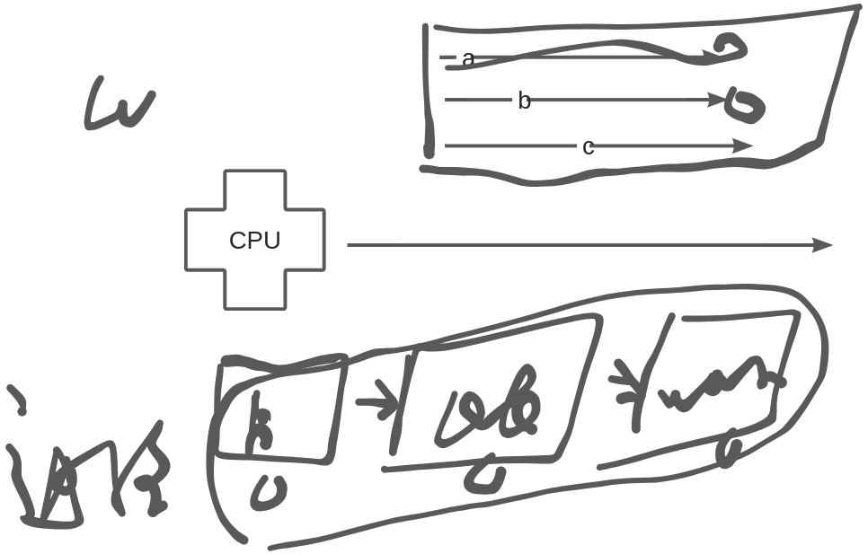

# 【01】多线程基础

## 1. 什么线程？

线程（Thread）是操作系统能够进行运算调度的最小单位，它被包含在进程之中，是进程中的实际运作单位。一条线程指的是进程中一个单一顺序的控制流，一个进程中可以并发多个线程，每条线程并行执行不同的任务。

## 2. 进程与线程的关系

一个进程当中 往往包含了多个线程。 exe,主线程 控制线程。

在多线程编程中，一个进程（Program）可以包含多个线程（Thread），这些线程共享相同的进程空间（包括代码段、数据段、堆等）和系统资源（如文件描述符和信号处理），但各自有独立的栈空间和线程控制块（TCB）。

锅炉爷爷是一个进程，每一条手就可以被看成一个线程。这样一个人能做更多的事情，提高了整个程序的效率。

## 3. 线程的特点

1. **轻量级**：与进程相比，线程的创建和销毁成本较低，因为线程是进程的一个执行流，共享进程的大部分资源，只需要少量的额外开销来维护线程的状态和控制信息。
2. **共享资源**：同一进程内的线程共享进程地址空间和全局变量等资源，这使得线程间通信更加便捷。但是，这也带来了数据同步和互斥的问题，需要使用适当的同步机制来避免数据竞争和死锁等问题。
3. **并发执行**：多个线程可以在同一时间内并发执行，提高了程序的执行效率。但是，由于线程的执行顺序和速度受到操作系统调度策略和硬件性能的影响，因此线程的执行结果可能是不确定的。
4. **独立调度**：线程是独立调度的基本单位，在多线程操作系统中，调度器根据线程的优先级、状态等因素来决定线程的调度顺序和执行时间。
5. **系统支持**：现代操作系统通常提供了对线程的支持，包括线程的创建、销毁、调度、同步等功能的API接口。

## 4. 什么是多线程编程？

多线程编程是指在一个程序中创建多个线程并发的执行，每个线程执行不同的任务。线程是操作系统能够进行运算调度的最小单位，一个进程中可以包含多个线程，每个线程都是进程中的一个单一顺序的控制流。多线程编程的主要目的是为了提高程序的执行效率和响应速度，使得程序能够充分利用CPU资源。

## 5. 为什么要使用多线程？

1. 充分利用CPU资源：多线程编程可以让程序在多个线程之间并发执行，从而充分利用CPU的多核或多处理器资源，提高程序的执行效率。
2. 提高程序响应速度：多线程编程可以将占据时间长的任务放到后台去执行，使得响应用户请求的线程能够尽快处理完成，缩短响应时间，提升用户体验。
3. 便于程序设计和维护：多线程编程可以将复杂的程序分解为多个相对独立的线程，每个线程负责完成特定的任务，从而简化程序设计和维护的难度。

## 6. 线程与CPU执行关系

1. **CPU调度单位**：线程是CPU调度的最小单位。这意味着操作系统根据一定的调度算法，将CPU的执行时间分配给各个线程，使得它们能够并发执行。
2. **单核CPU与多线程**：在单核CPU上，多个线程实际上是并发而非真正的同时执行。这是因为CPU会在不同的线程之间快速切换，每次只执行一个线程的一部分，然后切换到另一个线程。由于切换速度非常快，用户通常感觉多个线程是同时运行的。这种技术称为时间片轮转（Time Slicing）或多任务处理（Multitasking）。
3. **多核CPU与多线程**：在多核CPU上，多个线程可以真正地同时执行，因为每个线程可以被分配给不同的CPU核心去执行。这样，多个线程可以同时进行复杂的计算任务，从而大大提高整体性能。
4. **线程优先级**：操作系统会根据线程的优先级来决定执行顺序。优先级高的线程会获得更多的CPU时间片，从而更频繁地执行。
5. **线程同步与互斥**：当多个线程需要访问共享资源时，就需要考虑线程同步和互斥的问题。这是因为如果没有适当的同步机制，多个线程可能会同时修改同一个数据，导致数据不一致或错误。常用的线程同步机制包括互斥锁、条件变量、信号量等。
6. **线程与进程的关系**：线程是进程的一部分，每个进程可以包含多个线程。线程共享进程的内存空间和系统资源，但进程仍然是操作系统资源分配的最小单位。因此，多线程编程可以在不增加系统资源消耗的情况下提高程序的执行效率。
7. **并发与并行**：并发是指在同一时间段内，多个任务交替执行；而并行则是指在同一时间点，多个任务同时执行。在多核CPU上，多线程可以实现真正的并行执行；而在单核CPU上，多线程只能实现并发执行。（在计算机中 并发也有同时访问的意思）

## 7. 线程的生命周期

线程的生命周期通常包括以下几个阶段：

1. 新建状态（New）：当线程对象被创建时，它处于新建状态。此时，线程还没有开始执行，也没有分配任何资源。
2. 就绪状态（Runnable）：当线程对象调用了start()方法后，它进入就绪状态。此时，线程已经做好了执行的准备，等待操作系统调度执行。
3. 运行状态（Running）：当线程获得CPU时间片时，它进入运行状态。此时，线程开始执行其任务，直到任务完成或遇到阻塞条件。
4. 阻塞状态（Blocked）：当线程在执行过程中遇到某些阻塞条件（如等待I/O操作完成、等待获取某个锁等）时，它进入阻塞状态。此时，线程暂停执行，并释放CPU资源，直到阻塞条件消失并重新获得CPU时间片。
5. 死亡状态（Dead）：当线程执行完其任务或遇到异常导致退出时，它进入死亡状态。此时，线程的资源被回收，生命周期结束。

