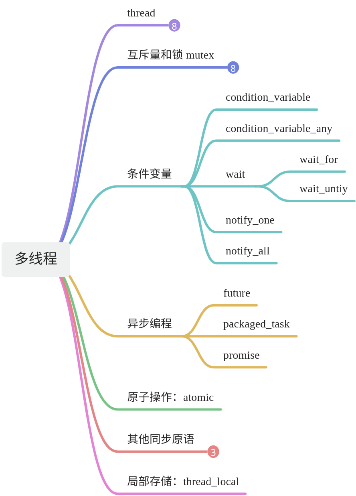

# 【02】创建多线程
## 1. C++中的多线程

传统的C++（C++11标准之前）中并没有引入线程这个概念，在C++11出来之前，如果我们想要在C++中实现多线程，需要借助操作系统平台提供的API，比如Linux的，或者windows下的 。

线程相关知识图谱




1. **std::thread** **类**：

	- std::thread 是C++中用于表示和控制线程的主要类。你可以通过传递一个可调用的对象（如函数、函数对象、lambda表达式或成员函数指针及其对象）给其构造函数来创建一个新线程。
	- 成员函数包括 join()（等待线程完成）、detach()（分离线程，允许其独立运行）、joinable()（检查线程是否可连接）等。

2. **互斥量和锁**：

	- std::mutex：互斥量（mutex），用于保护共享数据免受多个线程的同时访问。
	- std::lock_guard 和 std::unique_lock：这些是基于RAII（Resource Acquisition Is Initialization）的封装器，用于自动管理互斥量的锁定和解锁。
	- std::timed_mutex、std::recursive_mutex、std::recursive_timed_mutex：这些是std::mutex的变种，提供了额外的功能（如定时锁定或递归锁定）。

1. **条件变量**：

	- std::condition_variable 和 std::condition_variable_any：这些类允许线程基于某个条件等待。通常与互斥量一起使用，以在多个线程之间实现同步。

2. **未来和承诺**（C++11中引入，但更常用于异步编程）：

	- std::future、std::promise、std::packaged_task：这些类和函数允许异步操作的结果在不同线程之间传递。

3. **原子操作**：

	- std::atomic：这个模板类提供了对特定类型的原子操作（即不可中断的操作）的支持。这对于在多线程环境中安全地读写共享数据特别有用。

4. **其他同步原语**：

	- std::barrier：允许一组线程在某个点上同步。
	- std::latch：允许一组线程等待直到某个数量的事件发生。
	- std::call_once：确保给定的可调用对象在其生命周期内只被调用一次。

5. **线程局部存储**：

	- thread_local 关键字：允许变量在每个线程中都有自己的存储副本。

## 2. 创建一个线程

**使用****std::thread****类**：  
这是C++11及以后版本推荐的方式。你可以直接创建一个std::thread对象来启动一个新的线程，并传递一个可调用对象（如函数、函数对象、Lambda表达式等）作为线程的执行体。

```C++
#include <iostream>  
#include <thread>  
 
void thread_function() {  
    std::cout << "Hello from thread!\n";  
}  
 
int main() {  
    std::thread my_thread(thread_function);  
    my_thread.join(); // 等待线程结束  
    return 0;  
}
```

## 3. 线程的可调用对象

在C++中，线程的可调用对象（callable object）可以是多种类型，包括但不限于：函数指针、成员函数指针、lambda表达式、函数对象（也称为仿函数或functor）以及绑定对象（通过std::bind创建）。以下是一些示例代码：

### 3.1. 函数指针

```C++
#include <iostream>  
#include <thread>  
  
void functionPointerTask() {  
    std::cout << "Function pointer task executed.\n";  
}  
  
int main() {  
    std::thread t(functionPointerTask);  
    t.join();  
    return 0;  
}
```

### 3.2. 成员函数指针

```C++
#include <iostream>  
#include <thread>  
  
class MyClass {  
public:  
    void memberFunctionTask() {  
        std::cout << "Member function task executed.\n";  
    }  
};  
  
int main() {  
    MyClass obj;  
    std::thread t(&MyClass::memberFunctionTask, &obj); // 注意：需要传递对象指针  
    t.join();  
    return 0;  
}
```

### 3.3. Lambda表达式

```C++
#include <iostream>  
#include <thread>  
  
int main() {  
    std::thread t([]() {  
        std::cout << "Lambda task executed.\n";  
    });  
    t.join();  
    return 0;  
}
```

### 3.4. 函数对象（仿函数）

```C++
#include <iostream>  
#include <thread>  
  
struct Functor {  
    void operator()() {  
        std::cout << "Functor task executed.\n";  
    }  
};  
  
int main() {  
    Functor f;  
    std::thread t(f);  
    t.join();  
    return 0;  
}
```

### 3.5. 绑定对象（通过std::bind）

```C++
#include <iostream>  
#include <thread>  
#include <functional>  
  
void functionWithArgs(int a, int b) {  
    std::cout << "Function with args: " << a << ", " << b << ".\n";  
}  
  
int main() {  
    auto boundFunc = std::bind(functionWithArgs, 1, 2);  
    std::thread t(boundFunc);  
    t.join();  
    return 0;  
}
```

请注意，从C++11开始，`<thread>`库是C++标准库的一部分，用于处理线程。在创建线程时，你需要传递一个可调用对象给std::thread的构造函数。可调用对象可以是上述任何一种类型。

## 4. 如何传参数

在C++多线程编程中，当你想要在一个新的线程中执行一个可调函数（通常通过std::thread或类似的机制），并且这个函数需要参数时，你可以直接将参数传递给std::thread的构造函数。这里有两种主要的传递方式：通过值（by value）或通过引用（by reference）。

### 4.1. 通过值传递

当你通过值传递参数时，你实际上是在传递参数的副本。这意味着原始数据和线程中使用的数据是两个独立的实体。

```C++
#include <iostream>  
#include <thread>  
  
void print_sum(int a, int b) {  
    std::cout << "Sum: " << a + b << std::endl;  
}  
  
int main() {  
    int x = 5;  
    int y = 10;  
    std::thread t(print_sum, x, y);  
    t.join();  
    return 0;  
}
```

在这个例子中，x和y的值被复制并传递给新线程中的print_sum函数。

### 4.2. 通过引用传递

当你通过引用传递参数时，你实际上是在传递对原始数据的引用，而不是数据的副本。这意味着原始数据和线程中使用的数据是同一个实体。但是，这需要小心处理，因为如果你在一个线程中修改了数据，这些修改将在所有引用该数据的线程中可见。

```C++
#include <iostream>  
#include <thread>  
  
void modify_and_print(int& a, int& b) {  
    a += 5;  
    b += 10;  
    std::cout << "Modified values: " << a << ", " << b << std::endl;  
}  
  
int main() {  
    int x = 5;  
    int y = 10;  
    std::thread t(modify_and_print, std::ref(x), std::ref(y));  
    t.join();  
    std::cout << "Values in main thread: " << x << ", " << y << std::endl; // Will print 10, 20  
    return 0;  
}
```

在这个例子中，我们使用了std::ref来包装x和y的引用，并将它们传递给新线程中的modify_and_print函数。由于我们修改了这些值，所以原始变量x和y在main线程中的值也被改变了。

### 4.3. 注意事项

- **线程安全性**：当通过引用传递数据时，必须确保对这些数据的访问是线程安全的。否则，你可能会遇到数据竞争和其他并发问题。
- **资源管理**：确保你正确地管理了所有在新线程中创建或使用的资源。特别是，如果新线程使用了动态分配的内存或其他资源，你需要确保这些资源在不再需要时被正确释放。
- **异常处理**：新线程中抛出的异常不会自动传播到创建该线程的线程。因此，你需要确保在新线程中正确地处理所有可能的异常。

## 5. join与的detach的区别

1. **join方法**：

	- 当一个线程调用join方法时，它会阻塞当前线程（调用join的线程），直到被调用的线程（即join的参数所指定的线程）执行完成。
	- 这可以确保在主线程中，子线程执行完毕之前不会结束主线程的执行。
	- 使用join可以确保线程的资源被正确地回收和清理，因为当join返回时，线程对象所代表的线程已经完成了执行。
	- 如果在子线程未执行完毕的情况下尝试销毁其对应的std::thread对象，而该对象又未被join或detach，则会导致程序终止。

2. **detach方法**：

	- 当调用detach方法时，线程将与其所属的线程（即调用detach的线程）分离，并在后台独立运行。
	- 一旦线程被分离，它将不再受到主线程的控制，主线程也不再需要调用join来等待它的结束。
	- 分离的线程会自动回收其资源，当线程执行完毕后，其资源会被系统回收。
	- 需要注意的是，一旦线程被分离，就无法再对其进行join操作，因为此时线程已经脱离了主线程的控制。

join和detach的主要区别在于它们对线程执行完成后的处理方式不同。join会阻塞当前线程并等待子线程执行完成，而detach则会使线程在后台独立运行并自动回收资源。

## 6. 一个线程包含什么东西

一个线程通常包含以下组成部分：

1. **线程ID**：每个线程在系统中都有一个唯一的标识符，用于区分不同的线程。
2. **线程栈（Thread Stack）**：每个线程都有自己私有的栈空间，用于存储局部变量、函数调用时的参数和返回地址等信息。线程栈在创建线程时分配，并在线程结束时释放。
3. **线程状态**：线程的状态描述了线程当前的生命周期阶段，例如新建（New）、就绪（Ready）、运行（Running）、阻塞（Blocked）和终止（Terminated）等。
4. **线程上下文（Thread Context）**：线程上下文包含了线程执行时所需的所有信息，如CPU寄存器的内容、程序计数器（PC）的值、栈指针、信号掩码等。当线程被切换时，线程上下文会被保存，以便在之后恢复执行时能够继续执行。
5. **线程函数（Thread Function）**：线程函数是线程执行的具体逻辑，它包含了线程需要执行的代码。线程函数通常是由用户定义的，并在创建线程时作为参数传递给线程创建函数。
6. **线程优先级**：操作系统可以根据线程优先级来决定调度哪个线程执行。优先级较高的线程会获得更多的处理器时间。
7. **线程属性**：线程属性用于设置线程的一些特性，如栈大小、安全属性等。这些属性可以在创建线程时设置，也可以通过其他线程管理函数进行修改。
8. **线程同步原语**：为了协调多个线程的执行，C++提供了多种线程同步原语，如互斥锁（Mutex）、条件变量（Condition Variable）、信号量（Semaphore）等。这些原语可以帮助线程在访问共享资源时避免冲突和竞态条件。

## 7. this_thread

td::this_thread 是 C++ 标准库中的一个命名空间，它提供了与当前线程相关的函数和工具。在多线程编程中，std::this_thread 命名空间下的函数允许我们获取和操作当前线程的特定属性，如获取线程ID、使当前线程休眠等。

以下是一些 std::this_thread 命名空间下常用的函数及其使用方法：
### 1. **获取当前线程的ID**：

使用 std::this_thread::get_id() 函数可以获取当前线程的ID。这个ID是一个 std::thread::id 类型的对象，可以用于比较两个线程是否是同一个线程。

```C++
#include <iostream>  
#include <thread>  
  
void thread_function() {  
    std::thread::id id = std::this_thread::get_id();  
    std::cout << "Thread ID: " << id << std::endl;  
}  
  
int main() {  
    std::thread t(thread_function);  
    t.join();  
    return 0;  
}
```


### 2.**使当前线程休眠**：

std::this_thread::sleep_for() 和 std::this_thread::sleep_until() 函数可以使当前线程休眠一段时间。前者使线程休眠指定的时间长度（如毫秒、秒等），后者则使线程休眠到指定的时间点。

```C++
#include <iostream>  
#include <thread>  
#include <chrono>  
  
int main() {  
    std::this_thread::sleep_for(std::chrono::seconds(1)); // 休眠1秒  
    std::cout << "Woke up after 1 second!" << std::endl;  
  
    // 休眠到某个时间点  
    auto wakeup_time = std::chrono::system_clock::now() + std::chrono::seconds(2);  
    std::this_thread::sleep_until(wakeup_time);  
    std::cout << "Woke up at the specified time!" << std::endl;  
  
    return 0;  
}
```


