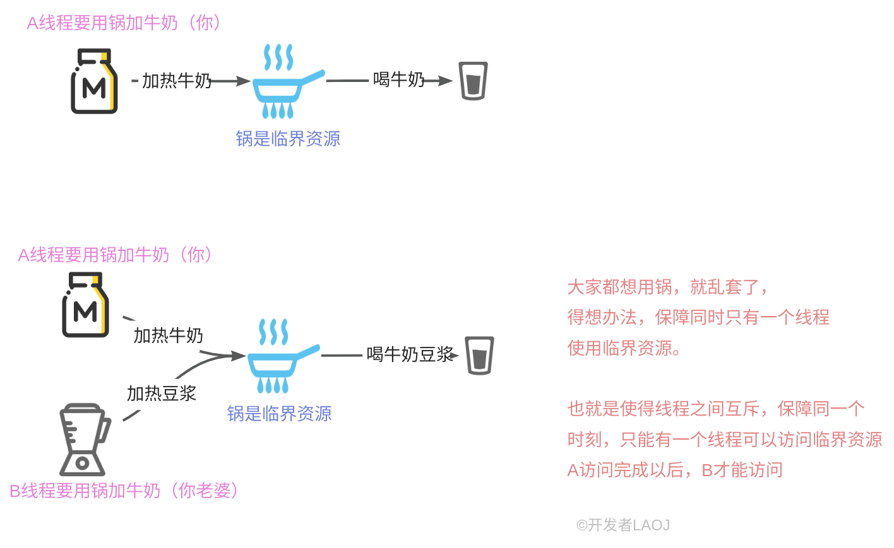
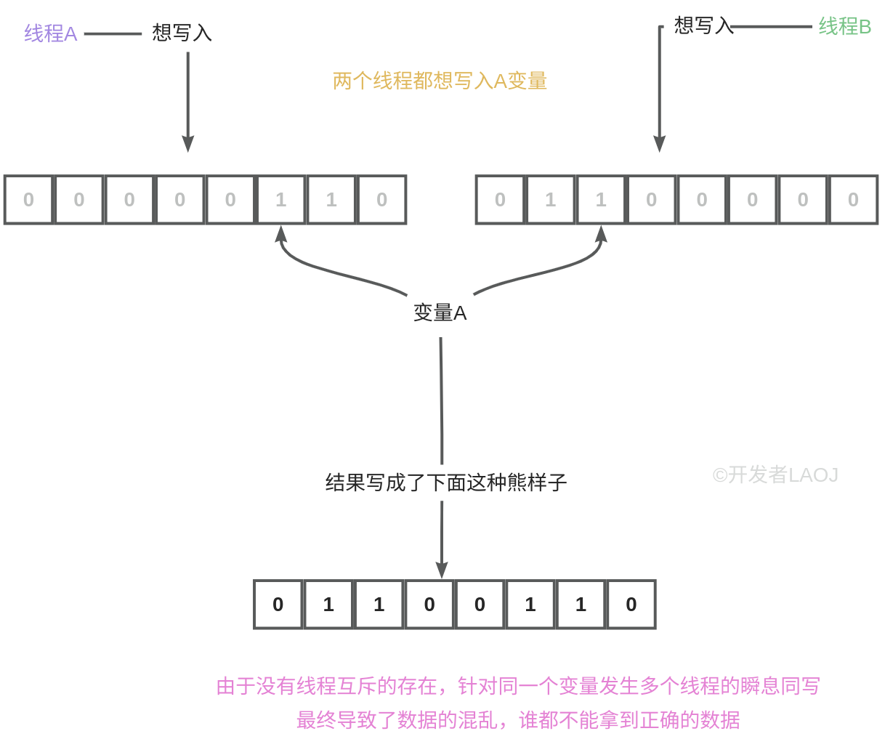

# 【03】线程同步与mutex
# 1. 什么线程同步？

**线程同步**（Thread Synchronization）是多线程编程中的一个重要概念，它指的是通过一定的机制来控制多个线程之间的执行顺序，以确保它们能够正确地访问和修改共享资源，从而避免数据竞争和不一致性的问题。

在多线程环境中，多个线程可能同时访问和修改共享资源（如变量、数据结构或文件等）。如果没有适当的同步机制，这些线程可能会以不可预测的顺序执行，导致数据竞争、脏读、脏写或其他不可预期的行为。线程同步的目标就是确保线程之间的有序执行，以维护数据的一致性和完整性。

**为什么要同步呢？**

!!! note
	如果，在同一个时刻，仅只有一个线程访问某个变量（临界资源），不会存在脏数据的问题，但是 ，如果同一时刻有多个线程，同时访问同一个临界资源的时候，就会存在问题。如何来解决这个问题呢？这就提出了“线程同步”这个概念。
	
	
我们有没有什么办法，控制这些线程对临界资源的访问呢？想个什么办法才能保障他们之间不乱套呢？，这就该**线程同步机制**登场了

# 2. 线程同步机制

C++中提供了多种线程同步机制，常用的方法包括：

1. **互斥锁（Mutex）**：互斥锁是最常用的线程同步机制之一。当一个线程想要访问共享资源时，它首先会尝试获取与该资源关联的互斥锁。如果锁已经被其他线程持有，则该线程将被阻塞，直到锁被释放。这样可以确保在任何时候只有一个线程能够访问共享资源。
2. **条件变量（Condition Variable）**：条件变量用于使线程在满足某个条件之前等待。它通常与互斥锁一起使用，以便在等待条件成立时释放锁，并在条件成立时重新获取锁。这允许线程在等待期间不占用锁，从而提高并发性能。
3. **信号量（Semaphore）**：信号量是一种通用的线程同步机制，它允许多个线程同时访问共享资源，但限制同时访问的线程数量。信号量内部维护一个计数器，用于表示可用资源的数量。当线程需要访问资源时，它会尝试减少计数器的值；当线程释放资源时，它会增加计数器的值。当计数器的值小于零时，尝试获取资源的线程将被阻塞。
4. **原子操作（Atomic Operations）**：原子操作是不可中断的操作，即在执行过程中不会被其他线程打断。C++11及以后的版本提供了`<atomic>`头文件，其中包含了一系列原子操作的函数和类。这些原子操作可以用于安全地更新共享数据，而无需使用互斥锁等同步机制。

# 3. 互斥锁mutex

互斥（Mutex）是一种同步机制，用于保护共享资源，防止多个线程同时访问和修改同一资源，从而引发数据竞争（data race）和不一致性。

当一个线程想要访问某个共享资源时，它首先会尝试获取与该资源关联的互斥锁（mutex）。如果互斥锁已经被其他线程持有（即被锁定），则该线程将被阻塞，直到互斥锁被释放（即被解锁）。一旦线程成功获取到互斥锁，它就可以安全地访问共享资源，并在访问完成后释放互斥锁，以便其他线程可以获取该锁并访问资源。


                       想想银行的ATM取款机额度流程。

互斥锁通常具有以下几个特性：

1. **互斥性**：任意时刻只有一个线程可以持有某个互斥锁。
2. **原子性**：对互斥锁的获取和释放操作是原子的，即在执行这些操作时不会被其他线程打断。
3. **可重入性**：某些互斥锁类型（如递归锁）允许同一线程多次获取同一个锁，但通常不建议这样做，因为它会增加死锁的风险。
4. **非阻塞性**：虽然互斥锁本身是一种阻塞性同步机制，但某些高级实现（如尝试锁）允许线程在无法立即获取锁时继续执行其他任务，而不是被阻塞。

  

咱们先来看一段代码

```C++
#include <iostream>  
#include <thread>  

// 共享变量，没有使用互斥锁或原子操作  
int counter = 0;

// 线程函数，对counter进行递增操作  
void increment_counter(int times) {
    for (int i = 0; i < times; ++i) {
        // 这是一个数据竞争，因为多个线程可能同时执行这行代码  
        counter++;
    }
}

int main() {
    // 创建两个线程，每个线程对counter递增10000次  
    std::thread t1(increment_counter, 100000);
    std::thread t2(increment_counter, 100000);

    // 等待两个线程完成  
    t1.join();
    t2.join();

    // 输出结果，可能不是20000  
    std::cout << "最终的结果: " << counter << std::endl;

    // 重置counter以进行下一次可能的实验  
    counter = 0;

    return 0;
}
```

  

再来看看使用mutex的情况(对上面的例子进行改进)

在C++中，你可以使用`<mutex>`头文件中的std::mutex类来创建和管理互斥锁。下面是一个简单的示例：

```C++
#include <iostream>  
#include <thread>  
#include <mutex>

using namespace std;

// 共享变量
int counter = 0;
mutex mymutex; //定义一个互斥锁

// 线程函数，对counter进行递增操作  
void increment_counter(int times) {
    for (int i = 0; i < times; ++i) {
       
        mymutex.lock();//在访问临界变量之前先加锁
        counter++;
        mymutex.unlock();//访问完了解锁，把锁交出
    }
}

int main() {
    // 创建两个线程，每个线程对counter递增10000次  
    std::thread t1(increment_counter, 100000);
    std::thread t2(increment_counter, 100000);

    // 等待两个线程完成  
    t1.join();
    t2.join();

    // 输出结果 
    std::cout << "最终的结果: " << counter << std::endl;

   

    return 0;
}
```

# 4. lock与unlock

在C++中，使用std::mutex的lock()和unlock()函数来管理对共享资源的访问，从而确保在多线程环境中资源的同步访问。

以下是关于如何使用它们以及需要注意的事项：

### 4.1. 如何使用

1 .**创建互斥量**：  
    首先，你需要创建一个std::mutex对象。

```C++
std::mutex mtx;
```
2.**锁定互斥量**：  
    在访问共享资源之前，使用lock()函数锁定互斥量。

```C++
mtx.lock();  
// 访问共享资源
```

3.**访问共享资源**：  
    在互斥量被锁定的期间，你可以安全地访问共享资源，因为其他试图锁定该互斥量的线程将被阻塞。

4.**解锁互斥量**：  
    一旦完成对共享资源的访问，使用unlock()函数解锁互斥量。

```C++
// 完成共享资源的访问  
mtx.unlock();
```

### 4.2. 注意事项

1 .**死锁**：  
    如果线程在持有互斥量的情况下调用了一个阻塞操作（如另一个互斥量的lock()），并且这个阻塞操作永远不会完成（因为其他线程持有它需要的资源），那么就会发生死锁。避免死锁的一种方法是始终按照相同的顺序锁定互斥量，或者使用更高级的同步原语，如std::lock_guard或std::unique_lock，它们可以自动管理锁的获取和释放。


2.**异常安全**：  
    如果在锁定互斥量后抛出异常，那么必须确保互斥量被正确解锁。使用std::lock_guard或std::unique_lock可以自动处理这种情况，因为它们在析构时会释放锁。

像下面的例子：

```C++
#include <iostream>  
#include <thread>  
#include <mutex>  
  
std::mutex mtx; // 全局互斥量  
  
void safe_function() {  
    std::lock_guard<std::mutex> lock(mtx); // 锁定互斥量  
    // 在这里执行需要互斥访问的代码  
    // 如果抛出异常，lock_guard 会在析构时自动解锁 mtx  
    try {  
        // 模拟一些可能抛出异常的代码  
        if (/* some condition that might cause an exception */) {  
            throw std::runtime_error("An error occurred!");  
        }  
        // ... 其他代码 ...  
    } catch (const std::exception& e) {  
        // 处理异常，但不需要担心解锁，因为 lock_guard 会自动处理  
        std::cerr << "Caught exception: " << e.what() << std::endl;  
    }  
    // lock_guard 在离开作用域时自动解锁 mtx  
}  
  
int main() {  
    // 假设这里有一些线程调用 safe_function()  
    // 由于使用了 lock_guard，所以无论是否抛出异常，mtx 都会被正确解锁  
    // ...  
  
    return 0;  
}
```

3..**不要手动解锁未锁定的互斥量**：  
    在调用unlock()之前，必须确保互斥量已经被lock()锁定。否则，行为是未定义的。


4..**不要多次锁定同一互斥量**：  
    对于非递归互斥量（如std::mutex），不要在同一线程中多次锁定它。这会导致未定义的行为。如果需要递归锁定，请使用std::recursive_mutex。


5..**使用RAII管理锁**：  
    使用RAII（资源获取即初始化）原则来管理锁的生命周期，通过std::lock_guard或std::unique_lock来确保锁在不需要时自动释放。


6..**避免长时间持有锁**：  
    尽量缩短持有锁的时间，以减少线程之间的争用，提高程序的并发性能。


7..**考虑使用更高级的同步原语**：  
    除了std::mutex之外，C++标准库还提供了其他更高级的同步原语，如条件变量（std::condition_variable）、读写锁（std::shared_mutex）等，它们可以在特定场景下提供更高效的同步机制。

# 5. mutex的4种类型

在C++中，特别是从C++11开始，std::mutex（互斥量）及其相关类型提供了一系列用于同步多线程访问共享资源的机制。以下是std::mutex的四种主要类型及其详细解释：

1. **std::mutex**：

	- 这是最基本的互斥量类型。
	- 它不允许递归锁定，即同一线程不能多次锁定同一个std::mutex。如果尝试这样做，程序的行为将是未定义的，通常会导致死锁。
	- 它提供了基本的锁定（lock()）和解锁（unlock()）操作。
	- 当一个线程锁定了一个std::mutex时，任何其他尝试锁定该互斥量的线程都将被阻塞，直到原始线程调用unlock()释放它。

2. **std::recursive_mutex**：

	- 这是一个递归（或可重入）互斥量。
	- 与std::mutex不同，它允许同一线程多次锁定同一个互斥量。这可以用于需要递归访问受保护资源的场景。
	- 线程在每次锁定时都需要对应地解锁，以确保正确的同步。
	- 如果线程没有正确匹配其锁定和解锁操作（即解锁次数少于锁定次数），则其他线程仍然会被阻塞。

```C++
#include <iostream>  
#include <thread>  
#include <mutex>  
  
std::recursive_mutex mtx;  
  
void recursive_function() {  
    mtx.lock(); // 第一次锁定  
    std::cout << "Thread " << std::this_thread::get_id() << " locked mutex.\n";  
  
    // 递归锁定  
    mtx.lock(); // 同一线程可以多次锁定  
    std::cout << "Thread " << std::this_thread::get_id() << " locked mutex recursively.\n";  
  
    mtx.unlock(); // 解锁一次  
    std::cout << "Thread " << std::this_thread::get_id() << " unlocked mutex once.\n";  
  
    mtx.unlock(); // 再次解锁  
    std::cout << "Thread " << std::this_thread::get_id() << " unlocked mutex again.\n";  
}  
  
int main() {  
    std::thread t1(recursive_function);  
    t1.join();  
  
    return 0;  
}
```

3.**std::timed_mutex**：

- 这是一个带时限的互斥量。
- 除了提供基本的锁定和解锁操作外，它还允许线程尝试在一定时间内锁定互斥量。
- 如果在指定的时间内无法获取锁，try_lock_for()或try_lock_until()函数将返回失败，而线程则不会被阻塞。
- 这对于实现有超时机制的资源访问非常有用。bokerface

```C++
#include <iostream>  
#include <thread>  
#include <chrono>  
#include <mutex>  
  
std::timed_mutex mtx;  
  
void timed_lock_function() {  
    auto start = std::chrono::high_resolution_clock::now();  //高精度的时间
  
    // 尝试在指定的时间段内获取锁  
    if (mtx.try_lock_for(std::chrono::seconds(2))) {  
        std::cout << "Thread " << std::this_thread::get_id() << " locked mutex.\n";  
        std::this_thread::sleep_for(std::chrono::seconds(3));  
        mtx.unlock();  
        std::cout << "Thread " << std::this_thread::get_id() << " unlocked mutex.\n";  
    } else {  
        std::cout << "Thread " << std::this_thread::get_id() << " failed to lock mutex within 2 seconds.\n";  
    }  
  
    auto end = std::chrono::high_resolution_clock::now();  
    std::chrono::duration<double> diff = end - start;  
    std::cout << "Thread " << std::this_thread::get_id() << " took " << diff.count() << " s.\n";  
}  
  
int main() {  
    std::thread t1(timed_lock_function);  
    std::thread t2(timed_lock_function);  
  
    t1.join();  
    t2.join();  
  
    return 0;  
}
```

try_lock_until()的用法示例：

```C++
#include <iostream>
#include <thread>
#include <chrono>
#include <mutex>

std::timed_mutex mtx;

void try_lock_until_function() {
    auto now = std::chrono::steady_clock::now();
    auto deadline = now + std::chrono::seconds(2);

    // 尝试在截止时间之前获取锁
    if (mtx.try_lock_until(deadline)) {
        std::cout << "Thread " << std::this_thread::get_id() << " locked mutex.\n";
        std::this_thread::sleep_for(std::chrono::seconds(3));
        mtx.unlock();
        std::cout << "Thread " << std::this_thread::get_id() << " unlocked mutex.\n";
    } else {
        std::cout << "Thread " << std::this_thread::get_id() << " failed to lock mutex before deadline.\n";
    }
}

int main() {
    std::thread t1(try_lock_until_function);
    std::thread t2(try_lock_until_function);

    t1.join();
    t2.join();

    return 0;
}
```

  

4.**std::recursive_timed_mutex**：

- 这是一个递归且带时限的互斥量。
- 它结合了std::recursive_mutex和std::timed_mutex的特性。
- 它允许同一线程多次锁定同一个互斥量，并提供了带时限的锁定尝试功能。
- 这使得线程在需要递归访问资源且希望在一定时间内获得锁的场景中更加灵活。

在使用这些互斥量类型时，需要注意正确地管理锁定和解锁操作，以避免死锁和其他同步问题。同时，根据具体的应用场景和需求选择合适的互斥量类型也是非常重要的。

