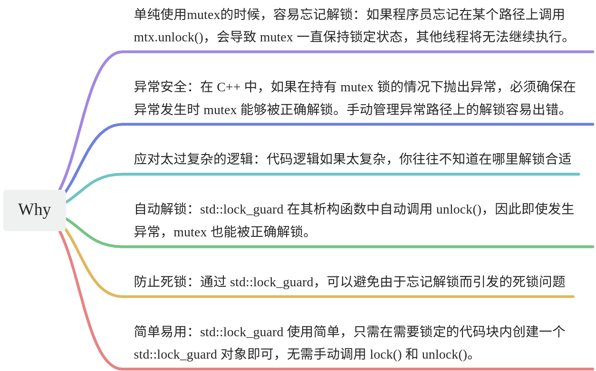

# 【04】lock_guard
### 1. 啥是lock_guard?

```C++
mutex mymutex
RAII 智能指针
```

lock_guard 是一个模板类， 位于` <mutex>` 头文件中 。 它符合 RAII风格，它主要用于管理 mutex 的生命周期，确保 mutex 在锁定的作用域内被正确地上锁和解锁。它主要解决了手动管理 mutex 锁定和解锁时可能出现的问题，如：忘记解锁、异常情况下未解锁等问题。

你可以简单把这个东西，看成是对mutex的一种管理封装，就是说用原生的mutex，有些时候不顺手，有瑕疵。使用lock_guard 比较省心，它来更好地管理你的mutex。

### 2. 为什么需要lock_guard?



### 3. 怎么开定义lock_guard？

咱们在VS中一步一步来体验一下 lock_guard的使用

```C++
#include <iostream>
#include<thread>
#include <vector>
#include <mutex>

using namespace std;

int mycount = 0;
mutex mymutex;

void sum()
{
	lock_guard<mutex> lock(mymutex); //我保护的是mutex类型的锁，它是mymutex
	for (size_t i = 0; i < 10000; i++)
	{
		mycount++;
	}
	//超出生命周期 自动进行解锁

}

int main()
{
	vector<thread> mybox;
	for (size_t i = 0; i < 10; i++)
	{
		mybox.emplace_back(sum);
	}

	for (thread& t:mybox)
	{
		t.join();
	}

	//最终结果
	cout << mycount << endl;

	return 0;
}
```

```C++
#include <mutex>
#include <iostream>
#include <thread>

std::mutex mtx;

void print_thread_id(int id) {
    std::lock_guard<std::mutex> lock(mtx); // 在构造函数中锁定mutex
    std::cout << "Thread #" << id << '\n';
} // 在析构函数中自动解锁mutex

int main() {
    std::thread threads[10];
    for (int i = 0; i < 10; ++i) {
        threads[i] = std::thread(print_thread_id, i + 1);
    }

    for (auto& th : threads) {
        th.join();
    }

    return 0;
}
```

### 4. lock_guard的特性

1. **RAII（Resource Acquisition Is Initialization）**：

	- std::lock_guard 在构造时锁定 mutex，在析构时解锁 mutex。这样可以确保在任何情况下（包括异常） mutex 都能被正确解锁。

2. **简单易用**：

	- 使用 std::lock_guard 可以简化代码，只需在需要锁定的代码块内创建一个 std::lock_guard 对象即可，无需手动调用 lock() 和 unlock()。

3. **异常安全**：

	- 由于 std::lock_guard 的析构函数自动解锁 mutex，所以即使在锁定期间抛出异常，mutex 也能被正确解锁。

4. **不可复制和不可移动**：

	- std::lock_guard 是不可复制和不可移动的。这确保了 mutex 锁的独占性，防止锁被意外复制或移动导致的锁定状态不一致。

```C++
std::lock_guard<std::mutex> lock1(mtx);
// std::lock_guard<std::mutex> lock2 = lock1; // 编译错误，禁止复制
// std::lock_guard<std::mutex> lock3(std::move(lock1)); // 编译错误，禁止移动
```

lock_guard类模板

```C++
// lock_guard类模板，用于管理互斥锁的加锁和解锁操作
template<class _Mutex>
class lock_guard
{
public:
    // 构造函数，在创建lock_guard对象时自动上锁互斥锁_Mtx
    explicit lock_guard(_Mutex& _Mtx)
        : _MyMutex(_Mtx)
    {
        _MyMutex.lock(); // 使用互斥锁的lock()成员函数进行上锁操作
    }

    // 构造函数，在已经上锁的情况下创建lock_guard对象
    // 在这种情况下，不需要再次上锁互斥锁，因此该构造函数空实现
    lock_guard(_Mutex& _Mtx, adopt_lock_t)
        : _MyMutex(_Mtx)
    {}

    // 析构函数，在lock_guard对象销毁时自动解锁互斥锁_Mtx
    // 使用互斥锁的unlock()成员函数进行解锁操作
    ~lock_guard() _NOEXCEPT
    {
        _MyMutex.unlock();
    }

    // 禁用拷贝构造函数和拷贝赋值运算符，确保lock_guard对象不可拷贝
    lock_guard(const lock_guard&) = delete;
    lock_guard& operator=(const lock_guard&) = delete;

private:
    _Mutex& _MyMutex; // 引用类型成员变量，用于保存互斥锁的引用
};

```

!!! warn
	- **注意**：lock_guard禁用了拷贝构造函数和拷贝赋值运算符，意味着**它不支持拷贝语义，只能通过直接创建对象来使用**。这样可以避免多个lock_guard对象同时管理同一个互斥锁而导致的错误行为。


5.**单一责任**：

- std::lock_guard 仅用于管理 mutex 的锁定和解锁，不支持其他复杂的锁定策略。对于更复杂的锁定需求，可以使用 std::unique_lock。


