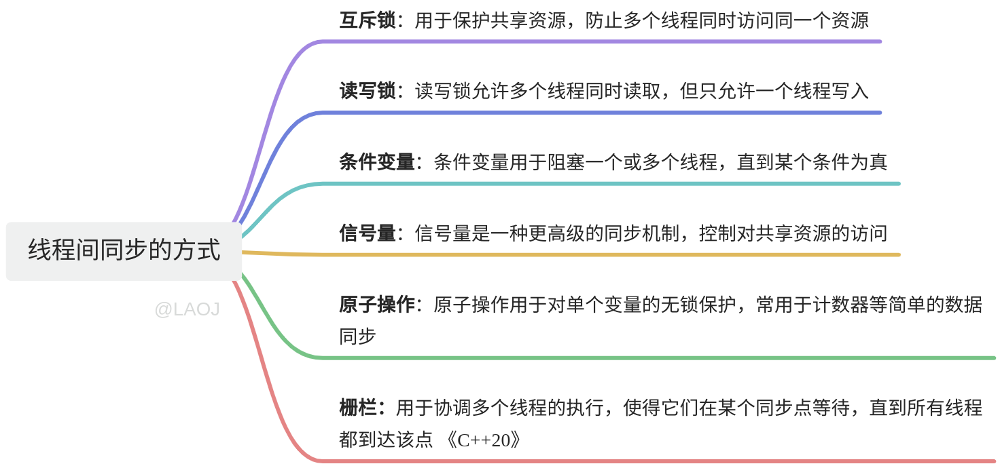

# 【06】线程间同步方式
## 1. 线程同步的方式

一般来说 ，我们要完成线程之间的同步和协作（也就是控制线程与线程之间的执行顺序或者资源挣用），往往会有下面几种方式。 顺序 资源挣用，现成之间不够同步


这些方式，猫有猫招，虎有虎道，这些机制各有各的使用场景。我们在编写代码的时候，根据自己的业务场景选择不同的机制来使用即可。

## 2. 基本用法

### 2.1. **互斥锁（Mutex）**

互斥锁是一种最基本的同步机制，用于保护共享资源，防止多个线程同时访问同一个资源。

```C++
#include <iostream>
#include <thread>
#include <mutex>

// 创建一个互斥锁对象
std::mutex mtx;

// 打印线程ID的函数
void print_thread_id(int id) {
    // 使用lock_guard自动管理锁的生命周期
    std::lock_guard<std::mutex> guard(mtx);
    std::cout << "Thread ID: " << id << std::endl;
}

int main() {
    // 创建两个线程
    std::thread t1(print_thread_id, 1);
    std::thread t2(print_thread_id, 2);

    // 等待两个线程执行完毕
    t1.join();
    t2.join();
    return 0;
}
```

### 2.2. **读写锁（Read-Write Lock）**

读写锁允许多个线程同时读取，但只允许一个线程写入。

```C++
#include <iostream>
#include <shared_mutex>
#include <thread>

// 创建一个共享互斥锁对象
std::shared_mutex rw_mtx;

// 读取函数
void read_function() {
    // 使用shared_lock来共享读取锁
    std::shared_lock<std::shared_mutex> lock(rw_mtx);
    std::cout << "Reading..." << std::endl;
}

// 写入函数
void write_function() {
    // 使用unique_lock来独占写入锁
    std::unique_lock<std::shared_mutex> lock(rw_mtx);
    std::cout << "Writing..." << std::endl;
}

int main() {
    // 创建两个线程，一个用于读取，一个用于写入
    std::thread t1(read_function);
    std::thread t2(write_function);

    // 等待两个线程执行完毕
    t1.join();
    t2.join();
    return 0;
}
```

### 2.3. **条件变量（Condition Variable）**

条件变量用于阻塞一个或多个线程，直到某个条件为真。

```C++
#include <iostream>
#include <thread>
#include <condition_variable>

// 创建互斥锁和条件变量对象
std::mutex cv_mtx;
std::condition_variable cv;
bool ready = false;

// 打印线程ID的函数
void print_id(int id) {
    // 获取锁
    std::unique_lock<std::mutex> lock(cv_mtx);
    // 等待条件变量ready变为true
    cv.wait(lock, []{ return ready; });
    std::cout << "Thread ID: " << id << std::endl;
}

// 设置ready为true并通知所有等待的线程
void set_ready() {
    // 模拟一些工作，等待1秒钟
    std::this_thread::sleep_for(std::chrono::seconds(1));
    {
        // 获取锁并设置ready为true
        std::lock_guard<std::mutex> lock(cv_mtx);
        ready = true;
    }
    // 通知所有等待的线程
    cv.notify_all();
}

int main() {
    // 创建两个线程用于打印ID
    std::thread t1(print_id, 1);
    std::thread t2(print_id, 2);

    // 创建一个线程用于设置ready并通知
    std::thread t3(set_ready);

    // 等待所有线程执行完毕
    t1.join();
    t2.join();
    t3.join();
    return 0;
}
```

### 2.4. **信号量（Semaphore）**

信号量是一种更高级的同步机制，控制对共享资源的访问。

在C++20之前，标准库没有提供信号量实现，需要使用第三方库或者自行实现。在C++20中，`std::counting_semaphore`被引入。

```C++
#include <iostream>
#include <thread>
#include <semaphore>

// 创建一个计数信号量对象，初始值为1
std::counting_semaphore<1> sem(1);

// 访问共享资源的函数
void access_resource(int id) {
    // 获取信号量
    sem.acquire();
    std::cout << "Thread " << id << " is accessing the resource" << std::endl;
    // 模拟一些工作，等待1秒钟
    std::this_thread::sleep_for(std::chrono::seconds(1));
    // 释放信号量
    sem.release();
}

int main() {
    // 创建两个线程
    std::thread t1(access_resource, 1);
    std::thread t2(access_resource, 2);

    // 等待两个线程执行完毕
    t1.join();
    t2.join();
    return 0;
}
```

### 2.5. **原子操作（Atomic Operation）**

原子操作用于对单个变量的无锁保护，常用于计数器等简单的数据同步。

```C++
#include <iostream>
#include <thread>
#include <atomic>

// 创建一个原子整型变量，初始值为0
std::atomic<int> counter(0);

// 递增函数
void increment() {
    for (int i = 0; i < 1000; ++i) {
        ++counter; // 原子递增
    }
}

int main() {
    // 创建两个线程
    std::thread t1(increment);
    std::thread t2(increment);

    // 等待两个线程执行完毕
    t1.join();
    t2.join();

    // 打印计数器的值
    std::cout << "Counter: " << counter.load() << std::endl;
    return 0;
}
```

### 2.6. 6. **栅栏（Barrier）**

栅栏用于协调多个线程的执行，使得它们在某个同步点等待，直到所有线程都到达该点。

在C++20之前，标准库没有提供栅栏实现，需要使用第三方库或者自行实现。在C++20中，`std::barrier`被引入。

```C++
#include <iostream>
#include <thread>
#include <barrier>

// 创建一个栅栏对象，参与线程数量为3
std::barrier sync_point(3);

// 任务函数
void task(int id) {
    std::cout << "Thread " << id << " is at the barrier." << std::endl;
    // 线程到达栅栏并等待
    sync_point.arrive_and_wait();
    std::cout << "Thread " << id << " passed the barrier." << std::endl;
}

int main() {
    // 创建三个线程
    std::thread t1(task, 1);
    std::thread t2(task, 2);
    std::thread t3(task, 3);

    // 等待三个线程执行完毕
    t1.join();
    t2.join();
    t3.join();
    return 0;
}
```

通过这些同步机制，开发者可以有效地管理多线程程序中的数据一致性和同步问题，根据具体的应用场景选择合适的同步工具是非常重要的。


