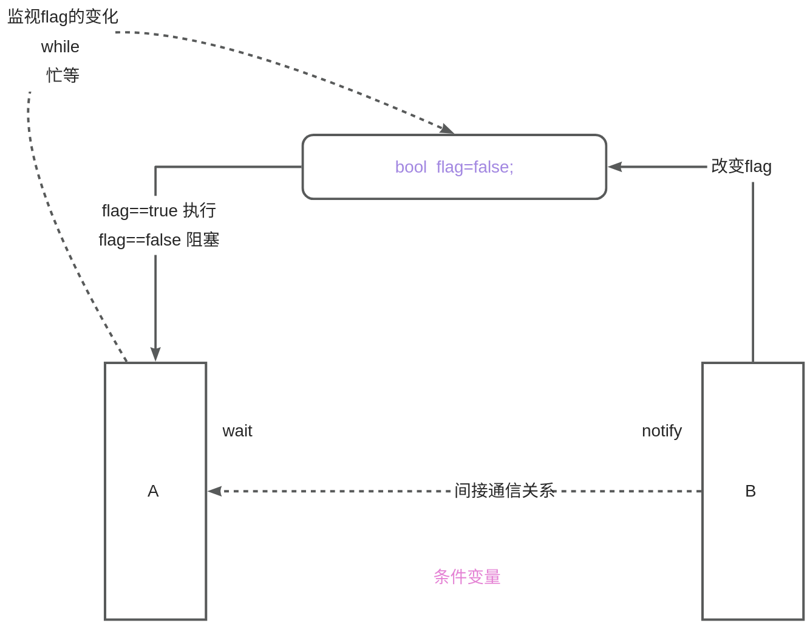
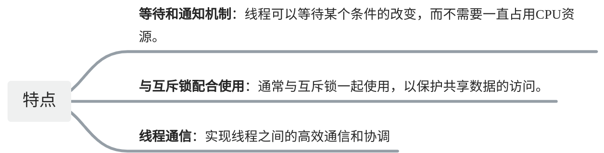

# 【07】条件变量condition_variable

## 1. 啥是条件变量



条件变量是一种同步原语，用于在线程之间协调共享资源的访问。它允许一个线程等待特定条件的满足（如某个值的变化），而另一个线程在条件满足时通知（或唤醒）等待的线程。这种机制可以防止线程忙等待，从而提高系统效率。




举个例子：

!!! note
	在古代，边疆有敌人入侵时，守卫会点燃烽火台，产生狼烟。看到狼烟的将士们会立即集结，准备迎敌。这相当于一种条件触发的通信机制：只有在特定条件（敌人入侵）下，才会触发信号（点燃烽火），让等待的将士们采取行动。
	
	### 类比条件变量
	
	在多线程编程中，条件变量类似于烽火台和狼烟的机制：
	
	- **守卫** 相当于一个线程，它在监视某个条件。
	- **将士们** 相当于其他线程，它们在等待这个条件的满足。
	- **烽火台和狼烟** 相当于条件变量，当条件满足时，守卫点燃烽火，通知将士们敌人来了。

再举个例：

!!! note
	想象一下，你和你的室友在等一个重要的包裹，但是不知道包裹具体什么时候会到达。为了不一直守在门口等包裹，你们决定分工：你去做其他事情，但你的室友会一直盯着门口。当包裹到达时，你的室友会通知你，这样你就可以继续做自己的事情，直到包裹到达再去处理。
	
	在这个例子中：
	
	- **你** 是等待包裹的线程。
	- **你的室友** 是检测包裹到达的线程。
	- **包裹到达** 是一个条件变量。
	- **通知你** 是条件变量的通知操作。


## 2. 条件变量的作用  
**1.减少轮询从而提高效率**

没有条件变量，CPU会浪费时间反复轮询某一个条件。条件变量出现使得线程可以在不满足条件进行休眠，将资源让给有需要的其他线程；

**2.线程之间的协调**

两个线程之间执行可以变得有序，也就是一个线程执行完成后，另外一个线程才会执行；

**3.复杂同步条件**

有时候一个线程不仅需要知道资源可达，还需要知道一些额外信息，比如说生产消费者中，缓冲队列是否满之类的操作；

!!! note
	线程进入阻塞可以是sleep，也可以是wait。sleep期间所持有的锁不会释放，到时见会自动唤醒，而wait期间将会释放锁，唤醒还需要额外的条件。前者更多的用在模拟操作延迟，后者用于多线程协作场景。

## 3. 如何定义条件变量

在C++中，你可以使用std::**condition_variable**来定义和使用条件变量。条件变量通常与互斥锁（如std::mutex）一起使用，以确保在检查和修改共享数据时线程间的同步。

以下是一个简单的示例，展示了如何定义和使用条件变量：

```C++
#include <iostream>  
#include <thread>  
#include <mutex>  
#include <condition_variable>  

std::mutex mtx; // 互斥锁  
std::condition_variable cv; // 条件变量  
bool ready = false; // 共享变量，用于检查条件是否满足  

void print_number(int id) {
    std::unique_lock<std::mutex> lck(mtx); // 锁定互斥锁  
    while (!ready) { // 检查条件是否满足  
        cv.wait(lck); // 如果不满足，则等待（阻塞当前线程，并释放锁）  
    }
    // 条件满足，执行相应操作  
    std::cout << "Thread " << id << " is running.\n";
    // ... 其他线程逻辑 ...  
}

void go() {
    std::this_thread::sleep_for(std::chrono::seconds(1)); // 模拟延迟  
    std::unique_lock<std::mutex> lck(mtx); // 锁定互斥锁  
    ready = true; // 设置条件变量  
    std::cout << "wo yijing xiugai la  na 10 ge jiahuo keyi zhixing l ";
    std::this_thread::sleep_for(std::chrono::seconds(3)); // 模拟延迟  
    cv.notify_all(); // 唤醒所有等待的线程  
}

int main() {
    std::thread threads[10];
    for (int i = 0; i < 10; ++i) {
        threads[i] = std::thread(print_number, i);
    }

    std::cout << "10 threads ready to race...\n";
    go(); // 触发条件变量  

    for (auto& th : threads) {
        th.join(); // 等待所有线程完成  
    }

    return 0;
}
```

在这个示例中：

- 我们定义了一个std::mutex对象mtx来保护共享变量ready。
- 我们定义了一个std::condition_variable对象cv用于线程间的等待和通知。
- print_number函数中的线程会检查ready变量，如果它不为true，则调用cv.wait(lck)来等待。在等待期间，线程会释放锁（由std::unique_lock管理），并阻塞直到其他线程通过调用cv.notify_all()或cv.notify_one()来唤醒它。
- go函数模拟了一个操作，该操作在一段时间后设置ready为true，并通知所有等待的线程。
- 在main函数中，我们创建了10个线程，每个线程都调用print_number函数。然后，我们调用go函数来触发条件变量，最后等待所有线程完成。

!!! note
	**请注意，条件变量必须与互斥锁一起使用，以确保在检查条件（****while (!ready)****）和修改共享数据（****ready = true;****）时的线程安全。如果省略了互斥锁，可能会导致数据竞争和其他并发问题。**

## 4. wait 和 wait_for

在 C++ 的多线程编程中，std::condition_variable 类提供了 wait 和 wait_for 方法，用于让线程在满足特定条件之前等待。这两个方法都与互斥锁（std::mutex 或 std::unique_lock）一起使用，以确保线程安全地访问共享数据。

wait是非常重要的，它是条件变量的重。

### a. wait 方法

std::condition_variable::wait 方法用于阻塞当前线程，直到另一个线程调用同一个 std::condition_variable 实例的 notify_one 或 notify_all 方法，或者直到指定的谓词函数（即条件）返回 true。

注意：如果你没有通知，即使条件为TRUE ，它也不会被执行。如果，你通知了，但是条件不成立，它仍然被阻塞，不会执行。它的执行顺序是 先通知 再检测条件。

#### ⅰ. 参数

- std::unique_lock<std::mutex>& lock：一个与互斥锁相关联的 std::unique_lock 对象。调用 wait 时，这个锁会被自动释放，允许其他线程获取该锁并执行。当 wait 返回时，锁会被重新获取。
- Predicate pred：一个可调用对象（如函数、lambda 表达式等），它返回一个布尔值，表示线程是否应该继续等待。

wait(lck); wait(lck,pred);

#### ⅱ. 工作原理

1. **释放锁**：当线程调用 wait 方法时，它会首先释放与 std::unique_lock 关联的互斥锁。这是为了允许其他线程可以访问和修改与条件变量相关的共享数据。
2. **进入等待队列**：释放锁后，线程会进入条件变量的等待队列中，进入阻塞状态。此时线程不再消耗 CPU 时间，直到被唤醒。
3. **等待条件或通知**：线程在等待队列中等待，直到两个条件之一发生：

	- 另一个线程调用了同一个条件变量的 notify_one 或 notify_all 方法，并且该线程是等待队列中的第一个线程（对于 notify_one）或等待队列中的所有线程（对于 notify_all）。
	- 谓词函数 pred 返回 true。

4. **重新获取锁**：当线程被唤醒后（无论是由于收到通知还是条件成立），它会尝试重新获取之前释放的互斥锁。如果此时锁已经被其他线程持有，则该线程会阻塞在互斥锁上，直到获得锁。
5. **检查条件**：获得锁后，线程会再次调用谓词函数 pred 来检查条件是否成立。如果条件不成立（即 pred 返回 false），则线程会重新进入等待队列，并释放锁，继续等待。这个过程会不断重复，直到条件成立。
6. **继续执行**：如果条件成立（即 pred 返回 true），则线程会退出 wait 方法，并继续执行后续的代码。

#### ⅲ. 注意事项

- wait 方法必须在已经锁定互斥锁的情况下调用，否则会抛出 std::system_error 异常。
- 在调用 wait 方法之前，应该确保与条件变量相关的共享数据已经被正确初始化，并且已经设置了适当的条件。
- 由于 wait 方法会释放和重新获取锁，因此在使用 wait 方法时应该确保没有其他线程会在等待期间修改与条件变量相关的共享数据，以避免竞态条件。

### b. wait 方法

wait 方法使线程进入等待状态，直到另一个线程调用 notify_one 或 notify_all 方法来唤醒它。在等待期间，线程会释放与之关联的互斥锁，允许其他线程访问共享数据。当线程被唤醒时，它会重新获取互斥锁，并继续执行。

wait 方法通常放在一个循环中，以检查条件是否真正满足。这是因为 notify_one 或 notify_all 只是发送了唤醒信号，但并不能保证条件已经满足。例如：

```C++
std::unique_lock<std::mutex> lck(mtx);  
while (!condition) { // 检查条件是否满足  
    cv.wait(lck); // 如果不满足，则等待（释放锁并阻塞）  
}  
// 条件满足，执行后续操作
```

### c. wait_for 方法

wait_for 方法与 wait 方法类似，但它允许你指定一个超时时间。如果在这段时间内条件没有满足，并且没有收到唤醒信号，那么 wait_for 会返回，并且线程会重新获取互斥锁。

wait_for 方法接受一个时间间隔作为参数，表示线程愿意等待的最长时间。这个时间间隔可以是 std::chrono 库中定义的任何时间单位。

wait_for 的返回值是一个 std::cv_status 枚举值，表示等待操作的结果。

可能的返回值包括：

- std::cv_status::**no_timeout**：表示等待操作成功完成，即在超时时间内条件被满足或收到了唤醒信号。
- std::cv_status::**timeout**：表示等待操作因超时而结束，条件没有被满足且没有收到唤醒信号。

使用 wait_for 的示例：

```C++
std::unique_lock<std::mutex> lck(mtx);  
if (cv.wait_for(lck, std::chrono::seconds(1), [](){ return condition; }) == std::cv_status::no_timeout) {  
    // 条件在1秒内被满足，执行后续操作  
} else {  
    // 等待超时，处理超时情况  
}
```

在这个示例中，我们使用了 lambda 表达式作为 wait_for 的第三个参数。这个 lambda 表达式定义了等待的条件。如果条件在1秒内被满足，或者线程在1秒内收到了唤醒信号，那么 wait_for 会返回 std::cv_status::no_timeout，并执行后续操作。否则，wait_for 会返回 std::cv_status::timeout，并处理超时情况。

## notify_all 和 notify_one  
notify_all() 和 notify_one() 是条件变量（std::condition_variable）的两个成员函数，用于唤醒等待条件变量的线程。  

### a. notify_all()  
* 作用：唤醒所有等待该条件变量的线程。  
* 使用场景：适用于多个线程需要同时检查条件的情况。通常用于广播通知，让所有等待的线程都重新检查条件。  

### b. notify_one()  
* 作用：唤醒一个等待该条件变量的线程。  
* 使用场景：适用于只有一个线程需要处理条件的情况。通常用于优先级调度或队列处理，让其中一个线程获得执行权。  

## 6. 案例：两个线程交替执行

下面这段代码的作用是让两个线程交替递增一个共享变量 myvalue，并确保它们不会同时修改 myvalue。通过使用互斥量 mtx 来保护共享变量，并使用条件变量 cv 来协调线程的执行顺序，确保线程1和线程2交替执行递增操作。

```cpp
#include <iostream>  
#include <thread>  
#include <mutex>  
#include <condition_variable>  

std::mutex mtx;             // 用于保护myvalue和turn的互斥量  
std::condition_variable cv; // 条件变量  
int myvalue = 0;           // 共享的myvalue变量  
bool turn = false;         // 控制哪个线程应该执行  

void increment(int thread_id) {
    for (int i = 0; i < 10; ++i) { // 例如，每个线程执行10次  
        std::unique_lock<std::mutex> lock(mtx);

        // 等待轮到自己执行  
        cv.wait(lock, [&] { return (thread_id == 1) ? !turn : turn; });

        // 执行myvalue++  
        ++myvalue;
        std::cout << "Thread " << thread_id << " incremented myvalue to " << myvalue << std::endl;

        // 切换turn标志并通知另一个线程  
        turn = !turn;
        cv.notify_all(); // 通知所有等待的线程，条件可能已改变（尽管这里只需要notify_one）  
    }
}

int main() {
    std::thread t1(increment, 1);
    std::thread t2(increment, 2);

    t1.join();
    t2.join();

    std::cout << "Final value of myvalue: " << myvalue << std::endl;

    return 0;
}
```