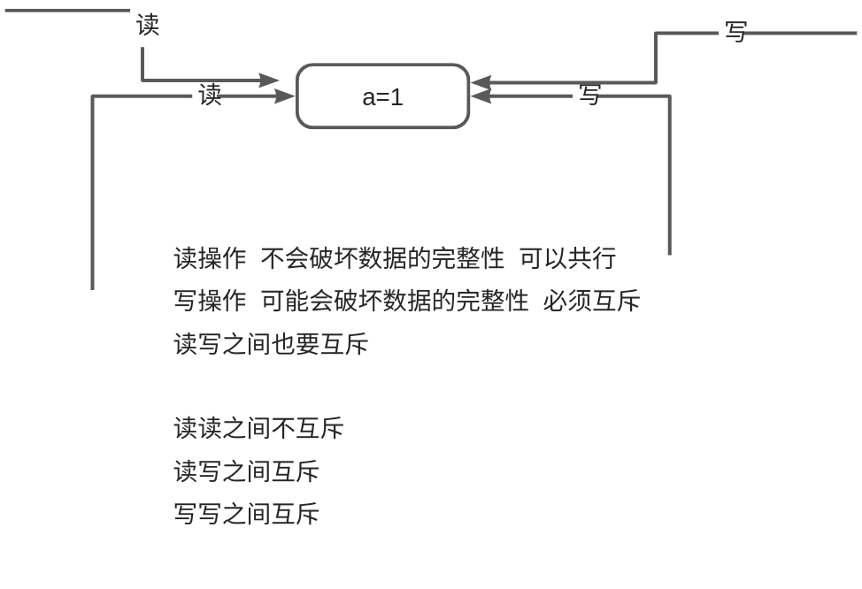
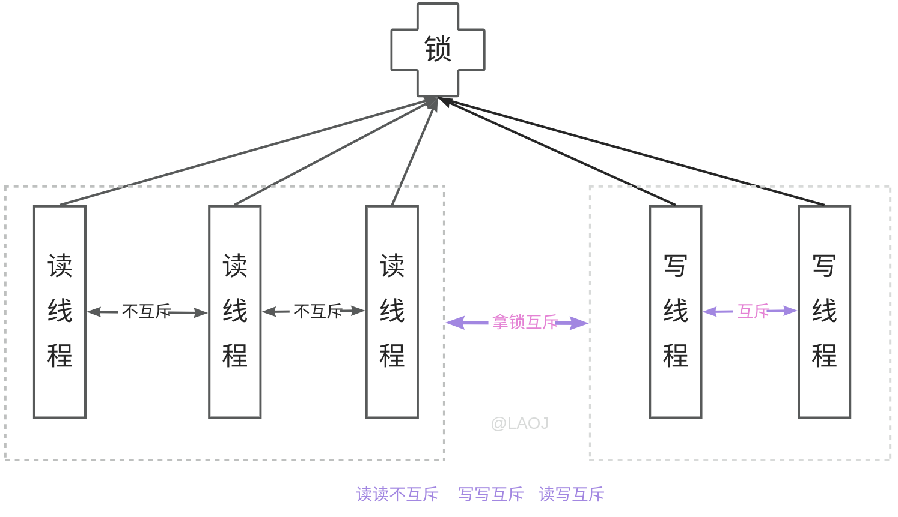
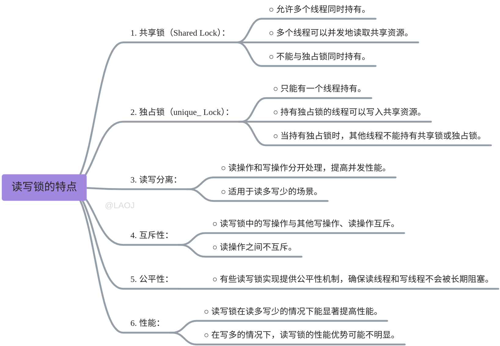
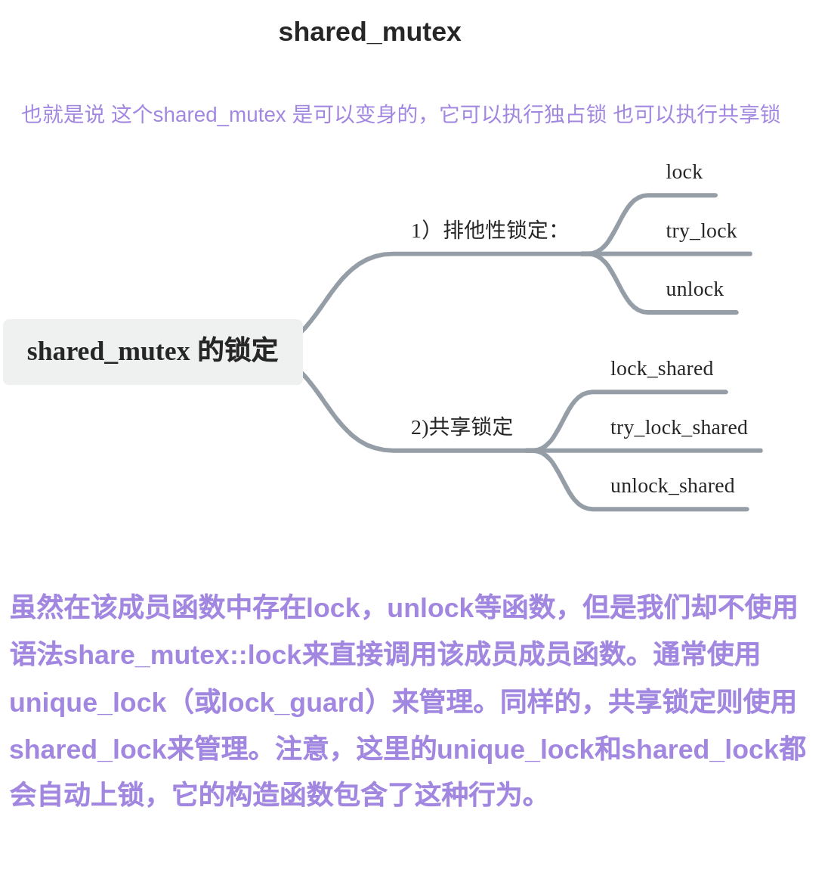
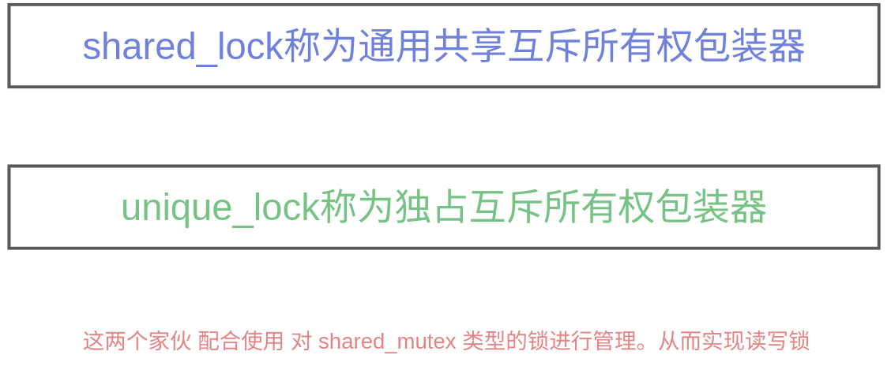

# 【08】读写锁
## 1. 读写锁

C++中的读写锁（也称为共享锁和独占锁）是一种同步机制，用于控制对共享资源的访问，允许多个线程同时读取资源，但在写入资源时只允许一个线程独占访问。

## 2. 读写锁基本特征




## 3. shared_mutex

`std::shared_mutex` 是 C++17 标准引入的一种互斥锁，用于支持多读单写的并发访问模式。

它允许多个线程同时持有共享锁（读锁），但在持有独占锁（写锁）时，其他线程不能再持有任何类型的锁。


主要成员函数功能解释：

- `lock()`: 获取独占锁。如果当前有其他线程持有共享锁或独占锁，则当前线程会被阻塞。
- `try_lock()`: 尝试获取独占锁。如果锁被其他线程持有，则返回 `false`，否则获取锁并返回 `true`。
- `unlock()`: 释放独占锁。
- `lock_shared()`: 获取共享锁。如果当前有其他线程持有独占锁，则当前线程会被阻塞。
- `try_lock_shared()`: 尝试获取共享锁。如果锁被其他线程持有独占锁，则返回 `false`，否则获取锁并返回 `true`。
- `unlock_shared()`: 释放共享锁。


## 4. shared_lock

`std::shared_lock` 是 C++17 标准引入的一种锁管理器，用于管理 `std::shared_mutex` 的共享锁。它可以自动获取和释放共享锁，简化了锁的管理。


**主要成员函数如下**：

- 构造函数：构造时可以自动获取共享锁。

	- `std::shared_lock(mutex_type& m)`: 构造时获取共享锁。
	- `std::shared_lock(mutex_type& m, std::defer_lock_t)`: 构造时不获取锁。
	- `std::shared_lock(mutex_type& m, std::try_to_lock_t)`: 尝试获取共享锁。
	- `std::shared_lock(mutex_type& m, std::adopt_lock_t)`: 假设调用者已经持有共享锁。

- `lock()`: 获取共享锁。
- `try_lock()`: 尝试获取共享锁。
- `unlock()`: 释放共享锁。
- `owns_lock()`: 返回锁是否被持有。
- `release()`: 释放锁的所有权，但不解锁。

## 5. 读写锁的实现

在C++标准库中，可以使用`std::shared_mutex`和`std::shared_lock`来实现读写锁，例如：

```C++
#include <shared_mutex>
#include <thread>
#include <iostream>
#include <vector>

std::shared_mutex rw_mutex; // 读写锁
int shared_data = 0; // 共享数据

// 读线程函数
void reader() {
    std::shared_lock lock(rw_mutex); // 申请共享锁
    std::cout << "Reader thread: " << std::this_thread::get_id() << " reads value: " << shared_data << std::endl; // 输出读取到的共享数据
}

// 写线程函数
void writer(int value) {
    std::unique_lock lock(rw_mutex); // 申请独占锁
    shared_data = value; // 修改共享数据
    std::cout << "Writer thread: " << std::this_thread::get_id() << " writes value: " << shared_data << std::endl; // 输出写入的共享数据
}

int main() {
    std::vector<std::thread> threads; // 用于存储线程的向量

    // 创建读线程
    for (int i = 0; i < 5; ++i) {
        threads.emplace_back(reader); // 启动读线程并加入向量
    }

    // 创建写线程
    for (int i = 0; i < 2; ++i) {
        threads.emplace_back(writer, i); // 启动写线程并加入向量
    }

    // 等待所有线程完成
    for (auto& t : threads) {
        t.join(); // 等待线程结束
    }

    return 0;
}
```

这个代码中，reader函数用于读取共享数据，writer函数用于写入共享数据。在main函数中，我们创建了多个读线程和写线程，并等待所有线程完成。读线程可以并发地读取数据，而写线程需要独占锁才能修改数据。