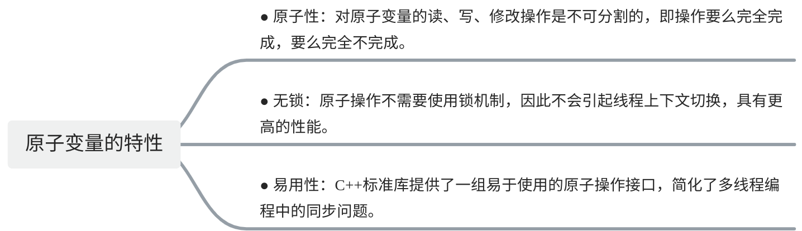
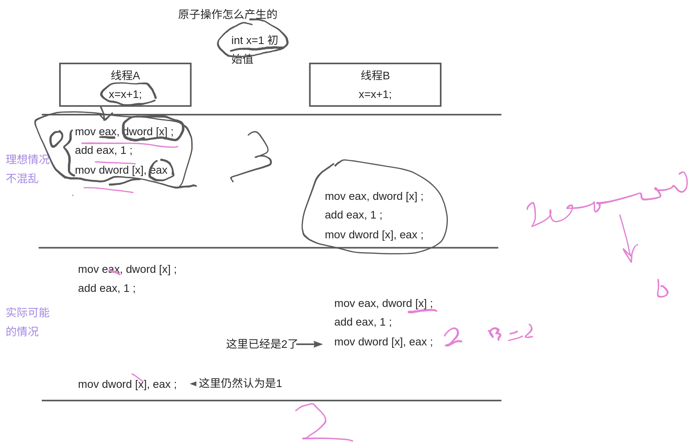
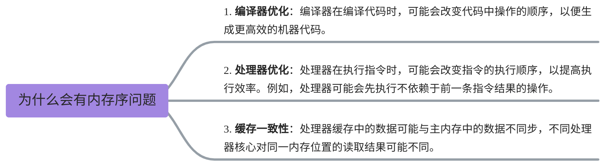
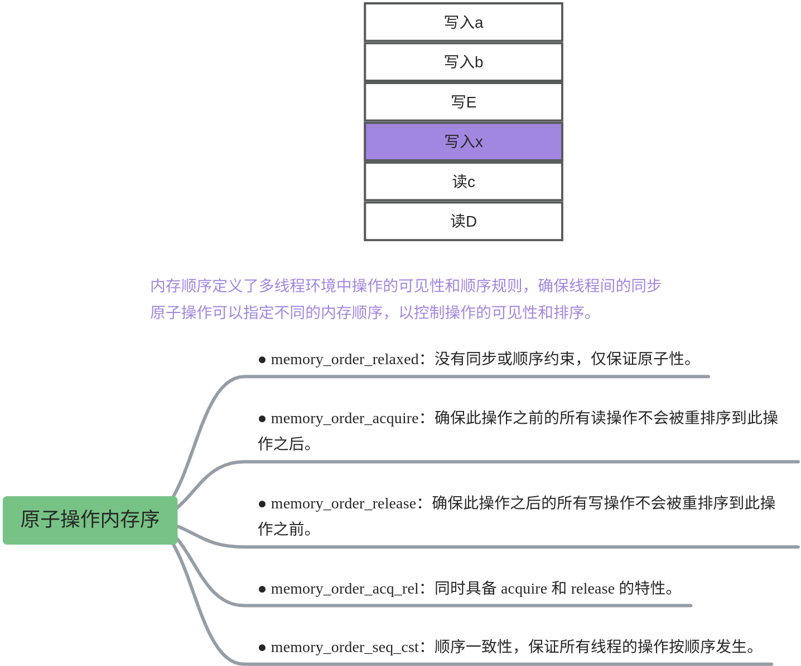
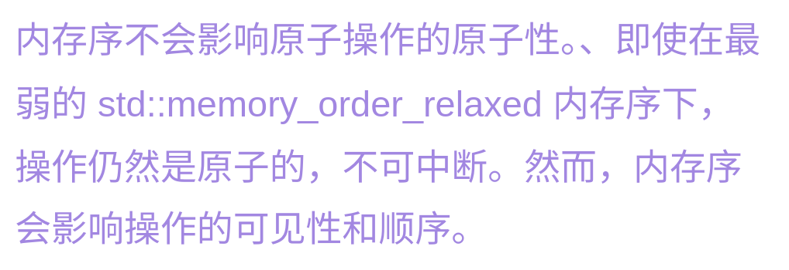

# 【09】原子变量和原子操作

## 1. 原子变量

原子变量是指使用`std::atomic`模板类定义的变量。这些变量提供了对其所表示的值进行原子操作的能力。原子变量确保在多线程环境中，对变量的读写操作是线程安全的，即操作不会被其他线程中断或干扰。


**定义原子变量**

```C++
#include <atomic>

std::atomic<int> atomicInt(0); //定义一个 int型的原子变量  名称交 atomicInt 默认值
```

  

## 2. 原子操作

原子操作是指对原子变量进行的不可分割的操作。不可分割的意思是这些操作要么完全执行，要么完全不执行，不会在执行过程中被其他线程打断。这些操作包括基本的读取、写入、交换、比较并交换（CAS）以及一些算术和按位操作。

- **加载和存储操作**

```CPP
int value = atomicInt.load(); // 原子加载
atomicInt.store(10);          // 原子存储
```

- **读写操作（等价于 load 和 store）**

```CPP
int value = atomicInt; // 原子读取
atomicInt = 10;        // 原子写入
```

- **自增和自减操作**

```CPP
atomicInt++; // 原子自增
atomicInt--; // 原子自减
++atomicInt; // 前置自增
--atomicInt; // 前置自减
```

- **其他修改操作**

```CPP
atomicInt += 5; // 原子加
atomicInt -= 3; // 原子减
```

#### 高级操作

- **compare_exchange**：比较并交换操作，用于实现无锁数据结构等复杂同步机制。

```
int expected = 0;
int desired = 1;
if (atomicInt.compare_exchange_strong(expected, desired)) {
    // 如果atomicInt的当前值等于expected，则将其设置为desired
    // 并返回true，否则将expected更新为atomicInt的当前值，返回false
}
```

  

## 3. 原子操作的内存序问题

在多线程编程中，内存顺序问题是由编译器和处理器的优化行为引起的。为了提高性能，编译器和处理器可能会对内存操作（如读取和写入）进行重排。这种重排在单线程程序中通常不会引起问题，但在多线程程序中，重排可能会导致线程间的数据竞争和不可预测的行为。







## 4. atomic的成员函数

在 C++ 中，`std::atomic` 类模板提供了一些操作符和成员函数，用于执行原子操作。这些操作符和成员函数保证在多线程环境下对原子变量的操作是线程安全的。以下是`std::atomic` 支持的一些主要原子操作符和成员函数：

### 4.1. 原子操作符

1. **赋值操作符 (**`=`**)**

	- 用于赋值操作。
	- 例如：`atomicVar = value;`

2. **取值操作符 (**`T()`**)**

	- 用于获取原子变量的当前值。
	- 例如：`T value = atomicVar;`

3. **前置和后置递增操作符 (**`++a`**,** `a++`**)**

	- 用于将原子变量的值递增。
	- 例如：`++atomicVar;` 或 `atomicVar++;`

4. **前置和后置递减操作符 (**`--a`**,** `a--`**)**

	- 用于将原子变量的值递减。
	- 例如：`--atomicVar;` 或 `atomicVar--;`

5. **复合赋值操作符 (**`+=`**,** `-=`**,** `&=`**,** `|=`**,** `^=`**)**

	- 用于对原子变量进行复合操作。
	- 例如：`atomicVar += value;`

### 4.2. 原子成员函数

1. `is_lock_free()`

	- 检查该原子操作是否是无锁的。
	- 返回值：`bool`

2. `load(memory_order order = memory_order_seq_cst) const`

	- 原子地读取并返回当前值。
	- 参数：内存顺序（可选）
	- 返回值：当前值

3. `store(T desired, memory_order order = memory_order_seq_cst)`

	- 原子地将值`desired`存储到对象中。
	- 参数：存储的值和内存顺序（可选）

4. `exchange(T desired, memory_order order = memory_order_seq_cst)`

	- 原子地将值`desired`存储到对象中，并返回之前的值。
	- 参数：存储的值和内存顺序（可选）
	- 返回值：之前的值

5. `compare_exchange_weak(T& expected, T desired, memory_order success, memory_order failure)`

	- 如果当前值等于`expected`，则将其替换为`desired`，并返回`true`，否则返回`false`并将`expected`更新为当前值。
	- 参数：期望值引用，新的值，成功和失败的内存顺序
	- 返回值：布尔值

6. `compare_exchange_strong(T& expected, T desired, memory_order success, memory_order failure)`

	- 类似于`compare_exchange_weak`，但具有更强的保证，即它不会由于伪失败而返回`false`。
	- 参数和返回值同上

7. `fetch_add(T arg, memory_order order = memory_order_seq_cst)`

	- 原子地将当前值增加`arg`，并返回之前的值。
	- 参数：增加的值和内存顺序（可选）
	- 返回值：之前的值

8. `fetch_sub(T arg, memory_order order = memory_order_seq_cst)`

	- 原子地将当前值减少`arg`，并返回之前的值。
	- 参数：减少的值和内存顺序（可选）
	- 返回值：之前的值

9. `fetch_and(T arg, memory_order order = memory_order_seq_cst)`

	- 原子地将当前值与`arg`进行按位与运算，并返回之前的值。
	- 参数：按位与的值和内存顺序（可选）
	- 返回值：之前的值

10. `fetch_or(T arg, memory_order order = memory_order_seq_cst)`

	- 原子地将当前值与`arg`进行按位或运算，并返回之前的值。
	- 参数：按位或的值和内存顺序（可选）
	- 返回值：之前的值

11. `fetch_xor(T arg, memory_order order = memory_order_seq_cst)`

	- 原子地将当前值与`arg`进行按位异或运算，并返回之前的值。
	- 参数：按位异或的值和内存顺序（可选）
	- 返回值：之前的值

### 4.3. 表格整理

| **成员函数/操作符**                                                                                  | **描述**     | **参数**               | **返回值**          | **示例**                                                                              |
| --------------------------------------------------------------------------------------------- | ---------- | -------------------- | ---------------- | ----------------------------------------------------------------------------------- |
| `atomic()`                                                                                    | 默认构造函数     | 无                    | 无                | `std::atomic<int> atomicInt;`                                                       |
| `atomic(T desired)`                                                                           | 带初始值的构造函数  | 初始值                  | 无                | `std::atomic<int> atomicInt(10);`                                                   |
| `is_lock_free()`                                                                              | 检查原子操作是否无锁 | 无                    | `bool`           | `bool lockFree = atomicInt.is_lock_free();`                                         |
| `load(memory_order order = memory_order_seq_cst)`                                             | 原子地读取当前值   | 内存顺序（可选）             | 当前值              | `int value = atomicInt.load();`                                                     |
| `store(T desired, memory_order order = memory_order_seq_cst)`                                 | 原子地存储值     | 存储的值和内存顺序（可选）        | 无                | `atomicInt.store(10);`                                                              |
| `exchange(T desired, memory_order order = memory_order_seq_cst)`                              | 原子地交换值     | 存储的值和内存顺序（可选）        | 之前的值             | `int oldValue = atomicInt.exchange(20);`                                            |
| `compare_exchange_weak(T& expected, T desired, memory_order success, memory_order failure)`   | 弱比较并交换     | 期望值引用，新的值，成功和失败的内存顺序 | `bool`           | `int expected = 10; bool result = atomicInt.compare_exchange_weak(expected, 20);`   |
| `compare_exchange_strong(T& expected, T desired, memory_order success, memory_order failure)` | 强比较并交换     | 期望值引用，新的值，成功和失败的内存顺序 | `bool`           | `int expected = 10; bool result = atomicInt.compare_exchange_strong(expected, 20);` |
| `fetch_add(T arg, memory_order order = memory_order_seq_cst)`                                 | 原子地增加      | 增加的值和内存顺序（可选）        | 之前的值             | `int oldValue = atomicInt.fetch_add(1);`                                            |
| `fetch_sub(T arg, memory_order order = memory_order_seq_cst)`                                 | 原子地减少      | 减少的值和内存顺序（可选）        | 之前的值             | `int oldValue = atomicInt.fetch_sub(1);`                                            |
| `fetch_and(T arg, memory_order order = memory_order_seq_cst)`                                 | 原子地按位与     | 按位与的值和内存顺序（可选）       | 之前的值             | `int oldValue = atomicInt.fetch_and(0xF);`                                          |
| `fetch_or(T arg, memory_order order = memory_order_seq_cst)`                                  | 原子地按位或     | 按位或的值和内存顺序（可选）       | 之前的值             | `int oldValue = atomicInt.fetch_or(0xF);`                                           |
| `fetch_xor(T arg, memory_order order = memory_order_seq_cst)`                                 | 原子地按位异或    | 按位异或的值和内存顺序（可选）      | 之前的值             | `int oldValue = atomicInt.fetch_xor(0xF);`                                          |
| `=`                                                                                           | 赋值操作       | 值                    | 无                | `atomicInt = value;`                                                                |
| `T()`                                                                                         | 取值操作       | 无                    | 当前值              | `T value = atomicInt;`                                                              |
| `++a`, `a++`                                                                                  | 前置/后置递增    | 无                    | 之前的值（后置），当前值（前置） | `++atomicInt;` 或 `atomicInt++;`                                                     |
| `--a`, `a--`                                                                                  | 前置/后置递减    | 无                    | 之前的值（后置），当前值（前置） | `--atomicInt;` 或 `atomicInt--;`                                                     |
| `+=`, `-=`, `&=`, `                                                                           | =`, `^=`   | 复合赋值操作               | 值                | 之前的值                                                                                |

这些操作符和成员函数使得 `std::atomic` 变量在多线程环境中进行安全的读写操作成为可能，从而避免数据竞争和不确定的行为。


