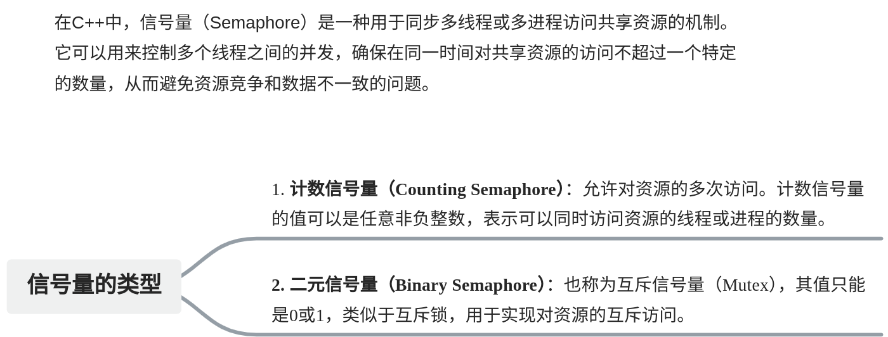
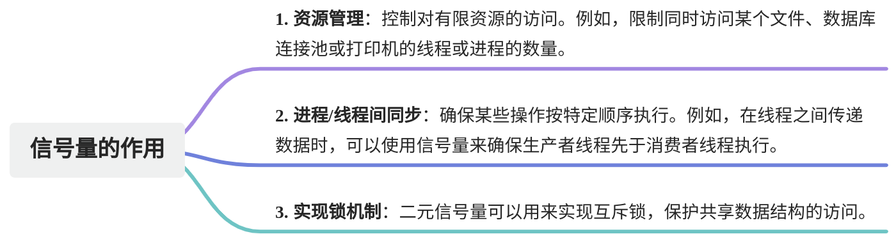
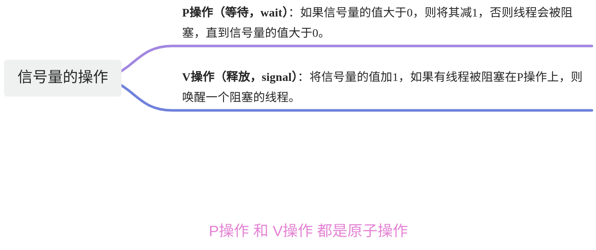
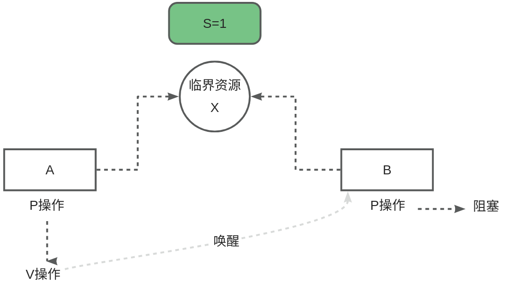

# 【10】信号量和counting_semaphore

## 1. 信号量概念

信号量（Semaphore）是一种用于管理和协调多线程或多进程访问共享资源的同步机制。它通过计数器来控制对资源的访问数量，确保多个线程或进程能够安全地使用共享资源而不会发生数据竞争或死锁。传统的锁（如互斥锁）可以用来保护共享资源，但对于某些场景（如资源的计数管理），信号量提供了更灵活和高效的解决方案。

### 1.1. 信号量的类型




### 1.2. 信号量的作用




## 2. 信号量的基本操作

### 2.1. 信号量操作的工作原理





### 2.2. 多线程中的应用（典型应用）


## counting_semaphore  
std::counting_semaphore是C++20标准库中的一个类模板，它实现了一个计数信号量。  
  
std::counting_semaphore的主要方法包括：  

| 成员函数                                                              | 说明                                             |
| ----------------------------------------------------------------- | ---------------------------------------------- |
| explicit counting_semaphore(ptrdiff_t desired)                    | 构造函数，初始化信号量的计数值为 desired。                      |
| counting_semaphore(const counting_semaphore&) = delete            | 禁止复制构造，信号量不支持复制。                               |
| counting_semaphore& operator=(const counting_semaphore&) = delete | 禁止复制赋值操作。                                      |
| void acquire()                                                    | P 操作，等待信号量的计数值大于0并减1，否则阻塞当前线程。                 |
| bool try_acquire()                                                | 尝试 P 操作，如果信号量的计数值大于0则减1并返回 true，否则返回 false。    |
| bool try_acquire_for(std::chrono::duration)                       | 尝试 P 操作，等待指定的时间，如果成功获取信号量则返回 true，否则返回 false。  |
| bool try_acquire_until(std::chrono::time_point)                   | 尝试 P 操作，直到指定的时间点，如果成功获取信号量则返回 true，否则返回 false。 |
| void release(ptrdiff_t update = 1)                                | V 操作，将信号量的计数值增加 update，如果有等待的线程，则唤醒相应数量的线程。    |
| ptrdiff_t max() const                                             | 返回信号量的最大计数值。                                   |

### 3.1counting_semaphore实现互斥  
以下是使用std::counting_semaphore实现一个简单的信号量示例：  

```cpp
#include <iostream>
#include <thread>
#include <semaphore>
#include <vector>

std::counting_semaphore<1> sem(1); // 初始值为1的计数信号量
/*
第一个1：类模板的非类型模板参数，指定了信号量的最大计数值，也就是可以同时允许多少个资源被访问。
在这个例子中，<1> 表示信号量的最大值是 1，这意味着最多只有一个线程可以访问受保护的资源

第二个1：这是信号量的初始计数值，表示当前有多少资源可供访问。在这个例子中，1 表示信号量初始化时计数值为 1，
意味着最开始时有一个资源可供访问
*/

void worker(int id) {
    sem.acquire(); // P操作，等待信号量大于0并将其减1
    std::cout << "Worker " << id << " is working\n";
    std::this_thread::sleep_for(std::chrono::seconds(1)); // 模拟工作
    std::cout << "Worker " << id << " is done\n";
    sem.release(); // V操作，将信号量加1
}

int main() {
    std::vector<std::thread> threads;
    for (int i = 0; i < 5; ++i) {
        threads.emplace_back(worker, i);
    }

    for (auto& t : threads) {
        t.join();
    }

    return 0;
}
```
### 3.2. counting_semaphore实现线程同步
```cpp
#include <iostream>
#include <thread>
#include <vector>
#include <semaphore>

// 信号量，用于线程同步，初始计数值为0，用于控制 work 线程的执行
std::counting_semaphore<1> ready(0);

// 信号量，用于线程同步，初始计数值为1，用于控制 prepare 线程的执行
std::counting_semaphore<1> done(1);

void prepare() {
    done.acquire(); // 减少信号量 done 的计数值，确保 prepare 在 work 完成之前不再执行
    std::cout << "Preparing...\n";
    std::this_thread::sleep_for(std::chrono::seconds(2)); // 模拟准备工作的耗时
    std::cout << "Preparation done.\n";
    ready.release(); // 增加信号量 ready 的计数值，通知 work 线程可以开始工作
}

void work() {
    ready.acquire(); // 等待 ready 信号量，确保准备工作完成后再执行
    std::cout << "Working...\n";
    std::this_thread::sleep_for(std::chrono::seconds(2)); // 模拟工作的耗时
    std::cout << "Work done.\n";
    done.release(); // 增加信号量 done 的计数值，通知 prepare 线程可以重新进入准备阶段
}

int main() {
    std::thread t1(prepare); // 创建 prepare 线程，执行准备工作
    std::thread t2(work);    // 创建 work 线程，执行主要工作

    t1.join(); // 等待 prepare 线程执行完成
    t2.join(); // 等待 work 线程执行完成

    std::cout << "All tasks completed.\n"; // 所有工作完成
    return 0;
}
```