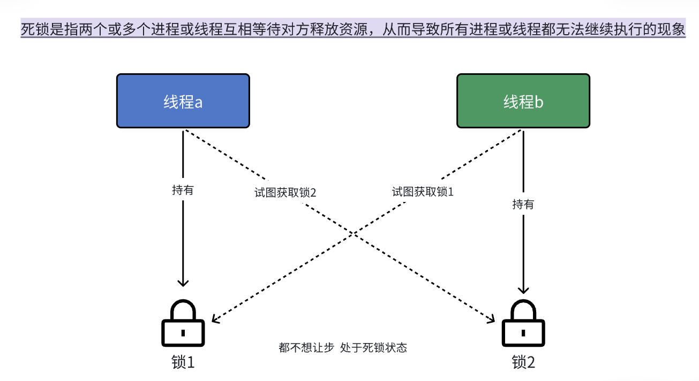

# 【12】死锁

### 死锁是什么？

死锁（Deadlock）是指两个或多个线程在执行过程中因争夺资源而造成的一种互相等待的现象。如果没有外力干涉，它们将永远无法继续执行下去。死锁会导致程序或系统的严重性能问题，甚至使整个系统陷入停滞。

  

### 死锁如何产生的？




死锁通常由以下四个必要条件引起，这四个条件同时满足时，系统就会产生死锁：

1. **互斥条件（Mutual Exclusion）**：

	- 资源一次只能被一个线程占用。

2. **请求和保持条件（Hold and Wait）**：

	- 线程已经持有至少一个资源，同时又申请新的资源，而新资源被其他线程占有。

3. **不剥夺条件（No Preemption）**：

	- 已获得的资源在未使用完之前，不能被强行剥夺，只能在使用完毕后由线程自己释放。

4. **循环等待条件（Circular Wait）**：

	- 存在一个线程循环等待的链，链中的每个线程都持有下一个线程需要的资源。

### 死锁的常见例子

假设有两个线程 `T1` 和 `T2`，两个资源 `R1` 和 `R2`。`T1` 先获取 `R1`，然后申请 `R2`；`T2` 先获取 `R2`，然后申请 `R1`。如果 `T1` 和 `T2` 都持有各自的资源并等待对方的资源，那么就会产生死锁。

```C++
#include <iostream>
#include <thread>
#include <mutex>

std::mutex mutex1;
std::mutex mutex2;

void task1() {
    std::lock_guard<std::mutex> lock1(mutex1);
    std::this_thread::sleep_for(std::chrono::milliseconds(100)); // 模拟工作
    std::lock_guard<std::mutex> lock2(mutex2);
    std::cout << "Task 1 finished\n";
}

void task2() {
    std::lock_guard<std::mutex> lock2(mutex2);
    std::this_thread::sleep_for(std::chrono::milliseconds(100)); // 模拟工作
    std::lock_guard<std::mutex> lock1(mutex1);
    std::cout << "Task 2 finished\n";
}

int main() {
    std::thread t1(task1);
    std::thread t2(task2);
    
    t1.join();
    t2.join();
    
    return 0;
}
```

### 如何解决死锁？

解决死锁的方法主要有以下几种：

1. **避免循环等待条件**：

	- 避免形成资源循环等待链。例如，可以通过对所有资源进行排序，并按顺序申请资源，确保不会形成循环等待。

2. **破坏请求和保持条件**：

	- 在一个线程申请资源时，不允许它同时持有其他资源。可以使用一次性分配所有资源的方法，即线程一次性申请它所需要的所有资源，只有在所有资源都满足的情况下才开始执行，否则就释放已经获得的资源重新申请。

3. **破坏不剥夺条件**：

	- 如果一个线程申请新的资源时已持有的资源被占用，可以强制释放它已占有的资源。尽管这种方法在实际系统中难以实现，但在某些情况下是可行的。

4. **使用死锁检测和恢复**：

	- 系统可以定期检测是否存在死锁，如果检测到死锁，则采取恢复措施，例如终止某些线程并释放它们占有的资源。

5. **使用高级同步工具**：

	- 使用 `std::lock` 和 `std::unique_lock` 等高级同步工具来避免死锁。`std::lock` 可以同时锁定多个互斥锁，避免循环等待。

### 使用 `std::lock` 解决死锁

使用 `std::lock` 同时锁定两个互斥锁，避免死锁：

```C++
#include <iostream>
#include <thread>
#include <mutex>

std::mutex mutex1;
std::mutex mutex2;

void task1() {
    std::lock(mutex1, mutex2); // 同时锁定两个互斥锁
    std::lock_guard<std::mutex> lock1(mutex1, std::adopt_lock);
    std::lock_guard<std::mutex> lock2(mutex2, std::adopt_lock);
    std::cout << "Task 1 finished\n";
}

void task2() {
    std::lock(mutex1, mutex2); // 同时锁定两个互斥锁
    std::lock_guard<std::mutex> lock2(mutex2, std::adopt_lock);
    std::lock_guard<std::mutex> lock1(mutex1, std::adopt_lock);
    std::cout << "Task 2 finished\n";
}

int main() {
    std::thread t1(task1);
    std::thread t2(task2);
    
    t1.join();
    t2.join();
    
    return 0;
}
```

在这个示例中，`std::lock` 同时锁定 `mutex1` 和 `mutex2`，并且使用 `std::adopt_lock` 来告诉 `std::lock_guard` 互斥锁已经被锁定，从而避免死锁。
