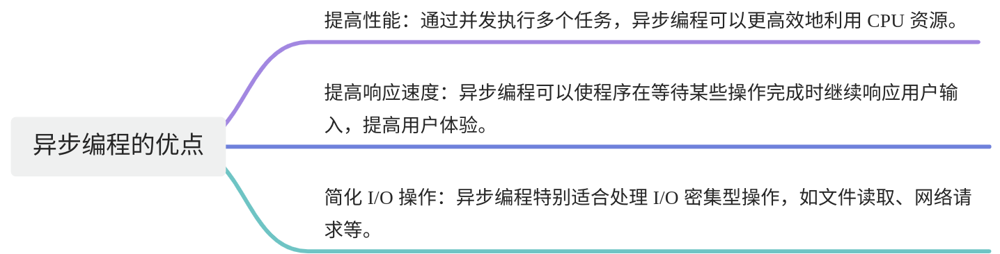
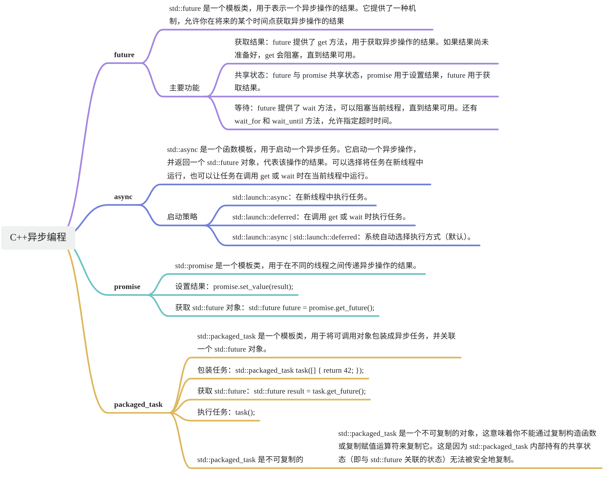
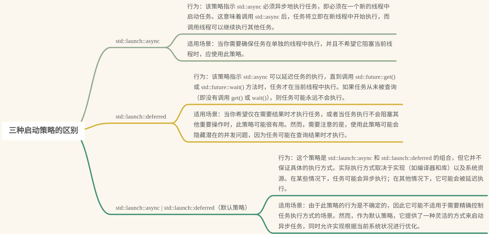

# 【13】异步编程 future和async
## 1. 什么是异步？

异步编程是一种编程范式，允许程序在等待某些操作完成时继续执行其他任务，而不是阻塞或等待这些操作完成 。

在传统的同步编程中，代码是按顺序执行的，每个操作必须等待前一个操作完成。这种方式在处理 I/O 操作、网络请求或计算密集型任务时可能会导致程序的性能瓶颈。例如，当程序需要从网络上获取数据时，它会等待数据返回后再继续执行，这期间 CPU 可能会处于空闲状态，浪费了资源。

异步编程则不同，它允许程序在等待操作完成的同时继续执行其他任务。例如，程序可以发起一个网络请求，然后继续执行其他操作，而不必等待网络请求完成。等到网络请求完成时，程序再处理返回的数据。



## 2. C++中的异步编程 相关知识点

C++11 引入了标准库中的一些异步编程工具，例如 `std::async`、`std::future` 和 `std::promise`。


## 3. async和future的使用

### 3.1. 什么是async？

**std::async**：是一个函数模板，用于启动一个异步任务。它接受一个可调用的对象（如函数、Lambda表达式、函数对象等）作为参数，并在一个单独的线程上异步执行该对象。std::async自动管理异步任务的生命周期，并返回一个std::future对象，该对象可用于获取异步操作的结果。

### 3.2. 什么是future？

**std::future**：是一个模板类，用于表示异步操作的结果。它允许开发者在将来的某个时刻查询异步操作的状态、等待操作完成或获取操作的结果。通常，std::future对象不是直接创建的，而是与std::async、std::packaged_task或std::promise配合使用。

**它的主要成员函数**

1. get()  
    作用：等待异步操作完成，并获取其结果。如果异步操作尚未完成，调用 get() 的线程将被阻塞，直到操作完成。一旦调用 get()，它将返回异步操作的结果，并且 std::future 对象将不再与任何共享状态相关联（即，它变为无效状态）。  
    注意：get() 方法只能被调用一次。如果尝试多次调用 get()，将抛出 std::future_error 异常。
2. wait()  
    作用：等待异步操作完成，但不获取结果。调用 wait() 会阻塞当前线程，直到异步操作完成。与 get() 不同，调用 wait() 后，std::future 对象仍然有效，可以继续使用 get() 来获取结果。
3. wait_for()  
    作用：等待异步操作完成，但只等待指定的时间段。如果异步操作在该时间段内完成，wait_for() 将返回 std::future_status::ready。如果操作未完成但时间已过，将返回 std::future_status::timeout。如果异步操作尚未启动（例如，使用 std::launch::deferred 策略），则返回 std::future_status::deferred。  
    参数：接受一个表示等待时间的时间段（如 std::chrono::seconds、std::chrono::milliseconds 等）。
4. wait_until()  
    作用：与 wait_for() 类似，但它是等待到指定的时间点而不是时间段。如果异步操作在该时间点之前完成，wait_until() 将返回 std::future_status::ready。如果操作未完成但时间已到，将返回 std::future_status::timeout。  
    参数：接受一个表示等待结束的时间点（如 std::chrono::system_clock::now() + std::chrono::seconds(10)）。
5. valid()  
    作用：检查 std::future 对象是否与有效的共享状态相关联。如果 std::future 对象与某个异步操作的结果相关联，则返回 true；如果 std::future 对象已被 get() 调用过或从未与任何共享状态相关联，则返回 false。

!!! note
	- `std::future::get()` 方法只能被调用一次，因为它会移动存储在 `std::future` 对象中的结果。如果尝试多次调用 `get()`，将抛出 `std::future_error` 异常。

### 3.3. 如何定义使用？

```C++
#include <iostream>  
#include <future>  
#include <chrono>  
#include <thread>  
  
// 一个简单的函数，模拟耗时的计算  
int do_some_work(int x) {  
    // 假设这个函数需要一些时间来完成  
    std::this_thread::sleep_for(std::chrono::seconds(1)); // 休眠1秒  
    return x * x; // 返回x的平方  
}  
  
int main() {  
    // 使用 std::async 启动一个异步任务  
    // std::async 的第一个参数是启动策略，这里使用 std::launch::async 表示异步执行  
    // 第二个参数是要异步执行的函数及其参数  
    std::future<int> result = std::async(std::launch::async, do_some_work, 42);  
  
    // 在这里，主线程可以继续执行其他任务，而 do_some_work 函数将在另一个线程中异步执行  
  
    // 假设主线程在这里做一些其他工作...  
    std::cout << "Waiting for async task to complete...\n";  
  
    // 使用 std::future::get() 方法等待异步任务完成并获取结果  
    // 注意：get() 方法会阻塞调用线程，直到异步任务完成  
    int value = result.get();  
  
    // 现在，异步任务已经完成，我们可以安全地使用结果  
    std::cout << "The result of do_some_work(42) is " << value << std::endl;  
  
    return 0;  
}
```

**三种启动策略的区别**



好，这一小节，咱们就掌握这些， 能知道 异步的基本概念 ， 能够掌握async和future的用法即可