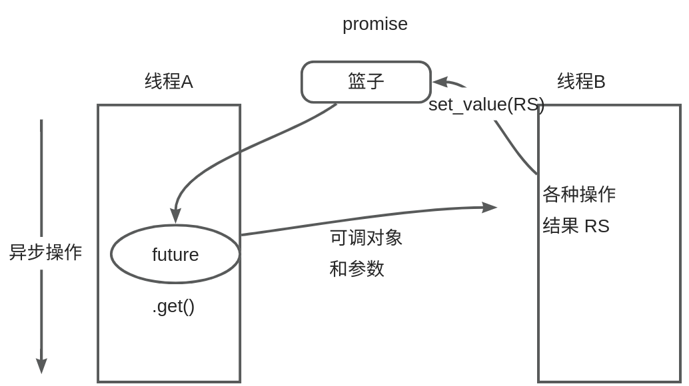

# 【14】异步编程 promise的用法

`std::promise` 是一个用于设置异步操作结果的机制。它允许你在一个线程中设置值或异常，然后在另一个线程中通过 `std::future` 对象检索这些值或异常。`std::promise` 通常与 `std::async`、`std::packaged_task` 或 `std::thread` 结合使用，以在异步操作中传递结果。

一个Promise对象是为了保存某个特定的结果值分配的，这个结果值是在未来的某个时间点计算得到的。结果值可以是任意类型的值（void类型除外）；也可以是指向常量和非常量（对象指针、函数或者成员函数）的指针；甚至是引用类型的“实值”。

一个Promise对象可以创建一个或多个std::future对象，用来承载该Promise对象所保存的结果值。只有当set_value()或者set_exception()被调用，这些结果值才能被执行。一旦被执行，这些结果值就可以通过std::future::get函数添加到std::future对象中。



### 定义与使用

#### 定义 `std::promise`

你可以通过包含 `<future>` 头文件来使用 `std::promise`。然后，你可以创建一个 `std::promise` 的实例，并指定它将要持有的值的类型。

```C++

#include <future>  
#include <iostream>  
  
int main() {  
    std::promise<int> prom;  
    // ...  
}
```

#### 使用 `std::promise`

`std::promise` 提供了 `set_value` 和 `set_exception` 方法来设置异步操作的结果或异常。同时，你可以通过调用 `get_future` 方法来获取一个与 `std::promise` 关联的 `std::future` 对象，该对象用于在另一个线程中检索结果。

```C++
#include <future>  
#include <iostream>  
#include <thread>  
  
void async_task(std::promise<int> prom) {  
    // 模拟异步操作  
    std::this_thread::sleep_for(std::chrono::seconds(1));  
    prom.set_value(42); // 设置异步操作的结果  
}  
  
int main() {  
    std::promise<int> prom;  
    std::future<int> fut = prom.get_future(); // 获取与 promise 关联的 future  
  
    std::thread t(async_task, std::move(prom)); // 启动异步任务，并将 promise 传递给它  
  
    // 在主线程中等待异步操作完成并获取结果  
    std::cout << "The result is " << fut.get() << std::endl;  
  
    t.join(); // 等待线程结束  
    return 0;  
}
```

### 成员函数

- `get_future()`：返回一个 `std::future` 对象，该对象与 `std::promise` 对象共享状态。你可以通过这个 `std::future` 对象来检索异步操作的结果。
- `set_value(T value)`：设置异步操作的结果。调用此方法后，与 `std::promise` 关联的 `std::future` 对象将变为 fulfilled 状态，并且可以通过调用 `std::future::get()` 来检索结果。
- `set_exception(std::exception_ptr p)`：设置异步操作中抛出的异常。调用此方法后，与 `std::promise` 关联的 `std::future` 对象将变为 rejected 状态，并且可以通过调用 `std::future::get()` 来重新抛出异常。

  

### 注意事项

1. **std::promise** **的生命周期**：确保 `std::promise` 对象在 `std::future` 对象需要它之前保持有效。一旦 `std::promise` 对象被销毁，任何尝试通过 `std::future` 对象访问其结果的操作都将失败。
2. **线程安全**：`std::promise` 的 `set_value` 和 `set_exception` 方法是线程安全的，但你应该避免在多个线程中同时调用它们，因为这通常意味着你的设计存在问题。
3. **异常处理**：当使用 `std::promise` 时，要特别注意异常处理。如果 `std::promise` 的 `set_exception` 方法没有被调用，但异步操作中确实发生了异常，那么这些异常将不会被捕获，并可能导致程序崩溃。
4. **性能考虑**：虽然 `std::promise` 和 `std::future` 提供了强大的异步编程能力，但它们也引入了额外的开销。在性能敏感的应用程序中，要仔细考虑是否真的需要它们。
5. **std::move** **的使用**：在将 `std::promise` 对象传递给线程函数时，通常需要使用 `std::move` 来避免不必要的复制。这是因为 `std::promise` 对象通常包含非托管资源（如共享状态），复制它们可能是昂贵的或不必要的。

