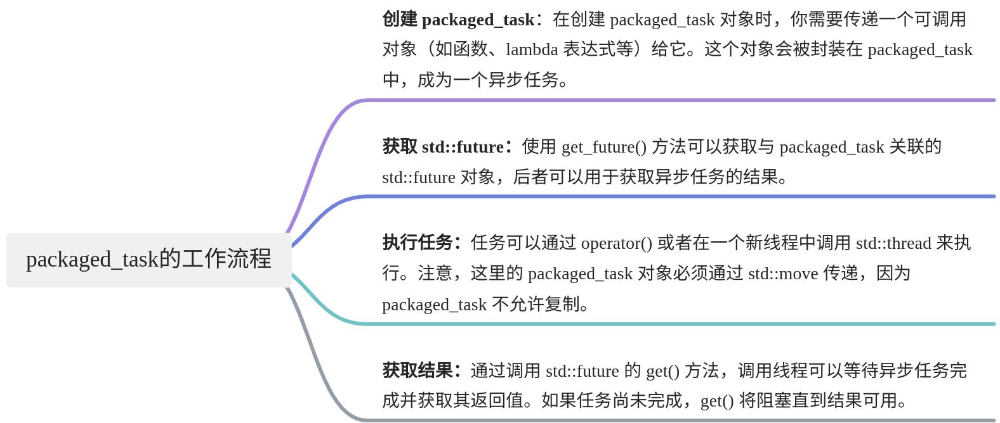

# 【15】异步编程 packaged_task的使用

##  1. packaged_task

`packaged_task` 是一个模板类，主要用于将一个可调用对象（如函数、lambda 表达式、函数对象等）包装起来，以便异步地执行，并能够获取其返回结果。它和 `std::future` 以及 `std::thread` 紧密相关，经常用于多线程编程中。

## 2. packaged_task基本使用

### 2.1. 工作流程


### 2.2. 定义和使用

封装lambda表达式

```C++
#include <future>  
#include <iostream>  
using namespace std;

int main() {
    std::packaged_task<int(int, int)> task([](int a, int b) {
        return a + b;
        });

    future<int> myfuture=task.get_future();
    task(12, 23);
    cout << myfuture.get() << endl;

    return 0;
}
```

  

封装函数

```C++
#include <iostream>
#include <thread>
#include <future>
#include <functional>

// 一个简单的函数，用于演示
int multiply(int a, int b) {
    return a * b;
}

int main() {
    // 创建一个 packaged_task，包装函数 multiply
    std::packaged_task<int(int, int)> task(multiply);

    // 获取与 task 相关联的 future
    std::future<int> result = task.get_future();

    // 将任务交给另一个线程去执行
    std::thread t(move(task), 5, 6);

    // 等待任务完成并获取结果
    int value = result.get();

    std::cout << "Result: " << value << std::endl; // 输出 "Result: 30"

    // 等待线程结束
    t.join();

    return 0;
}
```

  

### 2.3. 主要特性

- **不可复制性**：`packaged_task` 对象是不可复制的，但可以移动。
- **与** `**future**` **协作**：`packaged_task` 和 `std::future` 协同工作，允许异步任务的结果在稍后某个时间点被获取。
- **适用于多线程环境**：`packaged_task` 的设计使得它非常适合用于多线程环境中，尤其是需要将任务分发给不同线程执行的场景。

### 2.4. 应用场景

- **异步任务执行**：当你需要将一个任务分发给另一个线程去执行，并希望在任务完成后获取结果时，可以使用 `packaged_task`。
- **自定义线程池**：在实现自定义线程池时，`packaged_task` 可以用于将任务封装，并将其分发给线程池中的线程执行。