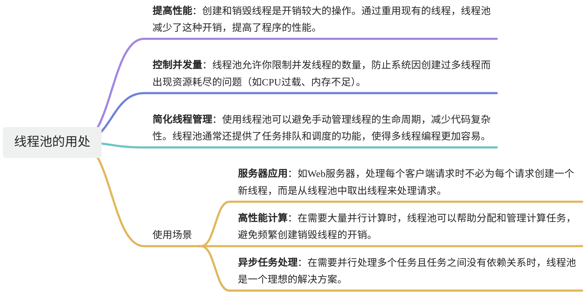
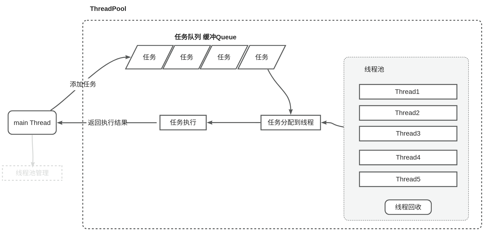

# 【17】线程池

## 1. 何为线程池？有什么用处？

**线程池**是指一种预先创建一组线程的机制，这些线程在应用程序启动时就已经创建好，等待执行任务。当有新的任务需要执行时，线程池会从线程集合中分配一个空闲线程来执行该任务，而不是每次都重新创建和销毁线程。

## 2. 为什么要使用线程池？

## 3. 一个线程池应该包含什么？


## 4. 如何使用C++实现一个线程池

```cpp
#pragma once

#include <iostream>
#include <thread>
#include <mutex>
#include <future>
#include <condition_variable>
#include <functional>
#include <queue>

/// <summary>
/// 线程池
/// </summary>
class ThreadPool {

public:
	//构造函数
	ThreadPool(int threadnums); 

	//添加任务到队列
	template <typename F,typename ...Arg>
	auto enques(F&& f,Arg&&... arg)->std::future<typename std::result_of<F(Arg...)>::type>;
	
	//析构函数
	~ThreadPool();

private:
	void worker();
	bool isstop;
	std::condition_variable  cv;
	std::mutex mtx;
	std::vector<std::thread>  workers;
	std::queue<std::function<void()>> myque;
};

//构造函数
ThreadPool::ThreadPool(int threadnums):isstop(false) {
	
	for (size_t i = 0; i < threadnums; i++)
	{
		workers.emplace_back([this]() {
			this->worker();
			});
	}
}

//析构函数
ThreadPool::~ThreadPool() {
	//更改停止标识
	{
		std::unique_lock<std::mutex>(mtx);
		isstop = true;
	}

	//通知所有所有阻塞中的线程
	cv.notify_all(); 

	//确保线程执行完成
	for (std::thread& onethread : workers)
	{
		onethread.join();
	}
}

//添加任务
template <typename F, typename ...Arg>
auto ThreadPool::enques(F&& f, Arg&&... arg)->std::future<typename std::result_of<F(Arg...)>::type> 
{
	//获得f执行后的类型
	using functype = typename std::result_of<F(Arg...)>::type;

	//获得一个智能指针 指向一个被包装为functype()的task
	auto task = std::make_shared<std::packaged_task<functype()>>(
			std::bind(std::forward<F>(f),std::forward<Arg>(arg)...)
		);
	
	//获得future
	std::future<functype> rsfuture = task->get_future();

	//将任务添加到队列
	{
		std::lock_guard<std::mutex> lockguard(this->mtx);
		if (isstop)
			throw std::runtime_error("出错：线程池已经停止了");
		
		//将任务添加到队列
		myque.emplace([task]() {
			(*task)();
			});
	}

	//通知线程去执行任务
	cv.notify_one();

	//返回future
	return rsfuture;
}


//每个具体的工作任务
void ThreadPool::worker() {

	while (true) {
		
		//定义任务
		std::function<void()> task;


		//从队列中取得一个任务
		{
			std::unique_lock<std::mutex> lock(mtx);
			cv.wait(lock, [this] { return this->isstop || !this->myque.empty(); });
			if (isstop && myque.empty()) return;
			task = std::move(this->myque.front());
			this->myque.pop();
		}

		//执行任务
		task(); 
	
	}

}
```

## 5. 使用线程
```cpp
//通过代码演示一下 线程池的使用
#include <iostream>
#include "ThreadPool.hpp"

int main() {
	ThreadPool mypool(4);
	for (size_t i = 0; i < 20; i++)
	{
		auto rsfuture0 = mypool.enques([](int a, int b)->int {
			std::cout << "当先线程：" << std::this_thread::get_id() << std::endl;
		return a + b; }, 10*i, 10*i);
		std::cout << "thread rs:" << rsfuture0.get() << std::endl;

	}
	
	return 0;
}

```